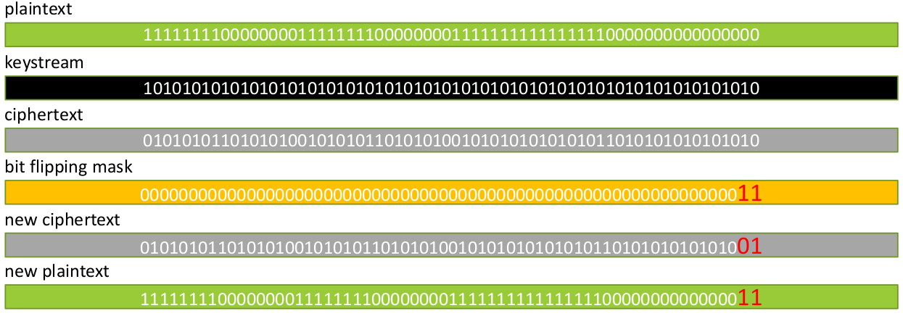

# Bitflipping attacks

> ***Bitflipping attacks***: this type of attack can be performed against both block ciphers and stream ciphers. The idea is to manipulate some parts of the ciphertext to manipulate the plaintext after the decryption or to manipulate parts of the plaintext before the encryption to modify the decrypted plaintext in other parts.

## Bitflipping attack against Stream Ciphers

<div style="width: 100%; max-width: 800px; min-width: 300px">



</div>

The attack is based on the fact that the encryption process is a simple XOR between the plaintext and the key stream. This means that the properties of the plaintext are preserved in the ciphertext.

To manipulate the plaintext we need to know only the actual plaintext (at least the part that we want to manipulate).

The mask is simple:

- For each bit that we want to change we use `1`.
- For each bit that we want to keep we use `0`.

The mask is XORed with the actual ciphertext to obtain the new ciphertext.

```python
    ct = pt XOR ks                  # encryption

    ct1 = ct XOR mask               # attack 

    ct1 = pt XOR ks XOR mask        # proof of correctness
    ct1 = (pt XOR mask) XOR ks      #
    ct1 = pt1 XOR ks                #

    pt1 = ct1 XOR ks                # decryption
```

## Bitflipping attack against Block Ciphers

Attacking ECB mode is not useful, in ECB mode all blocks are independent.

> ***Remember***: a good block cipher has the following property: 
>
> *One change in the plaintext will produce, in average, half of the bits flipped in the ciphertext*.
>
> This property is called ***avalanche effect*** and can be viewed in the reverse way: *one change in the ciphertext will produce, in average, half of the bits flipped in the plaintext*.

So if we use the same approach used for stream ciphers, we flip one (or more) bit in the ciphertext producing a big and pseudorandom change in the plaintext.

## Bitflipping attack against CBC mode

<div style="width: 100%; max-width: 800px; min-width: 300px; display: flex; justify-content: space-around">


</div>

</br>

In CBC mode, the decryption process is:

```python
    pt[i] = dec(ct[i]) XOR ct[i-1]
```

The attack is based on modify the ciphertext of the previous block to modify the plaintext of the current block. This means:

1. The previous block, when decrypted, becomes pseudorandom stuff.
2. The previous block acts as a mask for the target block (the current block).

