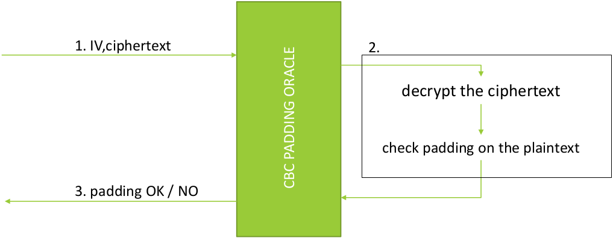
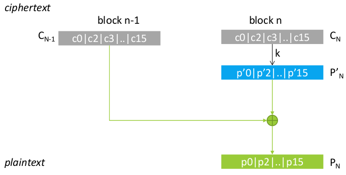
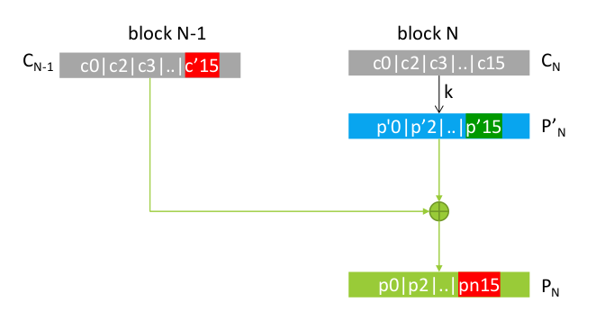
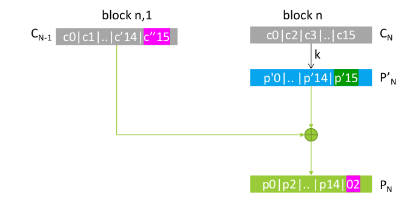

# Attacks against CBC Mode

## CBC Padding Oracle Attack

> ***CBC Padding Oracle Attack*** is an important attack to study not only for the attack itself but also for the concepts behind it. This attack show us how use the leaks from an oracle and why security protocols (and not only) are not very precise in the error messages.

> ***This attack is very complex to implement***.

<div style="width: 100%; max-width: 800px; min-width: 300px">



</div>

<br>

The outputs of the oracle must include the information about the correctness of the padding.

> ***Remark***: this information can be explicit, as a single bit (correct padding or not), or it can be deduced from the presence of an error message instead the correct output of the oracle.

The attack exploits the [bitflipping attack against CBC mode](Bitflipping.md#bitflipping-attack-against-cbc-mode).

> ***Remark***: the CBC decryption process is the following:
>
> <div style="width: 100%; max-width: 800px; min-width: 300px">
>
> 
>
> </div>
>
> Where:
> - $C_i$ is the ciphertext block.
> - $P'_i$ is the block decrypted before the XOR with the previous ciphertext block.
> - $P_i$ is the plaintext block.
>
> Each block is composed by 16 bytes, we call $c_i$, $p'_i$ and $p_i$ this bytes.

> ***PKCS Scheme***: the padding scheme used in CBC mode is the PKCS7, this scheme is used to pad the plaintext to a multiple of the block size. The padding is composed by $n$ bytes with value $n$.
>
> For example: the length of the plaintext is 13 bytes, the block size is 16 bytes, the padding will be `\x03\x03\x03`.

### Attack

This attack works by performing a bitflipping attack against the ciphertext.

#### Attack against the last byte of block N

<div style="width: 100%; max-width: 800px; min-width: 300px">



</div>

<br>

The target of the attack is guess the last byte, this is performed by flipping the last byte of the previous block until the oracle returns a correct padding. (brute-force on last byte by using a bitflipping attack)

```python

C = C1 || C2 || ... || Cn-1 || Cn

x = 0

for i in range(256):
    C[n-1] = C[n-1] XOR i
    if oracle(C):
        x = i
        break

p = xor(x, C[n][15])

```

The padding test will fail with all bytes excluding one, we can write:

```java
P_atk[n][15] = b'\x01'

P_mod[n][15] XOR C_atk[n-1][15] = P[n][15] = b'\x01'

P_mod[n][15] = b'\x01' XOR C_atk[n-1][15]

P[n][15] = C[n-1][15] XOR P_mod[n][15]
```


We know that `P[n][15] = b'\x01'` after the attack, from this we can recover `P'[n][15]` that is the plaintext before the XOR with the previous block of the ciphertext: `P'[n][15] = b'\x01' XOR C'[n-1][15]`, where `C'` is the ciphertext bitflipped.

Now we can recover the original plaintext: `P[n][15] = C[n-1][15] XOR P'[n][15]`, where `C` is the original ciphertext.

This process can be shortened by using the following formula:

$P[n][15] = C[n-1][15]\ \bigoplus \ \text{b'}\backslash \text{x01'} \bigoplus C'[n-1][15]$

#### Attack against the last 2 bytes of block N

<div style="width: 100%; max-width: 800px; min-width: 300px">



</div>

<br>

The last byte must be set to the value `\x02`, now we have to guess the second last byte. This is performed by flipping the last byte of the previous block until the oracle returns a correct padding: this means that the second last byte is `\x02`.

$P[n][14] = C[n-1][14]\ \bigoplus \ \text{b'}\backslash \text{x02'} \bigoplus C'[n-1][14]$

Where `C'` is the ciphertext bitflipped and `C` is the original ciphertext. The brute-force is performed on the second last byte of `C'`.

#### Attack in general

This attack is performed extending the previous attack to all the bytes of the block.

> ***Note***: to act on the first block we need to operate on the IV.

Numbering all block `i` from `1` to `n` (where `C[0] = IV`), and all bytes `j` from `0` to `15`, we can write:

```
P[i][j] = C[i-1][j] XOR b'\x0j' XOR C'[i-1][j]
```
$P[i][j] = C[i-1][j]\ \bigoplus \ \text{bytes([j])} \ \bigoplus \ C'[i-1][j]$

Where `C'` is the ciphertext bitflipped and `C` is the original ciphertext. The brute-force is performed on the byte `j` of `C'`.

> ***Remark***: after have completed the attack on a block (padding value `\x10 = 16`), we need to drop that block from the next tries.

### False Positive

The oracle can respond with a correct padding even if the plaintext is not correct. This can happen during the guessing of the first byte, this case must be checked manually and it is a consequence of the fact that the last block can be actually padded (not the entire block is the plaintext).

This case can be extended to specific cases where the plaintext is not padded but the content, after the bitflipping, is a valid padding.

Example:

```
last_block = b'\xde\xad\xbe\xef\xde\xad\xbe\xef\xde\xad\xbe\xef\x04\x04\x04\xff'
```

We attack the last byte and ww hit when the byte complete the padding with `\x04`, but the previous bytes are plaintext and not padding.
