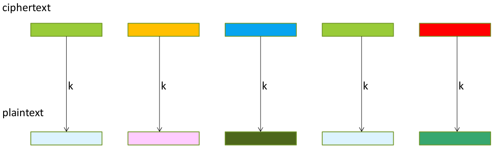
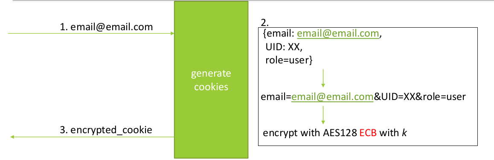
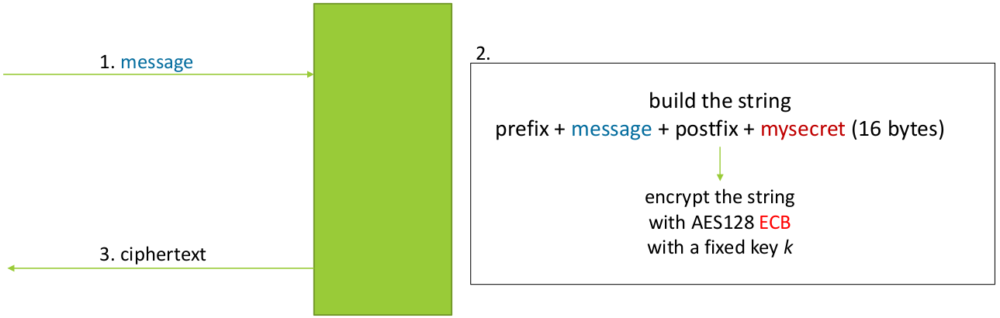
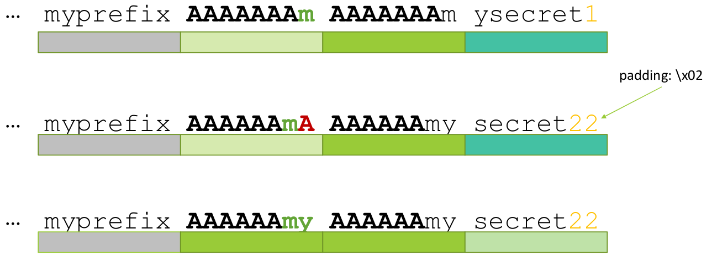

# Attacks against ECB Mode

> ***ECB Mode is broken***.

**Problems**:

1. We can **detect patterns** in the ciphertext (deterministic encryption).
2. We can **reassemble valid encrypted blocks** to create new valid ciphertexts (that can be decrypted as valid plaintexts).
3. We can **decrypt the ciphertext** without knowing the key (we can use the ***oracle*** to decrypt the ciphertext).

> ***Note***: detect the ECB mode is easy.

## Detect ECB Mode

<div style="width: 100%; max-width: 800px; min-width: 300px">



</div>

<br>

> ***Considerations***: (using the same key `k`)
>
> - Equals plaintext blocks will be encrypted to equals ciphertext blocks.
> - Equals ciphertext blocks will be decrypted to equals plaintext blocks.

ECB mode can be easily detected if we have a service (an oracle) that encrypts our plaintexts.

Suppose that the oracle uses a block cipher with block size 128bit (ex. AES), if we send to the oracle a plaintext composed by 2 blocks with the same content: if the oracle uses ECB mode the ciphertext will be composed by 2 blocks with the same content.

```python
pt = b'A'*16 + b'A'*16

ct = oracle(pt)

if ct[0:16] == ct[16:32]:
    print("ECB mode detected")
else:
    print("ECB mode not detected")
```
### Preliminary questions

1. What do we control?

- We control the input: we can choose arbitrary plaintexts.
- We control the number of input that we can send to the orable: the number of trials.

2. What information do we have?

- The mode of operation of the oracle is selected randomly between ECB and CBC.
- ECB Mode encrypts vertically.
- CBC Mode encrypts using a feedback.

3. What is not under our control?

- The data used a prefix and suffix to our plaintexts.
- The data size of the prefix and suffix.
- The key used by the oracle.

### Attack

We need to build a good payload to send to the oracle: 

At least we have to send 2 blocks with the same content.

> ***Problem***: the oracle attach to our plaintext a prefix and a suffix.

To solve this problem we can send 3 blocks with the same content, in this way:

The prefix length can be a multiple of the block size or not.

The easy case is when the prefix length is a multiple of the block size, in this case the problem is solved also with 2 blocks.

In the other case we have to send 3 blocks with the same content, in this way one part of the first block fill the prefix, the remaining part is longer then 2 blocks and we bypass the problem.

## ECB Cut & Paste Attack

Example: cookie encryption.

<div style="width: 100%; max-width: 800px; min-width: 300px">



</div>

<br>

Let's try to understand how the cookie is encrypted:

> Input: "myemail@email.com"

The cookie is composed by 3 fields:

`email=myemail@email.com&uid=xx&role=user`

It will be encrypted using AES-ECB.

<table>

<tr>
<td>Block 1</td>
<td>Block 2</td>
<td>Block 3</td>
</tr>

<tr>
<td>email=myemail@em</td>
<td>ail.com&uid=xx&r</td>
<td>ole=user\x08\x08\x08\x08\x08\x08\x08\x08</td>
</tr>

</table>

We want to have `role=admin` instead of `role=user`, we can exploit ECB mode to do this. 

1. We need to build a new cookie were the last block contains `user` plus padding.

<table>

<tr>
<td>Block 1</td>
<td>Block 2</td>
<td>Block 3</td>
</tr>

<tr>
<td>email=aaa@email.</td>
<td>com&uid=xx&role=</td>
<td>user\x0c\x0c\x0c\x0c\x0c\x0c\x0c\x0c\x0c\x0c\x0c\x0c</td>
</tr>

</table>

2. We need to build a block with the good output for `role` (admin). This block must be:

`admin\x0b\x0b\x0b\x0b\x0b\x0b\x0b\x0b\x0b\x0b\x0b`

So:

<table>

<tr>
<td>Block 1</td>
<td>Block 2</td>
<td>Block 3</td>
<td>Block 4</td>
</tr>

<tr>
<td>email=aaaaaaaaaa</td>
<td>admin\x0b\x0b\x0b\x0b\x0b\x0b\x0b\x0b\x0b\x0b\x0b</td>
<td>bbb&uid=xx&role=</td>
<td>user\x0c\x0c\x0c\x0c\x0c\x0c\x0c\x0c\x0c\x0c\x0c\x0c</td>
</tr>

</table>

3. Assemble the cookie:

`cookie = ck1[block0] + ck1[block1] + ck2[block2]`

## ECB Adaptive Chosen Plaintext Attack - ECB Padding Oracle Attack

> ***Padding Oracle Attack***: we can decrypt the ciphertext without knowing the key.

<div style="width: 100%; max-width: 800px; min-width: 300px">



</div>

<br>

<div style="width: 100%; max-width: 800px; min-width: 300px">



</div>

The idea behind this attack is to use a well designed payload to decrypt the ciphertext.

The plaintext has the following structure:

$pt = prefix\ ||\ input\ ||\ secret\_suffix$

Note that the prefix and the secret suffix are fixed, we don´t know anything about them.

We can control the input, we can choose arbitrary plaintexts. The basic idea is to send an input like this:

$ppp\ ||\ AAAAAAAA\ ||\ AAAAAAA$

- `ppp` is used to pad the prefix and fill the block, we need this to align our input with the blocks of the block cipher (in this example we have 8byte block size).

- `AAAAAAAA` is a full block, initially filled with stuff.

- `AAAAAAA` is the last block of the plaintext, important to note that the last byte of the block is empty. When the secret will be concatenated to the input, the last byte of the block will be the first byte of the secret.

The oracle will encrypt the input and return the ciphertext.
We can adapt the second block `AAAAAAAX` to decrypt the ciphertext until the encrypted version will be equal to the second block `AAAAAAAS`. Now we get the first byte `S = X` of the secret.

We can repeat this operation for all the bytes of the secret.

> ***Important Note***: if the secret suffix is greater then one block we need to expand the number of blocks of the input.

### Considerations

1. Consider DES as block cipher with block size 64bit.
Normal brute-force attack against the secret (1 block): $64\ \text{bits} \rightarrow 2^{64}\ \text{tries}$.
Padding oracle attack against the secret (1 block): brute-force 8 bytes separately $2^8 * 8 = 2^8 * 2^3 = 2^{11}$.

2. Consider AES as block cipher with block size 128bit.
Normal brute-force attack against the secret (1 block): $128\ \text{bits} \rightarrow 2^{128}\ \text{tries}$.
Padding oracle attack against the secret (1 block): brute-force 16 bytes separately $2^8 * 16 = 2^8 * 2^4 = 2^{12}$.

> ***This attack has a complexity of* $2^{8+n}$** where **$n$** is the number of bytes of the secret.

