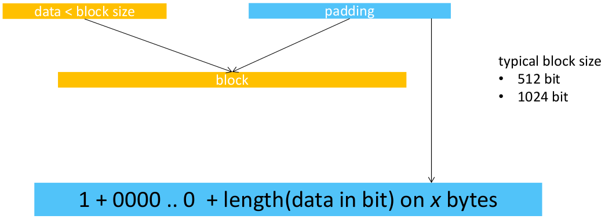
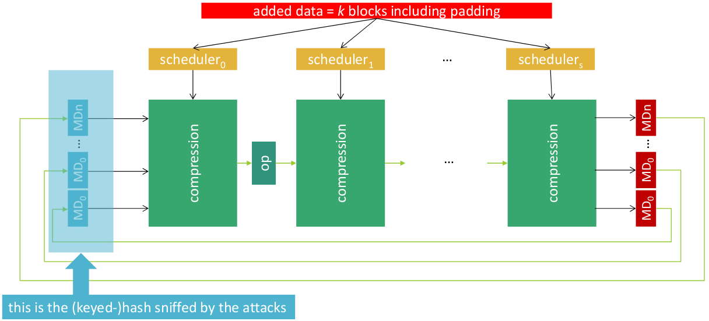
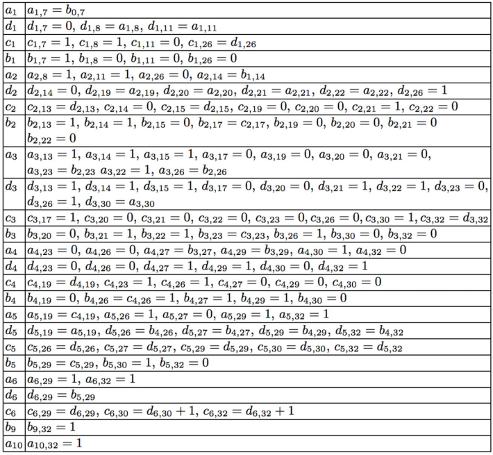

# Attacks against Hashes

## Attacks against Merkle-Damgard Hash Functions

- ***Multi-Collision Attack***: many messages generate the same hash (this is a intrinsic problem of hash function that maps infinite input to finite output, birthday paradox).
-*** Chosen-Prefix Collis
ion Attack***: given two different prefixes, find two different suffixes that generate the same hash.
- ***Length Extension Attack***: given a hash and its length, find a new hash that extends the message. This is useful to attack keyed-digests; `h = H(k || m)` find `h' = H(k || m || new_m)` without knowing `k`.

## Length Extension Attack

> Attack against keyed-digests based on Merkle-Damgard construction and secret prefix mechanism.

***Code against MD5***: [here](../../codes/hashes/LengthExstensionAttack/attack_md5.py)

We use the actual keyed digest as IV to the first round in the Merkle-Damgard construction, then we run the iteration for all new blocks added to the message.

The result will be a valid keyed digest for the new message. 

> ***Note***: for this operation we do not need to know the key. We need to sniff the keyed digest of a message that can be extended by postfixing a new message.

## Collision Attack against MD4

> Based on the paper of Wang. See [here](../../assets/otherResources/978-3-642-25243-3_19.pdf)

> Attack implementation [here](https://github.com/HMY626/MD4-Collision)

To perform successfully this attack we have to satisfy a set of sufficient conditions:

(It seems a big table but are only few bytes...)
