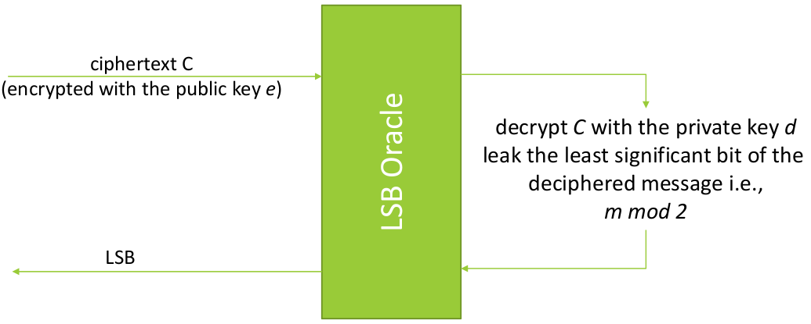

# Attacks against RSA

> ***Mathematical attacks***: most of the attacks against RSA try to exploit the mathematical properties of the algorithm. This means that a wrong choice of the parameters can lead to weak cryptographic properties.

> ***Implementation attacks***: the strong mathematical background of RSA can lead to weak implementations from programmers that do not understand completely this background.

## Category of attacks

> In general, all this attacks are allowed by the fact that the parameters (primes, public exponent, private exponent) are not chosen properly.

- ***Attacks based on factorization***: the attacker tries to factorize the modulus `n` to obtain the private key `d`.

    $$
    \begin{align*}
        &p,q = factorize(n)\\
        &phi = (p-1)*(q-1)\\
        &d = inv(e, phi)\\
    \end{align*}
    $$

    Factorization is a very hard problem when the primes are big enough, almost always the prime are selected properly and the attack is not feasible.

- ***Attacks based on the ciphertext***: the attacker tries to obtain the plaintext `m` from the ciphertext `c` without knowing the private key `d`. This is very useful when the RSA encryption is used to encrypt a secret key.

- ***Attacks based on recover the private key***: the attacker tries to recover the private key `d`. This can happen when primes and exponents are not chosen properly, the crypto-system become vulnerable to some specific mathematical theorems.

## Number Theory

### Bezout's identity

> ***Bezout's identity***: given two integers $n_1$ and $n_2$, there exist two integers $u$ and $v$ such that $u*n_1 + v*n_2 = gcd(n_1, n_2)$.

The Bezout's identity is the base of the ***Extended Euclidean Algorithm*** and can be used to compute the ***modular multiplicative inverse*** when $n_1$ and $n_2$ are coprime.

> 
> $u*n_1 + v*n_2 = gcd(n_1, n_2)$
>
> if we have $gcd(n_1, n_2) = 1$, working in modulo $n_2$ we have:
> 
> $u*n_1 + v*n_2 = 1 (\mod n_2)$
> 
> We note that $v*n_2 \mod n_2 = 0$, then:
>
> $u*n_1 = 1 (\mod n_2)$
>
> From this we can see that $u$ is the modular multiplicative inverse of $n_1$ in modulo $n_2$.
> 

### Extended Euclidean Algorithm

> $(u, v, gcd(n_1, n_2)) = egcd(n_1, n_2)$ such that $u*n_1 + v*n_2 = gcd(n_1, n_2)$.

```python

def egcd(a,b):

    if a == 0:
        return (b, 0, 1)

    g, u1, v1 = egcd(b % a, a)

    u = v1 - (b // a) * u1
    v = u1

    return (g, u, v)
```

### Integer roots modulo m

> ***Integer $kth$ roots modulo m***: given an integer $x$ and a modulus $m$, find $r$ such that $x = r^k \mod m$

> ***Important***: `pow` function does not compute the integer root.

The implementations are based on Newton's method.

```python

def iroot(k, x):
    u, s = x, x+1
    while u < s:
        s = u
        t = (k-1) * s + x // pow(s, k-1)
        u = t // k
    return s
```

Some implementation of this function can be found in the python module `gmpy2`.

## Attacks

### Fermat's Factorization - Find `p` and `q`, compute `d`

The Fermat's Factorization works when `p` and `q` are close to each other. We can rewrite the two primes as follow:

$p = a + b$
$q = a - b$

Where `b` is a small integer

$n = p*q = (a+b)*(a-b) = a^2 - b^2$

The algorithm is based on an approximation cycle of the square root of $n$:

1. It starts from the midpoint between $p$ and $q$ ($a$): $a = b = sqrt(n)$.
2. Then it increases $a$ and recompute $b$.
3. It will stops when find $a$ and $b$ such that $a^2 - b^2 = n$.

```python

def fermat_factorization(n):

    a = iroot(2, n)
    b = 0

    while True:
        b = a*a - n
        if is_square(b):
            break
        a += 1

    p = a + iroot(2, b)
    q = a - iroot(2, b)

    return p, q
```

Where `iroot` is the [integer root function](#integer-roots-modulo-m) and `is_square` is a function that check if a number is a perfect square:

```python

def is_square(n):
    return iroot(2, n)**2 == n
```

### Common Prime Factor Attack - Find `p` and `q`, compute `d`

This attack works when, for some reason, the same prime is used to generate two different moduli.

$n_1 = p*q_1$
$n_2 = p*q_2$

If we compute the gcd of the two moduli by using the Eucledian algorithm (very fast) we obtain `p`.

```python

    p = gcd(n_1, n_2)

    q_1 = n_1 // p
    q_2 = n_2 // p
```

> ***Note***: if the random number generator is weak, one of the two primes can be the same. This attack can be extended to a batch of moduli.  


### Common Modulus Attack - Decrypt the message without `d`

This attack works when the same modulus is used to encrypt two different messages. This can be easily detected because the modulus is part of the public key.

Suppose to have this two public keys:

$k_1 = (e_1, n)$
$k_2 = (e_2, n)$

The attacker gets the same message encrypted with the two public keys:

$c_1 = m^e_1 \mod n$
$c_2 = m^e_2 \mod n$

The attacker can use the Bezout's identity and write the following:

$u*e_1 + v*e_2 = gcd(e_1, e_2)$

Then, suppose that $gcd(e_1, e_2) = 1$, we can write:

$u*e_1 + v*e_2 = 1$

> Note that is very common to find $e_1$ and $e_2$ coprime ($gcd(e_1, e_2) = 1$), it is because the public exponent is usually chosen as a small prime number to optimize the encryption process (fast exponentiation).

Now we can write:

$c_1^u * c_2^v = m^(u*e_1 + v*e_2) = m^1 = m \mod n$

> ***Important***: the generation of new `e` is easy. The computation of a new `n` is expensive. When the target are smartcards or small power devices, sometimes the `n` is fixed and the `e` is changed (***this is a very bad practice***).

### Low Public Exponent Attack - Decrypt the message without `d`

This attack has two requirements:

- The public exponent $e$ is small.
- The message is short: $m^e < n$.

The best case is when $e = 3$, but can work with other small $e$ values.

```python

def low_public_exponent_attack(c, e):

    m = iroot(e, c)

    return m
```

The key point is that the message is short and the exponent is small, the ciphertext will be smaller then the modulus: the modulus operation will not affect the message.

### Hastad's Broadcast Attack - Decrypt the message without `d`

The Hastad's Broadcast Attack is an extension of the [Low Public Exponent Attack](#low-public-exponent-attack-decrypt-the-message-without-d).

The requirements are:

- The public exponent $e$ is reasonably small.
- The message is encrypted $e$ time with the same public exponent $e$ and different moduli $n_i$.
- The $n$ must be coprime: $gcd(n_i, n_j) = 1\ \ \ \forall (i,j)\ :\ i \neq j$.


The attack is based on the Chinese Remainder Theorem (CRT).

We have:

- $k_i = (e, n_i)$
- $c_i = m^e \mod n_i$

We call $n = n_1 * n_2 * ... * n_e$. The CRT ensure that we can find a number $c = m^e mod n$.

Now, we can apply the [Low Public Exponent Attack](#low-public-exponent-attack-decrypt-the-message-without-d) to find $m$.

> Note that the $n$ is larger then the $n_i$, this means that the message can be longer.

```python

def hastad_broadcast_attack(C, N, e):
    if len(N) != e:
        raise ValueError("Wrong number of moduli")

    c, _ = crt(N, C)
    m = iroot(e, c)

    return m
```

Where `crt` is the **Chinese Remainder Theorem** and is implemented in the module `sympy`.

```python
from sympy.ntheory.modular import crt
```

An other possible implementation of the attack with `e = 3` is the following:

```python

def hastad_broadcast_attack(C, N):
    assert len(C) == len(N) == 3

    g, u0, v0 = egcd(N[0], N[1])
    g, u1, v1 = egcd(N[0], N[2])
    g, u2, v2 = egcd(N[1], N[2])

    c0 = C[0] * u0 * (N[1] * N[2])
    c1 = C[1] * u1 * (N[0] * N[2])
    c2 = C[2] * u2 * (N[0] * N[2])

    c = c0 + c1 + c2

    m = iroot(3, c)

    return m
```


### LSB Oracle Attack - Decrypt the message without `d`

<div style="width: 100%; max-width: 800px; min-width: 300px">



</div>

<br>

***Assumption***: the oracle must leak the last bit of the ***plaintext***. 

The ciphertext $c$ is $c = m^e \mod n$, with $m < n$

Suppose to send to the oracle the following ciphertext $c_0 = 2^e * c \mod n$. The oracle will receive:

$c_0 = 2^e * c \mod n$
$c_0 = 2^e * m^e \mod n$
$c_0 = (2 * m)^e \mod n$

So it will decrypt a message $m_0$ that is $2 * m$. The multiplication by $2$ is a left shift of $1 \text{bit}$ of the plaintext.

Let's see what happen:

`2m` is a even number: we have multiply by `2` a number, this means that the result will be even.

Now, we are working in modulus `n = p*q`. The integers `p` and `q` are primes, this means that they are odd. The product of two odd numbers is odd, this means that `n` is odd.

If `m` is less then `n/2`, `2m` is less then `n`. So the last bit of `2m` is `0`.

If `m` is greater then `n/2`, `2m` is greater then `n`. As consequence that we are working in modulus `n`, we can rewrite `2m mod n = 2m - n`. A even number minus an odd number is an odd number, this means that the last bit of `2m` is `1`.

The conclusion is that:

- If we leak `0`, the LSB of `m` is `0`, then `m` is less then `n/2`.
- If we leak `1`, the LSB of `m` is `1`, then `m` is greater then `n/2`.

This process can be the atomic operation in a binary search, the attacker can recover all bits of the plaintext by sending $c_i = 2^(e*i) * c$ to the oracle.

After each iteration the attacker can restrict the search space.

```python

def LSB_oracle_attack(c, e, n, oracle):

    lower_bound = 0
    upper_bound = n

    b = 2

    while lower_bound < upper_bound:
        ci = pow(b, e, n) * c % n
        
        lsb = oracle(ci)

        if lsb == 0:
            upper_bound = (lower_bound + upper_bound) // 2
        else:
            lower_bound = (lower_bound + upper_bound) // 2

        b = b*2
    
    m = lower_bound
    return m
```

The search as a complexity of $O(log(n))$.

### Low Private Exponent Attack - Recovering `d`

This attack works when the private exponent `d` is small and it can be recovered by using advanced mathematical techniques from the public key `kpub = (e, n)`.

This mathematical techniques are based on the ***Continued Fraction Expansion*** and ***Lattice Reduction***.

When `n = p*q` with `p < q < 2q` (the primes have the same size in terms of bits), we can consider `d` low when:

- $d < n^{0.25}$ for the **Wiener's attack** (*Continued Fraction Expansion*).

- $d < n^{0.292}$ for the **Boneh-Durfee's attack** (*Lattice Reduction*).

#### CopperSmith's Short Pad Attack

Given a message $m$ padded with two random values (PKCS#1):

- $m_1 = m\ ||\ r_1$
- $m_2 = m\ ||\ r_2$

And encrypted with the same public key `kpub = (e, n)`:

- $c_1 = m_1^e \mod n$
- $c_2 = m_2^e \mod n$

The attack is based on the Franklin-Reiter Related Message Attack and allows to recover the message $m$ from the two ciphertexts $c_1$ and $c_2$.

The only requirement is, $p < floor(n / e^2)$ where `p` is the length of the padding.

> ***Important***: ***`p`*** is the ***length of the padding***, not the value of one of two primes used to compute `n`

> ***Note***: the modern padding schemes are designed to introduce a non linear properties between the two messages. This avoid this attack.

### Other attacks - Implementation attacks

#### Side Channel Attacks

- **Timing attacks**: the goal is guess the values of bits from the time needed to perform some operations. Remember that the time needed to perform an exponentiation is related to the number of bits set to `1` in the exponent.

- **Power consumption attacks**: the goal is guess the values of bits from the power consumption of the device.

#### Fault attacks

The goal of the attack is to recover one of two primes from the implementation of RSA decryption with CRT. The attacker can force an error in the decryption process and recover the prime that is not affected by the error.

