# Block Ciphers

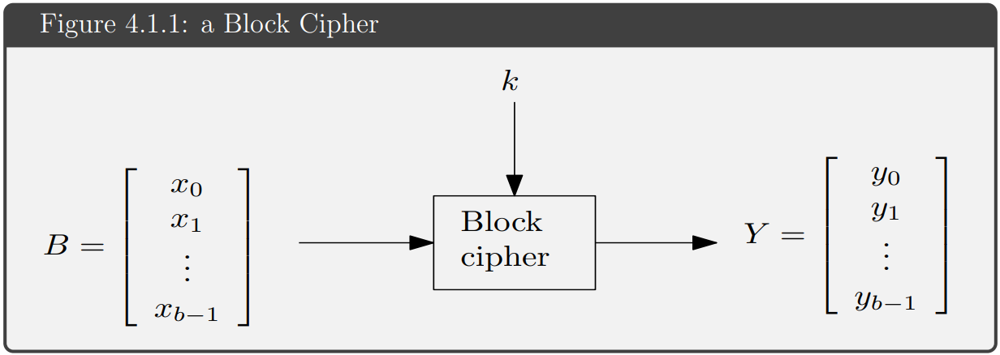

> A block cipher is a [symmetric encryption](#symmetric-encryption) algorithm that encrypts a fixed-length block of plaintext $p_i$ with a key $k$. 

## Shannon's Principles

Shannon defines two atomic operations:

> ***Confusion***: the relationship between the plaintext and the ciphertext must be obscured. (ex. substitution)

> ***Diffusion***: the influence of each plaintext bit is spread over many ciphertext bits. (ex. permutation)

The goal of building a block cipher is combining these two operations many times to obtain a secure cipher:

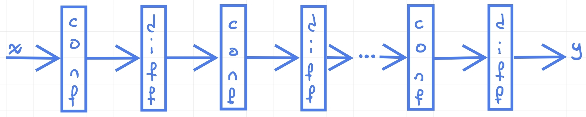

## Data Encryption Standard (DES)

The DES is a block cipher based on the Feistel network. It gets a 64-bit plaintext and a 56-bit key as input and produce a 64-bit ciphertext as output.

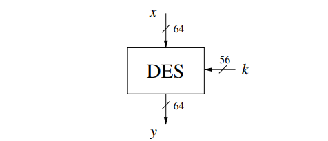

The DES algorithm is composed by 16 rounds of encryption, it is the same operation for each round using a different subkey (all derived by the main key). Before the first round the plaintext is permuted by the **initial permutation** ($IP$) and after the last round the ciphertext is permuted again by the **final permutation** ($FP$), the final permutation is the inverse of the initial permutation: $FP = IP^{-1}$.

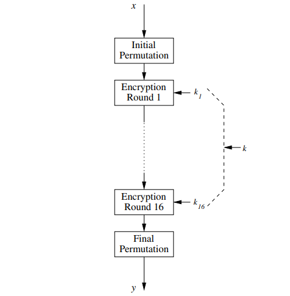

Each round consists in a Feistel network with a different subkey.

### Feistel Network

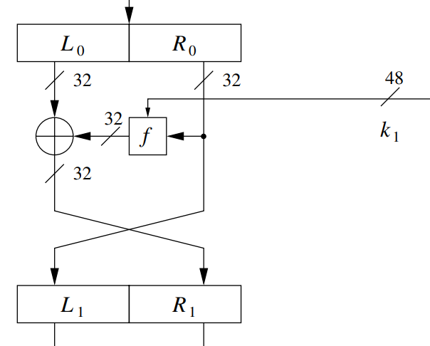

The 64-bits block is divided in two 32-bits blocks: $L_i$ and $R_i$.

The output of the Feistel network is computed as:

$L_{i+1} = R_i$

$R_{i+1} = L_i \oplus f(R_i, K_i)$

> ***Note***: one round of the Feistel network encrypts only one half of the block using, as key, the combination of the other half and the subkey.

> ***Important***: according with the previous note, is fundamental that the two blocks are swapped after each round.

In a single round, the encryption process appears as a stream cipher where the function $f$ is the PRNG.

> ***Decryption***: the decryption process is the same as the encryption process, but the subkeys are used in reverse order.

### DES Internals

#### $IP$ and $IP^{-1}$

The two permutation are simle bit permutation, they are inserted only for electrical reasons (speed-up the interface with the bus).

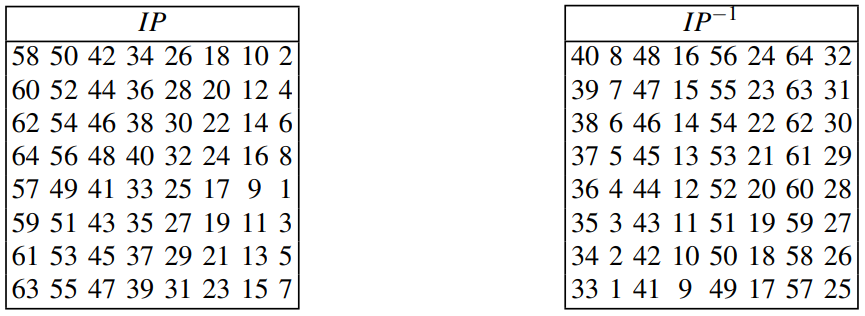

> ***Some considerations***: the NSA wants that this algorithm is only used in hardware implementations, the implementation of a permutation is very easy and fast in hardware. In software the implementation of a permutation is very slow.

#### $f$ function

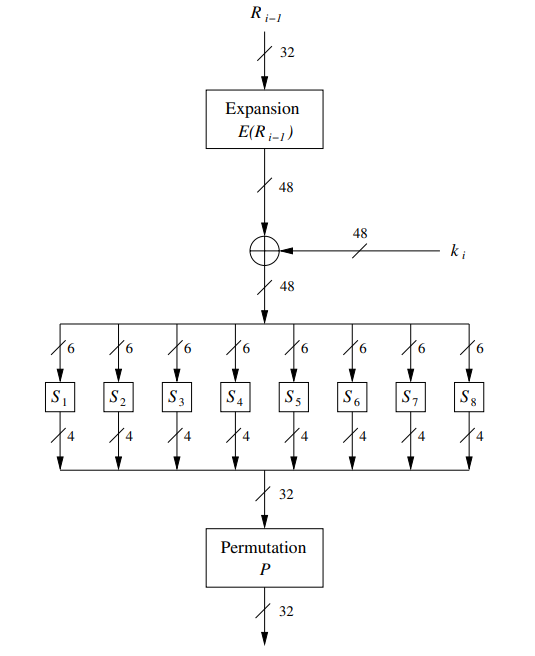

The $f$ function is composed by:

**1.** ***E-Box***: The expansion box is a permutation that expands the 32-bits of the right block to 48-bits. The expansion is performed by duplicating some bits and provides **diffusion**.

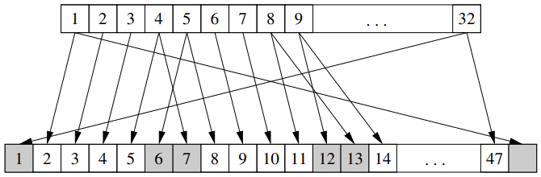

**2.** ***XOR***: The output of the expansion box is XORed with the subkey.

**3.** ***S-Boxes***: The S-Boxes are 8 boxes that get 6-bits as input and return 4-bits as output. The S-Boxes provide **confusion**. This is the heart of the DES algorithm and are implemented with a lookup table.

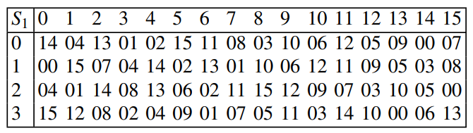

The access to the S-Boxes is performed by decoding in a particular way the 6-bits input: the first and the last bit are used to select the row and the middle 4-bits are used to select the column.

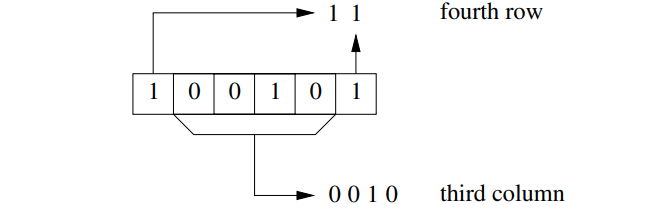

**4.** ***P-Box***: The P-Box is a permutation that permutes the 32-bits output of the S-Boxes. The P-Box provides **diffusion**.

### DES Key Schedule

The DES key schedule algorithm is a function that derives 16 subkeys of 48-bits from the main key of 56-bits.

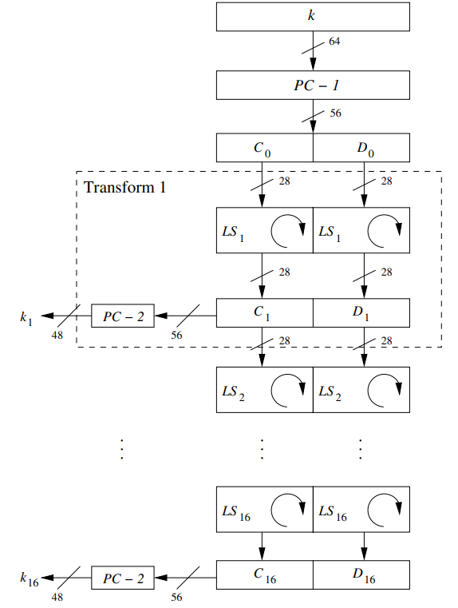

***Preprocessing***:

**1.** ***PC-1***: The PC-1 is a permutation that permutes the 64-bits key, dropping 8 bits and obtaining a 56-bits key (the bits dropped are the last bit of each byte).

**2.** The 56-bits key is divided in two 28-bits blocks: $C_0$ and $D_0$.

***Round operations***:

**-** ***Shift***: Each block is left shifted by a number of positions that depends on the round number: for rounds 1, 2, 9, 16 the blocks are shifted by 1 position, for the other rounds the blocks are shifted by 2 positions. 

**-** ***PC-2***: The $C_i$ and $D_i$ blocks are concatenated and permuted by the PC-2 permutation that drops 8 bits, obtaining the 48 bits of the subkey $K_i$.

The process is iterated for all 16 rounds generating all the subkeys. Note that the total number of shifts on the blocks after all the rounds is 28: this means that $C_{16} = C_0$ and $D_{16} = D_0$.

***Important***: the subkeys are only a permutation of the main key.

### DES Decryption

The decryption process is exactly the same as the encryption process, but the subkeys are used in reverse order. This is possible because the rounds are bases on the Feistel network. 

The key schedule algorithm must be inverted, but it is very easy because the last blocks $C_{16}$ and $D_{16}$ are equal to the first blocks $C_0$ and $D_0$. So, starting from them we need only to perform the right shifts instead the left shifts.

The **IP** and **FP** permutations must be swapped.

### Security of DES

The DES key space is too small to be considered secure.

1) **Analytical attacks**:

- **With differential cryptanalysis** it is possible to break the DES with $2^{47}$ chosen plaintexts. The result is better than brute force, but it is still not practical because requires TB of data encrypted with the same key.

- **With linear cryptanalysis** it is possible to break the DES with $2^{43}$ chosen plaintexts. The result is still better than other attack, but it is still not practical for the same reason.

2) **Brute force attack**:

The brute-force attack requires $2^{56}$ encryptions, before the 1998 this was unfeasible, but:

- 1998 - Deepcrack: 56h to break the DES (cost: $250.000).
- 2007 - COPACOBANA: 36h to break the DES (cost: $10.000).

> ***Notes about the S-Boxes***: the S-Boxes was projected in '70 by IBM, there are some considerations about them:
> - The S-Boxes may contain a backdoor.
> - The S-Boxes resist to differential cryptanalysis and linear cryptanalysis, although this techniques were not known in '70.
> - The S-Boxes are the non-linear element of DES, they are fundamental for the security of the algorithm: the outputs and the inputs of DES cannot be the unknowns in a linear equation system.

## Alternative to DES

- AES: Advanced Encryption Standard. Standard de facto for symmetric encryption in all of the world.
- 3DES: Triple DES. It is a variant of DES that uses 3 keys and 3 rounds of encryption. It is still used in some applications, but it is not secure as AES.
- All AES-Finalists.

## AES

AES is a block cipher based on the substitution-permutation network. It was selected in 2001 as the Advanced Encryption Standard (AES) to replace DES from a list of five finalists, the winner is Rijndael.

The AES algorithm gets a 128-bit plaintext and a 128, 192 or 256-bit key as input and produce a 128-bit ciphertext as output. The number of internal rounds depends on the key length: 

- 10 rounds for 128-bit key, 
- 12 rounds for 192-bit key,
- 14 rounds for 256-bit key.

AES is based on Galois Field (GF) arithmetic.

### Introduction to Finite Fields

> Finite fields and Galois fields are synonymous.

> ***Some notes about basic algebric structures***:
>
> - A ***group*** is a set $G$ with a binary operation $+$ (and $-$).
> - A ***ring*** is a set $R$ with two binary operations $+$, $-$ and $\cdot$.
> - A ***field*** is a set $F$ with these binary operations $+$, $-$, $\cdot$ and $()^{-1}$ (inverse).

> ***Theorem***: finite fields exist only if they have cardinality $p^m$ where $p$ is a prime number and $m$ is a positive integer.

#### Types of Finite Fields

- **Prime fields**: $GF(p)$, where $p$ is a prime number ($m = 1$).

- **Extension fields**: $GF(p^m)$, where $p$ is a prime number and $m$ is a positive integer.

> ***Note***: $GF(2^m)$ is very important in cryptography.

#### Prime Fields Arithmetic

The elements of a prime field $GF(p)$ are the integers in the set $\{0, 1, ..., p-1\}$.

1. **Addition**: the addition in $GF(p)$ is the usual addition in $\mathbb{Z}_p$: $a + b \mod p$.
2. **Subtraction**: the subtraction in $GF(p)$ is the usual subtraction in $\mathbb{Z}_p$: $a - b \mod p$.
3. **Multiplication**: the multiplication in $GF(p)$ is the usual multiplication in $\mathbb{Z}_p$: $a \cdot b \mod p$.

4. ***Division***: the division in $GF(p)$ is performed by multiplying the dividend by the inverse of the divisior: **is called inversion**.

##### Inversion

Let $a \in GF(p)$, the inverse of $a$ is the element $a^{-1} \in GF(p)$ such that $a \cdot a^{-1} = 1 \mod p$.

It can be computed by using the ***Extended Euclidean Algorithm***.

#### Extension Fields Arithmetic

The extension fields are quite different from the prime fields.

##### Element representation

The elements of $GF(2^m) are polynomials of degree $m-1$ with coefficients in $GF(2)$

$$
    A(x) = a_{m-1}x^{m-1} + a_{m-2}x^{m-2} + ... + a_1x + a_0 \\
    where\ a_i \in GF(2) = \{0, 1\}
$$

An element of a extension field can be represented as a vector of bits: $A(x) = (a_{m-1}, a_{m-2}, ..., a_1, a_0)$.

##### Addition and Subtraction

The addition and the subtraction in $GF(2^m)$ are performed by adding and subtracting the coefficients of the polynomials.

$$
    C(x) = A(x) + B(x) = \sum_{i=0}^{m-1} c_i x^i \\
    where\ c_i = a_i + b_i \mod 2
$$

##### Multiplication

The multiplication in $GF(2^m)$ is performed by multiplying the polynomials, then reducing the result by the irreducible polynomial $P(x)$.

$$
    C'(x) = A(x) \cdot B(x)
    C(x) = C'(x) \mod P(x)
$$

The modulo reduction is the remainder of the polynomial division of $C'(x)$ by $P(x)$.

##### Inverison

The inverse $A^{-1}(x)$ of $A(x)$ is the element $A^{-1}(x) \in GF(2^m)$ such that $A(x) \cdot A^{-1}(x) = 1 \mod P(x)$.

### Introduction to AES

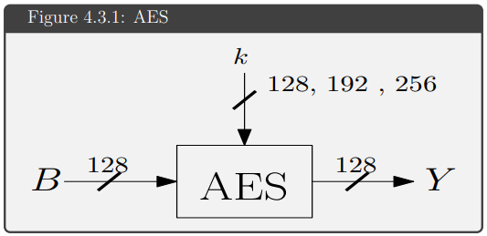

Remarks:

1. AES is by now the most important symmetric encryption algorithm.
2. NSA allows AES for classified data up to top secret with 192 and 256-bit keys.

### Structure of AES

> ***Important***: AES is not a Feistel network, it is a substitution-permutation network.

> ***Important***: AES encrypts the entire block in one single round, this means that the 10/12/14 rounds encrypts 10/12/14 times the block.

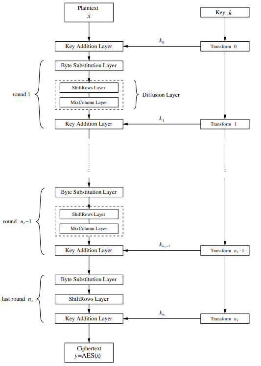

> At the very beginning of the process the key is added: this is called ***key whitening***. 

> ***Note***: the last round does not perform the ***MixColumns*** operation.

### AES Operations

The operation of AES are the following:

1. ***Byte Substitution***: it is a substitution box implemented with a lookup table. It is a non-linear operation that provides confusion.

2. ***Shift Rows***: it is a permutation that shifts the rows of the state. It provides diffusion.

3. ***Mix Columns***: it is a linear operation that mixes the columns of the state. It provides diffusion.

4. ***Add Round Key***: it is a XOR operation between the state and the round key.

### Internals of AES

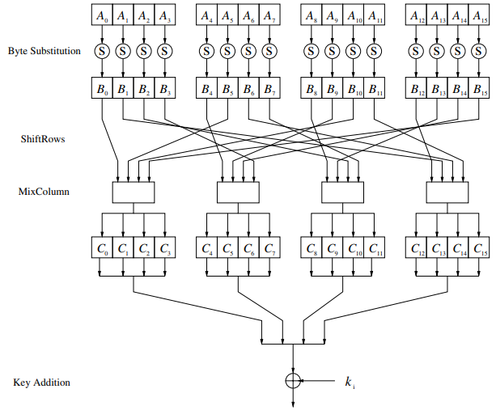

The 128 bits of the inputs block are divided in 16 blocks (each one of 1 byte)

#### Byte Substitution

The byte substitution is performed by a substitution box (S-Box) implemented with a lookup table. The mathematical description of the S-Box is based on the $G(2^8)$ field.

$$
    B'_i = A_i^{-1} \mod P(x) \\
    B_i = affine\_mapping(B'_i)
$$

Example:

Consider $A_i \in GF(2^8)$ and compute the inverse:

$$
    A_i = 1100\ 0000 \rightarrow A_i(x) = x^7 + X^6 + 1 \\
    B'_i = 0010\ 1111 \leftarrow B'_i(x) = A^{-1}_i = x^5 + x^3 +x^2 + x + 1 \\
$$

Then apply the affine mapping:

$$
    B_i =  \begin{bmatrix}
                b_0\\
                b_1\\
                b_2\\
                b_3\\
                b_4\\
                b_5\\
                b_6\\
                b_7\\
            \end{bmatrix}
        \equiv
            \begin{bmatrix}
                1 & 0 & 0 & 0 & 1 & 1 & 1 & 1\\
                1 & 1 & 0 & 0 & 0 & 1 & 1 & 1\\
                1 & 1 & 1 & 0 & 0 & 0 & 1 & 1\\
                1 & 1 & 1 & 1 & 0 & 0 & 0 & 1\\
                1 & 1 & 1 & 1 & 1 & 0 & 0 & 0\\
                0 & 1 & 1 & 1 & 1 & 1 & 0 & 0\\
                0 & 0 & 1 & 1 & 1 & 1 & 1 & 0\\
                0 & 0 & 0 & 1 & 1 & 1 & 1 & 1\\
            \end{bmatrix}
        \cdot
            \begin{bmatrix}
                b'_0\\
                b'_1\\
                b'_2\\
                b'_3\\
                b'_4\\
                b'_5\\
                b'_6\\
                b'_7\\
            \end{bmatrix}
        +
            \begin{bmatrix}
                1\\
                1\\
                0\\
                0\\
                0\\
                1\\
                1\\
                0\\
            \end{bmatrix}
        \mod 2
$$

#### Shift Rows

Rappresenting the state as a matrix, the shift rows operation shifts the rows of the state matrix to the left of a number of positions that depends on the row number:

- The first row is not shifted.
- The second row is shifted by 1 position.
- The third row is shifted by 2 positions.
- The fourth row is shifted by 3 positions.

$$
    \begin{bmatrix}
        \bold{B_0} & B_4 & B_8  & B_{12}\\
        \bold{B_1} & B_5 & B_9  & B_{13}\\
        \bold{B_2} & B_6 & B_{10} & B_{14}\\
        \bold{B_3} & B_7 & B_{11} & B_{15}\\
    \end{bmatrix}
    \rightarrow
    \begin{bmatrix}
        \bold{B_0} & B_4 & B_8  & B_{12}\\
        B_5 & B_9 & B_{13} & \bold{B_1}\\
        B_{10} & B_{14} & \bold{B_2} & B_6\\
        B_{15} & \bold{B_3} & B_7 & B_{11}\\
    \end{bmatrix}
$$

#### Mix Columns

The mix columns operation consists in multiplying the state matrix by a fixed matrix $M$.

$$
    \begin{bmatrix}
        C_0\\
        C_1\\
        C_2\\
        C_3\\
    \end{bmatrix}
    \cdot
    \begin{bmatrix}
        2 & 3 & 1 & 1\\
        1 & 2 & 3 & 1\\
        1 & 1 & 2 & 3\\
        3 & 1 & 1 & 2\\
    \end{bmatrix}
    =
    \begin{bmatrix}
        B'_0
        B'_5
        B'_{10}
        B'_{15}
    \end{bmatrix}
$$

This performed for each column of the state matrix.

#### Add Round Key

The add round key operation is a XOR operation between the state matrix and the round key.

## Multiple Encryption and Meet-in-the-Middle Attack

> ***Question***: DES is a well designed algorithm, it is possible increase the security against the brute-force by encrypting the plaintext multiple times?

### Double Encryption

A first step to increase the security of DES (and any other block cipher) is to **encrypt the plaintext twice with two different key**.

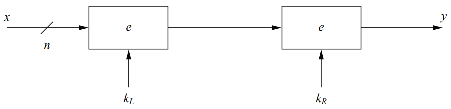

#### Resistance to Brute Force

The naive approach to brute-forcing 2DES is to try all the possible keys for $K_L$ and $K_R$. This means doubling the effort of the brute-force attack on DES.
if the key space is $2^n$ and the plaintext space is $2^m$, then the number of false positives is $2^{n-m}$.
$x_1 \stackrel{\text{\tiny ?}}{=} e^{-1}_{k_L}(\ e^{-1}_{k_R}(\ y_1\ )\ ),\ \ \forall k_L \in \mathcal{K}_L, k_j \in \mathcal{K}_R$

So $|\mathcal{K}_L = 56bit|$ and |$\mathcal{K}_R = 56bit|$, then $|\mathcal{K}_L \times \mathcal{K}_R| = 2^{112}$.

***If we cannot find a best attack, we can say that is a good way to securing DES***

#### Meet-in-the-Middle Attack

But is not true, there is a better attack: the ***Meet-in-the-Middle Attack***. The goal of this attack is search the two keys separately, this means that the complexity pass from $2^{56} \cdot 2^{56}= 2^{112}$ to $2^{56} + 2^{56} = 2^{57}$ (Add instead Mult).

- **Phase 1**: brute-forcing the first key.

    Search throw all possible $k_L \in \mathcal{K}_L$, the attacker compute and <u>store</u> all possible single-**encrypted** version of the plaintext $x_1$.

    $z_{L,i} = e_{k_L,i}(\ x_1\ )$

    | $\mathcal{Z}_L$     | $\mathcal{K}_L$     |
    |-----------|-----------|
    | $z_{L,0}$ | $k_{L,0}$ |
    | $z_{L,1}$ | $k_{L,1}$ |
    | ...       | ...       |
    | $z_{L,2^{56}-1}$ | $k_{L,2^{56}-1}$ |

    > **Complexity for phase 1**: $2^{56}$ encryptions + $2^{56}$ storage.

- **Phase 2**: brute-forcing the second key.

    Search throw all possible $k_R \in \mathcal{K}_R$, the attacker compute all possible single-**decrypted** version of the ciphertext $y_1$ searching for a collision in $\mathcal{Z}_L$.

    $z_{R,i} = e^{-1}_{k_R,i}(\ y_1\ )\ \rightarrow\ \stackrel{\text{\tiny ?}}{\exists} z_{L,i} \in \mathcal{Z}_L\ st\ z_{L,i} = z_{R,i}$

    When a collision is found, the attacker has found the pair of keys $(k_{L,i}, k_{R,j})$ such that $e_{k_{L,i}}(\ e_{k_{R,j}}(\ x_1\ )\ ) = y_1$.

    > ***Important note***: the attacker sometimes have to use a second pair of $(x_2, y_2)$ to verify the collision and exclude false positives.

    > **Complexity for phase 2**: $2^{56}$ decryptions.

- **Total complexity**: $2^{56} + 2^{56} = 2^{57}$ algorithm operations + $2^{56}$ storage. It is important to understand that the effort of the attack is twice the effort of the brute-force attack on normal DES: suppose to use COPACOBANA, the effort is $2^{57} = 2^{56} * 2 \approxeq 36h * 2 \approxeq 72h$.

### Triple Encryption

Double encryption fails in increasing the security of DES, but what about triple encryption?

The concept behind triple DES is the same used for double encryption: the plaintext is encrypted three times with three different keys (note, the first and the third key can be the same).

> ***Naive brute-force attack***: the naive approach requires $2^{56} \cdot 2^{56} \cdot 2^{56} = 2^{168}$ encryptions. It is not feasible, but is not the best attack.

> ***Meet-in-the-Middle attack***: the best attack is the meet-in-the-middle attack. With three steps of encryption, the attacker needs to search for two keys at the same time. 
>
> - **Phase 1**: brute-forcing the first key. The process is the same of 2DES, the attacker need to try all possible $k_L \in \mathcal{K}_L$ and compute and store all possible single-encrypted version of the plaintext $x_1$. 
> 
>   **Complexity**: $2^{56}$ encryptions + $2^{56}$ storage.
>
> - **Phase 2**: brute-forcing the second and the third key. The attacker, now, cannot find directly a collision by decrypting $y_1$ but he needs to decrypt twice the ciphertext to be able to find a collision.
>
>   **Complexity**: $2^{56} \cdot 2^{56} = 2^{112}$ decryptions.
>
> The total complextity is $2^{56} + 2^{112} \approxeq 2^{112}$ algorithm operations + $2^{56}$ storage. At this moment, this can be considered secure.

> ***Important note about multiple encryption***: multiple encryption is a possibility to increase the security of a well designed cipher with a small key space. But it is important to remark that all even numbers of encryption are non very useful because the meet-in-the-middle attack can be applied.
>
> Considering DES:
>
> | Number of encryption | Complexity |
> |----------------------|------------|
> | 1                    | $2^{56}$   |
> | 2                    | $2^{57}$   |
> | 3                    | $2^{112}$  |
> | 4                    | $2^{113}$  |
> | 5                    | $2^{168}$  |
> | 6                    | $2^{169}$  |
> | ...                  | ...        |
>
> We can conclude that:
> - **odd numbers**: doubling the exponent of the complexity.
> - **even numbers**: doubling the complexity (exponent + 1).

#### EDE Mode

The EDE mode is a mode of structuring 3DES from three standard DES module:

$$
    y = e_{k_3}(\ e^{-1}_{k_2}(\ e_{k_1}(\ x\ )\ )\ )
$$

The first and the last blocks perform the encryption and the second block performs the decryption. This mode is called ***EDE*** (Encrypt-Decrypt-Encrypt).

> **Why?**: this is done to maintain compatibility with DES, if the first and the second key are the same dummy key (or all keys are equals, but a safe key), the EDE mode is equivalent to (single) DES.

### False Positive in Brute Force Attacks

> ***A brute force attack can produce false positives***.

A simmetric algorithm can be viewed as a function $f$ that maps a plaintext $x_i$ from the $\mathcal{P}$ space to a ciphertext $y_i$ in the $\mathcal{C}$ space by using a specific key $k$ from the $\mathcal{K}$ space.

Suppose:

$|\mathcal{P}| = |\mathcal{C}| = 2^{64}$

$|\mathcal{K}| = 2^{80}$

There are $2^{80}$ possible mapping from $\mathcal{P}$ to $\mathcal{C}$, if the mapping select random elements from $\mathcal{C}$. Suppose that before to find the $k^{(1)}$ which map $x_1 \rightarrow y_1$, the attacker find all other possible $y_i$: this means that the attacker tries $2^{64}$ keys before to find that key.

***This number is smaller then key space size: $2^{80}$! This means that more key must generate the same ciphertext for a given plaintext.***

$$
key\ candidates = \frac{|\mathcal{K}|}{|\mathcal{P}|} = \frac{2^{80}}{2^{64}} = 2^{16} = 65536
$$

***But only one is the one used by the sender***

> ***Idea***: use a second pair of $(x_2, y_2)$ to verify the collision and exclude false positives.

> ***Theorem***: given a block cipher with key length of $k$ bits, block size of $n$ bits and $t$ pairs of plaintext/ciphertext, the expected munber of false keys is:
>
> $$
> 2^{k - t \cdot n}
> $$

## Modes of Operations

The modes of operation are a set of techniques that allow to use a block cipher to encrypt a message of arbitrary length.

We can divide the modes of operation in two categories:

- **Stream cipher modes**: the block cipher is used as PRNG, the plaintext is XORed with the keystream.
- **Block cipher modes**: the block cipher is used as block cipher, the plaintext is divided in blocks and each block is encrypted and concatenated in some way.

An other important classification is:

- **Deterministic modes**: the same plaintext is always encrypted in the same way, the ECB mode is an example.
- **Non-deterministic/Probabilistic modes**: the same plaintext is encrypted in different ways, all other mode of operation are non-deterministic.

> ***Definition***: an encryption schema is ***deterministic*** if a particulare plaintext is mapped to a fixed ciphertext if the same key is used.

> ***Definition***: an encryption schema is ***probabilistic*** if the schema uses randomness to achive a non-deterministic generation of the ciphertext (the mapping plaintext-ciphertext is not fixed).

### ECB Mode - Electronic Code Book

> ***Deterministic mode***

> ***Block Cipher mode***

> ***No authentication***

The message $P$ is divided in blocks of $n$ bits, where $n$ is the block size of the cipher. Each block is encrypted indipendentely with the same key $k$.

 

$P = P_1\ ||\ P_2\ ||\ ...\ ||\ P_m$

$\ \ \ \ \ \downarrow$

$C = e_k(P_1)\ ||\ e_k(P_2)\ ||\ ...\ ||\ e_k(P_m) = e_k(P)$

The ECB encryption is a mapping function $e_k: \mathcal{P} \rightarrow \mathcal{C}$ that maps a certain block of plaintext to a certain block of ciphertext.

> ***Advantages***: it is very simple and fast, the encryption and the decryption are parallelizable and errors are localized.

> ***Disadvantages***: it is not secure, it is deterministic and it is not authenticated. It is sensible to pattern attacks and traffic analysis.
>
> An attacker can invert, drop or substitute blocks of ciphertext without knowing the key and without being detected.
>
> See [attack against ECB mode](#attacks-against-ecb-mode).

### CBC Mode - Cipher Block Chaining

> ***Non-deterministic mode***

> ***Block Cipher mode***

> ***No authentication***

The message $P$ is divided in blocks of $n$ bits, where $n$ is the block size of the cipher. The current plaintext block is XORed with the previous ciphertext block before to be encrypted.

  

> ***Initialization Vector***: the IV is a random nonce of $n$ bits that is used to XOR the first block of plaintext. This is the source of initial randomness that makes the CBC mode non-deterministic. This value does not have to be secret, but must be a nonce (`number used only once`).
> 
> *Note*: use the key as IV is a very bad idea!
>
> **Chosen Ciphertext Attack**:
>   - The attacker sends to the oracle a message with 2 identical blocks CC.
>   - The attacker receives: $P_1 = e_k^{-1}(C) \oplus IV$ and $P_2 = e_k^{-1}(C) \oplus C$.
>   - The attacker can compute: $IV = P_1 \oplus P_2 \oplus C$.
> 
> Since the $IV$ is equals to the $k$, the attacker has found the key.

### CFB Mode - Cipher FeedBack

> ***Non-deterministic mode***

> ***Stream Cipher mode***

> ***No authentication***

The block cipher is used as PRNG to generate a keystream of $n$ bits at time. The keystream is XORed with the plaintext to obtain the ciphertext.

 

The keystream is generated by encrypting the previous ciphertext block with the key $k$. The first encryption is performed by using the IV as input.

$C_i = P_i \oplus e_k(C_{i-1}),\ \ \forall i \in \{1, 2, ...\},\ with\ C_0 = IV$

$P_i = C_i \oplus e_k(C_{i-1}),\ \ \forall i \in \{1, 2, ...\},\ with\ C_0 = IV$

### OFB Mode - Output FeedBack

> ***Non-deterministic mode***

> ***Stream Cipher mode***

> ***No authentication***

The block cipher is used as PRNG to generate a keystream of $n$ bits at time. The keystream is XORed with the plaintext to obtain the ciphertext.

 

The keystream is generated by re-encrypting the previous keystream block with the same key $k$. The first encryption is performed by using the IV as input.

$C_i = P_i \oplus e_k(kb_{i-1}),\ \ \forall i \in \{1, 2, ...\},\ with\ kb_0 = IV$

$P_i = C_i \oplus e_k(kb_{i-1}),\ \ \forall i \in \{1, 2, ...\},\ with\ kb_0 = IV$

> $kb_{i-1}$ is the previous keystream block.

### CTR Mode - Counter

> ***Non-deterministic mode***

> ***Stream Cipher mode***

> ***No authentication***

The block cipher is used as PRNG to generate a keystream of $n$ bits at time. The keystream is XORed with the plaintext to obtain the ciphertext.

 

The keystream is generated by encrypting a block of data that contains a counter and a nonce (IV). The counter can be a simple incremental counter or the output of a LFSR.

$O_i = e_k(IV\ ||\ j),\ \ where\ j\ is\ the\ value\ of\ the\ counter\ for\ the\ i-th\ block$

$C_i = P_i \oplus O_i$

 

$O_i = e_k(IV\ ||\ j),\ \ where\ j\ is\ the\ value\ of\ the\ counter\ for\ the\ i-th\ block$

$P_i = C_i \oplus O_i$

### GCM Mode - Galois Counter Mode

> ***Non-deterministic mode***

> ***Stream Cipher mode***

> ***Authenticated***

The GCM mode is a combination of the CTR mode with a MAC (**t-tag**). The MAC is computed by using the Galois Field arithmetic.

- **Encryption** (GCM-ENC | CTR):

    $ctr_0 = derive\_from(IV)$

    $\forall i$:

    $\ \ \ \ ctr_i = ctr_{i-1} + 1$

    $\ \ \ \ C_i = P_i \oplus e_k(ctr_i)$

- **Authentication** (GCM-AUTH):

    $H = e_k(0^{128})\ \ \ \ \ \ \ \ \ \ \ \ \ \ \ \ Authentication\ subkey$

    $g_0 = AAD \times H\ \ \ \ \ \ \ \ \ \ \ Additional Authentication Data$

    $\forall i \in {1,\ ...,\ m}$:

    $\ \ \ \ g_i = (g_{i-1} \oplus C_i) \times H$

    $t$-$tag = (g_m \times H) \oplus e_k(ctr_0)$

> ***Important***: the $\times$ operator is the multiplication in the Galois Field.

### CCM Mode - Counter with CBC-MAC

> ***Non-deterministic mode***

> ***Stream Cipher mode***

> ***Authenticated***

The CCM mode is a combination of the CTR mode with a MAC (**t-tag**). The MAC is computed by using the CBC-MAC.

- **Encryption** (CCM-ENC | CTR):

    $ctr_0 = derive\_from(IV)$

    $\forall i$:

    $\ \ \ \ ctr_i = ctr_{i-1} + 1$

    $\ \ \ \ C_i = P_i \oplus e_k(ctr_i)$

- **Authentication** (CCM-AUTH):

    The authentication tag is computed by using the CBC-MAC. It is the last block of the ciphertext encrypted with the key $k$ in CBC mode.

    $t$-$tag = IV$

    $\forall i \in {1,\ ...,\ m}$:

    $\ \ \ \ t$-$tag = e_{k,CBC}($t$-$tag \oplus P_i)$
