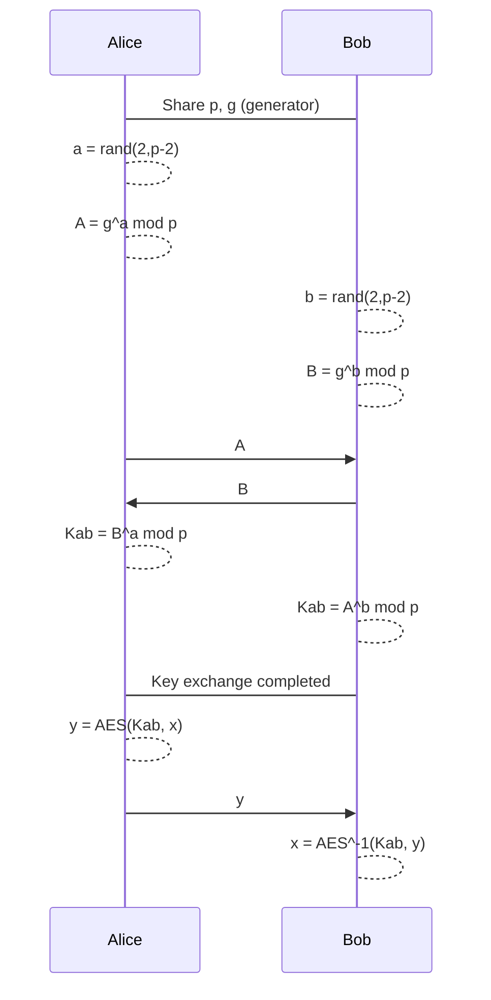
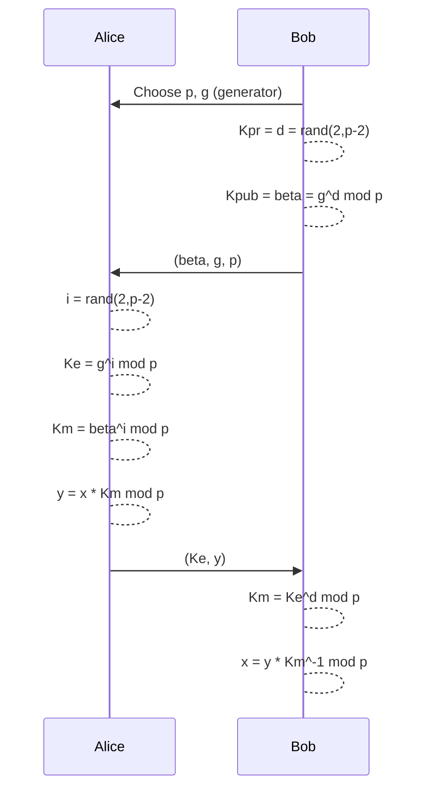

# Diffie-Hellman Key Exchange

## The Protocol

## How it works
Alice and Bob agreed on a prime number $p$ and a generator $\alpha$ of $\mathbb{Z}_p^*$.

Alice:
1. Chooses a random number $K_{pr,A} = a \in \{2, 3, ..., p-1\}.
2. Computes $K_{pub,A} = A = \alpha^a \mod p$.
3. Sends $K_{pub,A}$ to Bob.
4. Receives $K_{pub,B} = B$ from Bob.
5. Computes $K_{sym} = B^a \mod p$.

Bob:
1. Chooses a random number $K_{pr,B} = b \in \{2, 3, ..., p-1\}.
2. Computes $K_{pub,B} = B = \alpha^b \mod p$.
3. Sends $K_{pub,B}$ to Alice.
4. Receives $K_{pub,A} = A$ from Alice.
5. Computes $K_{sym} = A^b \mod p$.

## Proof of Correctness

Alice: $\ \ K_{sym} = B^a \mod p = (\alpha^b)^a \mod p = \alpha^{ab} \mod p$

Bob: $\ \ \ K_{sym} = A^b \mod p = (\alpha^a)^b \mod p = \alpha^{ab} \mod p$

## Diffie-Hellman Problem (DHP)

> ***Supposition***: the attacker is *passive*.

**DLP is**: the attacker knows $\alpha, p, A, B$ and wants to compute $K_{sym} = \alpha^{ab}$.

Solution 1:

1. Compute $a$ from $A = \alpha^a \mod p \rightarrow a = \log_{\alpha}A \mod p$
2. Compute $K_{sym} = B^a \mod p$

Solution 2:

1. Compute $b$ from $B = \alpha^b \mod p \rightarrow b = \log_{\alpha}B \mod p$
2. Compute $K_{sym} = A^b \mod p$

Both solutions are equivalent and they are based on solving the DLP.

**Unfortunately for the attacker the DLP is very hard to solve if $p$ is a very large prime**

> The Diffie-Hellman Problem is, for now, equivalent to the DLP; but is not clear if this procedure is the only one to compute $K_{ab}$. We have **NOT** proven yet.

## Attacks against DLP

1. Brute-Force Attack:

    Try all $x$ until $\alpha^x \equiv \beta \mod p$.

    ***Complexity***: $O(p)$

2. Square-Root Attack:

    There are two algorithms to compute the DLP, both with a complexity of $O(\sqrt{p})$.

    If we need a **security level** of 80 bits, we need a prime number $p$ of 160 bits.

    > **This is the best attack against Elliptic Curves**.

3. Index Calculus Attack:

    For certain groups, like $\mathbb{Z}_p^*$ and $\mathbb{GF}(2^m)^*$, the most powerful attack is the Index Calculus.

    To protect against this attack with a **security level** of 80 bits, we need a prime number $p$ of 1024 bits.

# Elgamal Encryption

> Elgamal is an asymmetric cryptosystem based on the Diffie-Hellman Key Exchange.

## Protocol

> **Choosing a new i, Alice can repeat the process to send another message**

## Proof of Correctness of elgamal

Bob computes:

$\ \ \ \ \ \ y \cdot K_m^{-1} \mod p \equiv y \cdot (K_e^d)^{-1} \mod p \equiv\\$
$\ \ \ \ \ \ \ \ \ \ \ \ \ \ \ \ \ \ \ \ \ \ \ \ \ \ \ \ \ \ \ \ \ \ \ \ (x \cdot K_m) \cdot K_e^{-d} \equiv\\$
$\ \ \ \ \ \ \ \ \ \ \ \ \ \ \ \ \ \ \ \ \ \ \ \ \ \ \ \ \ \ \ \ \ \ \ \ \ x \cdot \beta^i \cdot (g^i)^{-d} \equiv\\$
$\ \ \ \ \ \ \ \ \ \ \ \ \ \ \ \ \ \ \ \ \ \ \ \ \ \ \ \ \ \ \ \ \ \ \ \ \ x \cdot (g^d)^i \cdot (g^i)^{-d} \equiv\\$
$\ \ \ \ \ \ \ \ \ \ \ \ \ \ \ \ \ \ \ \ \ \ \ \ \ \ \ \ \ \ \ \ \ \ \ \ \ x \cdot g^{di - di} \equiv\\$
$\ \ \ \ \ \ \ \ \ \ \ \ \ \ \ \ \ \ \ \ \ \ \ \ \ \ \ \ \ \ \ \ \ \ \ \ \ x \cdot g^0 \equiv\\$
$\ \ \ \ \ \ \ \ \ \ \ \ \ \ \ \ \ \ \ \ \ \ \ \ \ \ \ \ \ \ \ \ \ \ \ \ \ x \cdot 1 \equiv\\$
$\ \ \ \ \ \ \ \ \ \ \ \ \ \ \ \ \ \ \ \ \ \ \ \ \ \ \ \ \ \ \ \ \ \ \ \ \ x$

## Advantages

1. The Elgamal encryption include the Diffie-Hellman Key Exchange.

2. After the publishing of the public key of Bob, Alice can send him messages (with different keys) without any other communication from Bob.

3. Elgamal is a **probabilistic encryption**, the randomness is provided by $i$.

## Security and Attacks

1. Compute the DLP:

    $d = \log_g \beta \mod p$

    or 

    $i = \log_g K_e \mod p$

    Generally the parameters are chosen in order to make the DLP hard to solve.

2. Attack against the generation of $i$: reuse of secret exponent.

    > ***Note***: using a TRNG, the probability of reuse of $i$ is low but is possible that it happens.

    $K_e = g^i \mod p; K_m = \beta^i \mod p$

    $y_1 = x_1 \cdot K_m \mod p; \rightarrow (y_1, K_e)$

    $y_2 = x_2 \cdot K_m \mod p; \rightarrow (y_2, K_e)$

    The attacker can trigger the usage of the same $i$ from the fact that $K_e$ is the same (this means that $K_m$ is also the same).

    Assumption: the attacker knows $x_1$ (known plaintext attack).

    $$
    \begin{cases}
        y_1 = x_1 \cdot K_m \mod p\\
        y_2 = x_2 \cdot K_m \mod p\\
    \end{cases}
    $$

    The attacker can find the second plaintext by computing: $x_2 = y_2 \cdot y_1^{-1} \cdot x_1 \mod p$. This can be extended to any other message with the same $K_e$.

# Rabin Cryptosystem

> The Rabin cryptosystem is an asymmetric cryptosystem based on [Quadratic Residues](#quadratic-residues-solving-x2--r--mod-n).

## Key generation - $Gen(\lambda)$

$Gen(\lambda)$: choose two prime numbers $p,q$ such that $p \equiv q \equiv 3 \mod 4$ and $p \ne q$, compute $N = p \cdot q$.

The public key is $K_{pub} = N$ and the private key is $K_{pr} = (p,q)$.

## Encryption - $Enc_{K_{pub}}(x)$

$Enc_{K_{pub}}(x)$: compute $y = x^2 \mod N$.

## Decryption - $Dec_{K_{pr}}(y)$

$Dec_{K_{pr}}(y)$: compute $x_p = y^{\frac{p+1}{4}} \mod p$ and $x_q = y^{\frac{q+1}{4}} \mod q$.

Then compute with the [Chinese Remainder Theorem](#chinese-remainder-theorem-crt): $x = crt(x_p, x_q, p, q)$.
