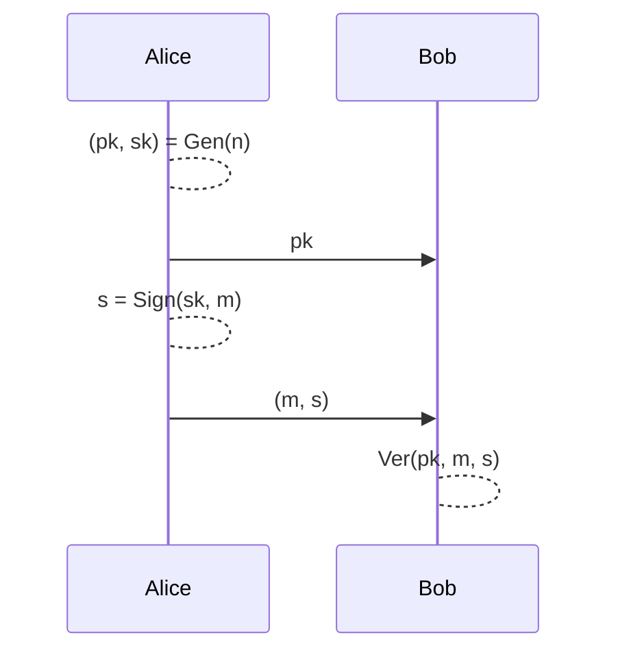
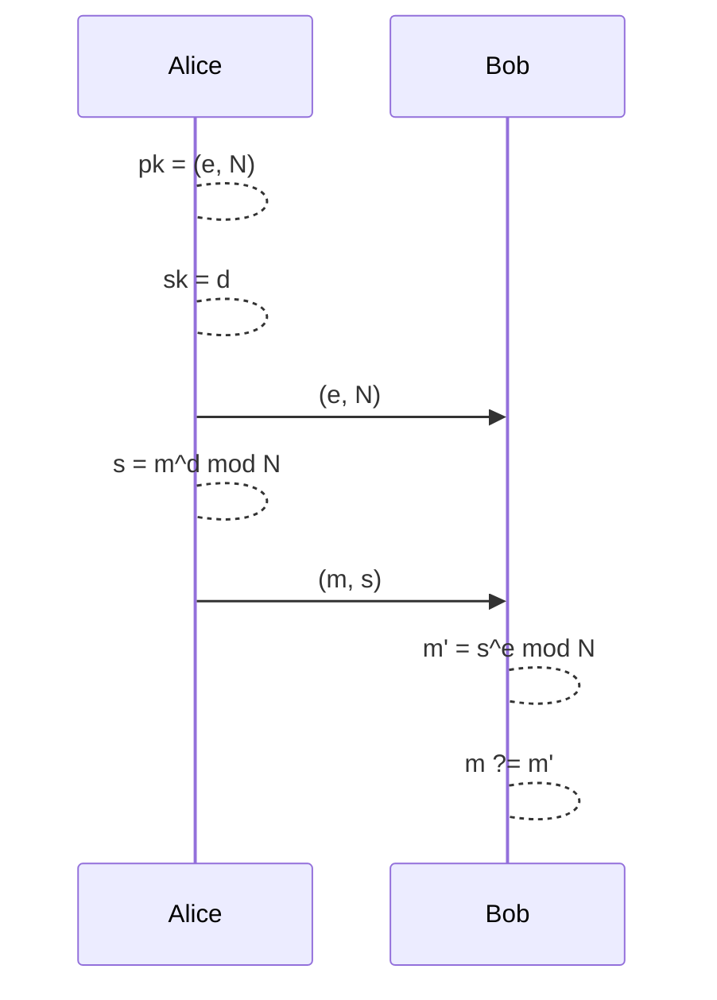
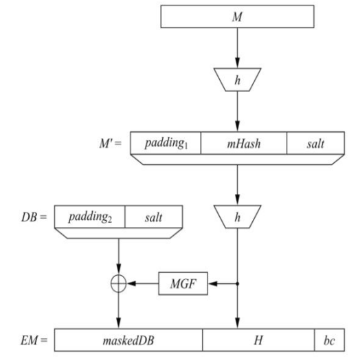
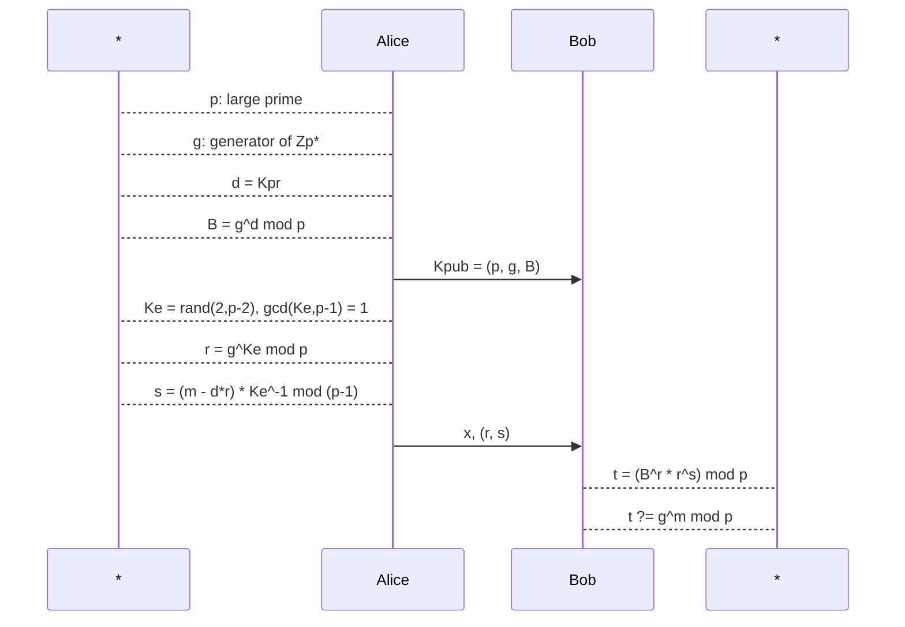

# Digital Signature

> A digital signature is a mathematical scheme for verifying the authenticity of digital messages or documents.

The digital signature schema consists of three probabilistic algorithms:

- ***$Gen(n) \rightarrow (pk,sk)$***: generate the public and private keys with size $n$ bits.

- ***$Sign(sk, m) \rightarrow s$***: sign the message $m$ with the private key.

- ***$Ver(pk, m, s) \rightarrow \{0,1\}$***: verify the signature $s$ of the message $m$ with the public key.

The scheme is secure if somebody who knows the public key $pk$ and a lots of valid signatures $(m_1, s_1), ..., (m_l, s_l)$ cannot produce a new message and a valid signature for it.

## Digital Signature Abstract Protocol

## Security services

1. ***Message Authentication***: the receiver can verify that the sender of the message is authentic.

2. ***Message Integrity***: the receiver can verify that the message has not been altered.

3. ***Non-repudiation***: the sender cannot deny the fact that he sent the message.

The first two services are protection against third-party attacks, the third service is protection against the sender.

> ***Note***: the non-repudiation service is guaranteed only if the digital signature is implemented via asymmetric cryptography. 
>
> A signature produced by a symmetric algorithm provides message authentication and message integrity, but not non-repudiation. In fact, the sender and the receiver has the same key and the same capabilities. It is impossible to prove who generate the signature (the sender or the receiver).

## RSA Digital Signature

The RSA digital signature is based on the RSA cryptosystem. The procedure is the same of [RSA Encryption](#rsa-cryptosystem). The only difference is that the message is signed with the private key and verified with the public key.

Here the sensitive operation is the signature, that is performed by the sender of the message with the private key. When RSA is used for encryption, the sensitive operation is the decryption, that is performed by the receiver of the message with the private key.

### Protocol

Signature: $Sign_{sk}(m): s = m^d \mod N$

Verification: $Ver_{pk}(m', s): m' \stackrel{?}{=} s^e \mod N$

> ***Proof of correctness***: $\ \ \ m' \mod N \equiv s^e \mod N \equiv (m^d)^e \mod N \equiv m^{de} \mod N \equiv m \mod N$

#### Computational Aspects

The **signature** is a single modular exponentiation, it is performed with the square-and-multiply algorithm. The exponent is $d$, that is big and generated without particular regards to the efficiency of the modular exponentiation. ***This operation is costly***.

The **verification** is a single modular exponentiation, it is performed with the square-and-multiply algorithm. The exponent is $e$, it value is small and generated such that the modular exponentiation is efficient. ***This operation is highly optimized***.

### EMSA-PSS

The EMSA-PSS is a padding scheme for the RSA digital signature. It is based on the Probabilistic Signature Scheme (PSS) and the Encoding Method for Signature with Appendix (EMSA), this protect RSA from some attacks (ex. blinding attack).

1. The message is processed by an hash function $h$ to obtain a hash value $mHash$.

2. The hash value is padded with a fixed prefix $padding_1$ and a random suffix $salt$.

3. The padded hash is processed by the hash function $h$ to obtain a new hash value $H$.

4. The hash $H$ is processed by a mask generation function $MGF$ to obtain a mask $mask$ that is XORed with the $DB = padding_2|salt$ to obtain the masked DB.

The final hashed message is $EM = maskedDB|mask|bc$.

> Note: the $bc$, $padding_1$ and $padding_2$ are fixed values defined in the standard.

The digital signature will be performed over the $EM$ value.

## Elgamal Digital Signature

The Elgamal digital signature is based on the Elgamal cryptosystem, it is slightly different from the Elgamal encryption and the signature is composed by two values.

### Protocol

### Mathematical Expression and Proof of Correctness

- $Gen() \rightarrow K_{pub}(p, g, B),\ K_{pr}(d)$
    
    Where: $p$ prime, $g$ generator of $\mathbb{Z}_p^*$ and $B = g^d \mod p$.

- $Sign(m) \rightarrow (r, s)$

    Where the signer choose a random ephemeral key $K_e$ such that $gcd(K_e, p-1) = 1$. Then compute the two parts of the signature:

    $r \equiv g^{K_e} \mod p$

    $s \equiv (m - d \cdot r) \cdot K_e^{-1} \mod (p-1)$

- $Ver(m, (r, s)) \rightarrow \{0,1\}$

    The verifier has received the $K_pub$.

    The verifier receives the message $m$ and the signature $(r, s)$. Then computes $t \equiv (B^r \cdot r^s) \mod p$ and check if it is equivalent to $g^m \mod p$.

    If the two values are equivalent, the signature is valid.

The proof of correctness is:

$$
\begin{align}
    t& \equiv (B^r \cdot r^s) \mod p \equiv\\
    &\equiv (g^d)^r \cdot (g^{K_e})^s \mod p \equiv\\
    &\equiv g^(d\cdot r | K_e \cdot s) \mod p\\
    \\
    &g^(d\cdot r | K_e \cdot s) \mod p \equiv g^m \mod p \\
    \\
    d\cdot r + K_e \cdot s &\equiv m \mod (p-1)\\
    K_e \cdot s &\equiv m - d\cdot r \mod (p-1)\\
    s& \equiv (m - d\cdot r) \cdot K_e^{-1} \mod (p-1)
\end{align}
$$

- At the point $(14)$ we have written the signature test performed by the verifier.
- At the point $(16)$ we pass to the equivalence between the exponents.

The last row is exactly the expression of the signature $s$ at signer side.

Note that, when we pass to the exponents, we pass from $\mod p$ to $\mod (p-1)$, this is a consequence of the Fermat's Little Theorem.

> **Remark**: the Elgamal signature $(r,s)$ has twice the size of the message $m$.

> **Remark**: the Elgamal digital signature scheme is the base for the DSA (Digital Signature Algorithm) and the ECDSA (Elliptic Curve Digital Signature Algorithm).

## DSA - Digital Signature Algorithm

The DSA is a digital signature algorithm based on the Elgamal digital signature. It is a standard of the NIST (National Institute of Standards and Technology).

### DSA Key Generation

1. Generate a prime $p$ with $l \approx 1024$ bits.

2. Find a prime divisor $q$ of $p-1$ such that $q \approx 160$ bits.

3. Find a generator $\alpha$ of $\mathbb{Z}_q^*$, $\text{ord}(\alpha)=q$.

4. Choose a random number $d \in \{1, ..., q-1\}$.

5. Compute $\beta \equiv \alpha^d \mod p$.

The keys are:

$\ \ k_{pub} = (p, q, \alpha, \beta)$

$\ \ k_{pr} = d$

### DSA Signature

1. Choose a random number $K_e \in \{1, ..., q-1\}$.

2. Compute $r \equiv (\alpha^{K_e} \mod p) \mod q$.

3. Compute $s \equiv K_e^{-1} \cdot (SHA(m) + d \cdot r) \mod q$.

The signature is $(r, s)$.

### DSA Verification

1. Compute the auxiliary value $w \equiv s^{-1} \mod q$.

2. Compute the auxiliary value $u_1 \equiv SHA(m) \cdot w \mod q$.

3. Compute the auxiliary value $u_2 \equiv r \cdot w \mod q$.

4. Compute $v \equiv (\alpha^{u_1} \cdot \beta^{u_2} \mod p) \mod q$.

The signature is valid if $v \equiv r \mod q$.

## Abstract DSA over $G$

DSA can be formulated over a generic cyclic group $G$ of order $n$.

We define:

- $(G, \circ)$ a cyclic group of order $n$.
- $f: G \rightarrow \mathbb{Z}_n$ a function.
- $h: Z_2^* \rightarrow \mathbb{Z}_n$ a hash function.

Let $g$ be a generator of $G$ and $\rho: \mathbb{Z}_n \rightarrow G$ be the corresponding isomorphism.

### DSA Key Generation

$Gen() \rightarrow (sk, pk)$

$sk = \text{rand}(\mathbb{Z}_n)$

$pk := \rho(sk)$

### DSA Signature

$Sign(x) = (r, s) \in \mathbb{Z}_n \times \mathbb{Z}_n$

Let $k = \text{rand}(\mathbb{Z}_n)\ st\ \exists\  k^{-1} \in \mathbb{Z}_n$

$r = f(\rho(k))$

$s = k^{-1} \cdot (x + sk \cdot r) \mod n$

### DSA Verification

$Ver(x, (r, s)) \rightarrow \{0,1\}$

$Ver(x, (r, s)) = 1\ \text{iff}\ r = f(\ \rho(\frac{h(x)}{s} \circ pk \circ pk \ldots \circ pk))$

Where the $\circ$ operation is repeated $\frac{r}{s}$ times.

## Schnorr Sigma Protocol

The Schnorr Sigma Protocol is an identification protocol. 

> ***Identification protocol***: an identification protocol is a protocol that allows the prover to convince the verifier, that knows only the $pk$ of the prover, his identity (that he knows the $sk$).

The public key consists of a finite field $GF(p)$ and two elements $g,h \in GF(p)$.

The secret key is a integer $k \in \{1, ..., p-1\}$ such that $h = g^k$.

### Protocol

1. $\mathcal{P}$ generates a random number $r \in \{1, ..., p-1\}$ and sends $c = g^r$ to $\mathcal{V}$.

2. $\mathcal{V}$ generates a random number $e \in \{1, ..., p-1\}$ and sends it to $\mathcal{P}$.

3. $\mathcal{P}$ computes $s = r + e \cdot k \mod (p-1)$ and sends it to $\mathcal{V}$.

4. $\mathcal{V}$ checks if $g^s \equiv c \cdot h^e \mod p$.

## Schnorr Signature

1. All users of the signature system agree on a group $G$ of prime order $q$ where the DLP is hard.

2. All users of the signature system agree on a hash function $h: \{0,1\}^* \rightarrow \mathbb{Z_q}$.

### Key Generation

1. Choose a random number $x \in \{1, ..., q-1\}$.

2. Compute $y = g^x \mod p$.

The public key is $y$ and the private key is $x$.

### Signature

1. Choose a random number $k \in \{1, ..., q-1\}$.

2. Compute $r = g^k \mod p$.

3. Compute $e = h(r || m)$.

4. Compute $s = k - x \cdot e \mod q$.

The signature is $(r, s)$.

### Verification

1. Compute $r_v = g^s \cdot y^e \mod p$.

2. Compute $e_v = h(r_v || m)$.

The signature is valid if $e_v \equiv e \mod q$.

# Subliminal Channels

> A subliminal channel is a covert channel that is used to transmit information in a manner that is not readily apparent to the casual observer.

# Blind Signature

The blind signature is a digital signature that is performed without the signer knowing the content of the message. This is useful to protect the privacy of the signer and notarize the message.

## Completely Blind Signature

1. The requestor multiply the document for a random value $r$. This value is called **blinding factor**.

2. The requestor sends the blinded document to the signer.

3. The signer signs the blinded document.

4. The requestor divides the signed document for the blinding factor.

The signature is valid for the original document.

## RSA Blind Signature

> ***This can be a legal process or an attack.***

1. Alice chooses a random number $k \in \{1, ..., nN-1\}$. She blind the message $m$ computing $t = m \cdot k^e \mod n$.

2. Alice sends the blinded message $t$ to Bob.

3. Bob signs the blinded message $t$ with the private key $d$: $st \equiv t^d \mod n \equiv (mk^e)^d \mod n \equiv m^dk \mod n$.

4. Alice divides the signed message for the blinding factor: $s = \frac{st}{k} \mod n \equiv \frac{m^dk}{k} \mod n \equiv m^d \mod n$.

So Alice gets the signature $s = m^d \mod n$ of the message $m$ without Bob knowing the content of the message.
