# Hash Functions

## Commitment Schemes

> The underlying problem: Alice want to commit to a prediction but she does not want to reveal the prediction until the end of the game. Bob wants to make sure that Alice cannot change her mind after she has committed to the prediction.

A commitment scheme is a protocol that allows a party to commit to a value without revealing the value and to later reveal the value. It is divided in two phases:

- **Commitment phase**: Alice sends to Bob the commitment value $c = Com(b,r)$, where $b$ is the secret value to be committed and $r$ is a random value.

- **Reveal phase**: Alice sends to Bob the secret value $b$ and the random value $r$, now Bob can verify that the commitment value $c$ is consistent with the secret by using the commitment function $c' = Com(b',r) \stackrel{?}{=} c = Com(b,r)$.

A commitment scheme is secure if it satisfies the following properties:

1. **Hiding**: the commitment value $c$ does not reveal any information about the secret value $b$.

2. **Binding**: given $c$, there is a unique value of $b$ that is consistent with $c$.

### Pedersen's Commitment

Let $g, h \in G_q$ such that nobody knows $log_gh$. These values are chosen by a trusted third party.

The committer chooses a random value $t \in \mathbb{Z}_q$ and commits himself to a value $s \in \mathbb{Z}_q$ by computing: $E(s,t)=g^sh^t$.

The committer sends $E(s,t)$ to the verifier.

The committer reveals $s$ and $t$ to the verifier that can verify the commitment by computing: $E(s,t) = g^{s'}h^{t'}$.

> ***Theorem about hiding property***: 
>
> $\forall s \in \mathbb{Z}_q$ and $\forall t \in \mathbb{Z}_q$ randomly chosen (with an uniform distribution) $\rightarrow$ $E(s,t)$ is uniformly distributed in $G_q$.

> ***Schnorr Group***: the subgroup of $G_q \subset \mathbb{Z}_p^*$ of order $q$ is called Schnorr group. It is the largest subgroup of $\mathbb{Z}_p^*$ where $p = q*r + 1$, usually $r = 2$.

### Davies-Meyer Compression Function

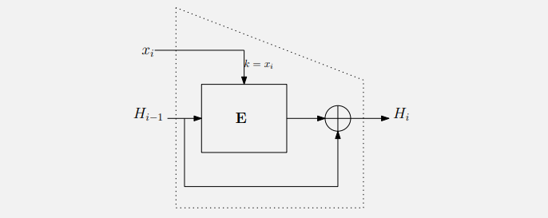

The block $x_i$ of the committed message is used as key in a block cipher to encrypt the previous block $y_{i-1}$ of the committed message. The result is then XORed with the previous block $y_{i-1}$.

$\forall i \in \{1, 2, ..., m\}: Enc_{x_i}(H_{i-1}) \oplus H_{i-1}$:

The commitment value is the last block of the committed message $H_m$.

## Introduction to Hash Functions

A hash function is an auxiliary function in cryptography. It is used for signature, MAC, key derivation, password storage, RNGs, etc.

> ***Motivation for signature***: suppose that the signature algorithm is RSA, the message length is restricted to the key length. So, if the message is a big pdf file and the keys cannot be big as the file (for computational reasons), we need something that can reduce the size of the message or that allows us to sign a message of arbitrary length.

One first solution can be a "ECB like" approach: divide the message in blocks and sign each block. But this **is not secure**, the signature security properties are satisfied only at block level: an attacker can drop, substitute or reorder the blocks.

The best solution is to use a function that somehow "compress" the message in a fixed length value. This is the hash function.

## Requirements for an Hash Function

1. Arbitrary length input.
2. Fixed and short output length.
3. Deterministic (same input, same output) and efficient to compute.
4. **Pre-image resistance**.
5. **Second pre-image resistance**.
6. **Collision resistance**.

### Pre-image Resistance

> The function $h$ must be a ***one-way function***. This means that:
>
> Given $z = h(x)$, it is computationally infeasible to find $x$ from $z$.

### Second Pre-image Resistance

> Given $x_1$ fixed, must be computationally infeasible to find $x_2 \ne x_1$ such that $h(x_1) = h(x_2)$.

This is also called ***weak collision resistance***.

### Collision Resistance

> It must be computationally infeasible to find two different inputs $x_1$ and $x_2$ such that $h(x_1) = h(x_2)$.

## Collision attack and Birthday Paradox

The collision attack is much harder to prevent then the second-preimage attack: the attacker has two degrees of freedom to find a collision, but it need to trick the signer to sign one of two messages.

***Question:*** can we have an hash function without collisions? ***No***.

The hash functions get an input from an arbitrary length space (potentially infinite) and maps it to a fixed output length space. Normally $|x| >> |z|$, so collision must exist. The goal in hash function design is to make the collisions very hard to find.

The ***Birthday Paradox*** states that if we have $n$ people in a room, the probability that two of them have the same birthday is greater than 50% if $n > 23$. 

$P(n)$: the likelihood to have no collision in $n$ people.

- $P(2) = 1 - \frac{1}{365}$
- $P(3) = (1 - \frac{1}{365}) \cdot (1 - \frac{2}{365})$

And so on...

The general formula is: $P(t) = \prod_{i=1}^{t-1} (1 - \frac{i}{365})$.

If we evaluate that formula for $t=23$ we obtain that $P(23) \approx 0.5$.

The probability to have no collision after $m$ tries is $P(m) = \prod_{i=1}^{m-1} (1 - \frac{i}{2^{n}})$, from which we can derive this formula:

$t = 2^{\frac{n+1}{2}} \cdot \ln(\frac{1}{1-\lambda}$

Where $\lambda$ is the desired probability to have at least 1 collision and $n$ is the length of the hash function output.

**Example**: $n = 80$, $\lambda = 0.5$, $t = 2^{\frac{81}{2}} \cdot \sqrt{\ln(2)} \approx 2^{40}$.

In general, we can say that if we want to have a security level of $m$ bits, we need a hash function of at least $2m$ bits.

```
    AES-128 -> 128 bits key -> 256 bits output hash functin (ex. SHA-256)
    AES-192 -> 192 bits key -> 384 bits output hash functin (ex. SHA-384)
    AES-256 -> 256 bits key -> 512 bits output hash functin (ex. SHA-512)
```

## Second Pre-image Attack (brute-force based)

The second pre-image attack is based on a brute-force approach. The attacker has a message $x_1$ and wants that the hash of a second message $x_2$ is equals to the hash of $x_1$.

For example $x_1 = \text{"Transfer 10\$"}$, the attacker want $x_2 = \text{"Transfer 10000\$"}$.

The approach is calculate $x_i$ as a transparent modification (for the context of $x$) from $x_2$ until the hash of $x_i$ is equals to the hash of $x_1$.

> A transparent transformation is a transformation that does not change the meaning of the message, in a pdf file can be a white space or tabulations at the end of the message.

## Hash Function Constructions

At the highest level, hash functions can be divided in two categories:

- **Block cipher construction**: the hash function is constructed by using a block cipher.

- **Dedicated construction**: the hash function is constructed by using dedicated techniques.

### Dedicated Construction

Mainly, the dedicated construction hash functions are based on **Merkle-Damgard construction** or on **Sponge construction**.

#### Merkle-Damgard Construction

The Merkle-Damgard construction is a construction that allows to build a hash function from a compression function. It is based on an iterative process on blocks of the message.

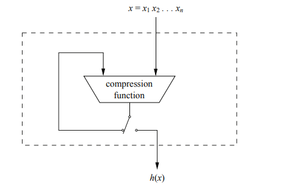

#### Sponge Construction

The sponge construction is a construction that allows to build a hash function from a permutation function. It is based on an iterative process on blocks of the message.

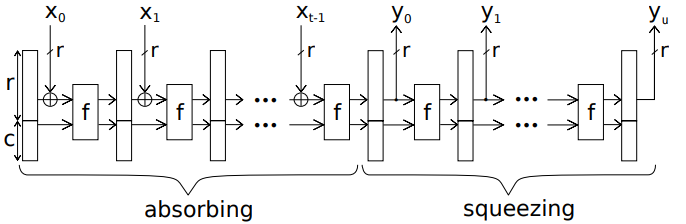

In the absorb phase, the message is processed by the permutation function. In the squeeze phase, the output is generated by the permutation function.

## MD4

The MD4 is an hash function that was designed by Ronald Rivest in 1990. It is based on the Merkle-Damgard construction and it is a 128 bits hash function. 

The input message is divided in blocks of 512 bits, each block is divided in 16 words (32 bits).

### MD4 Compression Function

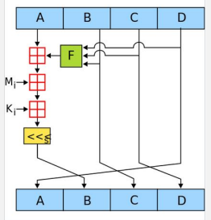

> The $F$ function is a non linear function. It gets as input 3 words and returns a word.

The rounds are 48, grouped in three rounds groups of 16 rounds each. The $M_i$ are the message blocks and $K_i$ is a 32 bits round constant.

## SHA-1

Secure Hash Algorithm 1 (SHA-1) is a hash function based on the Merkle-Damgard construction. The message is divided in blocks of 512 bits, each block is sequentially processed by the compression function.


### SHA-1 Compression Function

The compression function is composed by 80 rounds grouped in 4 stages of 20 rounds each. The input of the function is the previous hash value $H_{i-1}$ and the current message block $x_i$.

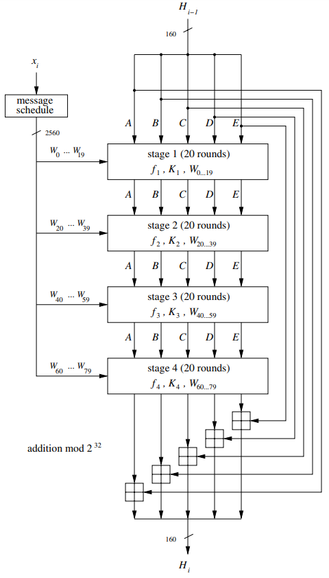

Each round hash gets:

- 5 words $(A,B,C,D,E)$ from the previous round.
- 1 word $W_i$ derived from the input message

For the first message block, the initial hash value $H_0$ is a fixed value:

- $H_0 = \{\\\ \ \text{0x67452301}, \\\ \ \text{0xEFCDAB89}, \\\ \ \text{0x98BADCFE}, \\\ \ \text{0x10325476}, \\\ \ \text{0xC3D2E1F0}\\\}$

### SHA-1 Round Function

The round function is afunction that gets as input 5+2 words and returns 5 words: 

$RF(A,B,C,D,E,W_j,K_t) \rightarrow (A,B,C,D,E)$.

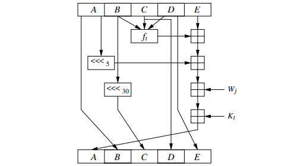

$$
\begin{bmatrix}
    A_{in} \\
    B_{in} \\
    C_{in} \\
    D_{in} \\
    E_{in} \\
\end{bmatrix}
\rightarrow
\begin{matrix}
    W_j \\
    \downarrow \\
    RF \\
    \uparrow \\
    K_t \\
\end{matrix}
\rightarrow
\begin{bmatrix}
    A_{out} = E_{in} \boxplus f_t(B_{in}, C_{in}, D_{in}) \boxplus \text{rot}(A_{in}, 5) \boxplus W_j \boxplus K_t \\
    B_{out} = A_{in} \\
    C_{out} = \text{rot}(B_{in},30) \\
    D_{out} = C_{in} \\
    E_{out} = D_{in} \\
\end{bmatrix}
$$

The $f_t$ function is a non linear function and $K_t$ is a constant, both depend on the stage number. 

| Stage | Rounds | $f_t$                                                        | $K_t$      |
|-------|--------|--------------------------------------------------------------|------------|
| 1     | 0-19   | $f_t(B,C,D) = (B \land C) \lor (\lnot B \land D)$            | 0x5A827999 |
| 2     | 20-39  | $f_t(B,C,D) = B \oplus C \oplus D$                           | 0x6ED9EBA1 |
| 3     | 40-59  | $f_t(B,C,D) = (B \land C) \lor (B \land D) \lor (C \land D)$ | 0x8F1BBCDC |
| 4     | 60-79  | $f_t(B,C,D) = B \oplus C \oplus D$                           | 0xCA62C1D6 |

The final permutation of the words is fundamental: each round performs a "very good encryption" only on the $E$ word, if the words are not swapped at the end, the next round will continue to encrypt the same word.

### SHA-1 Message Schedule

The message schedule is a function that gets as input the message block of 512 bits and expands it in 80 words of 32 bits (2560 bits).

$$
\begin{cases}
    W_j = x_{i,j}\ ,\ \ for\ 0\leq j\leq 15 \\
    W_j = \text{rot}(W_{i-3} \oplus W_{i-8} \oplus W_{i-14} \oplus W_{i-16}, 1)\ ,\ for\ 16\leq j\leq 79\\
\end{cases}
$$

## SHA-2 Family

The SHA-2 family is an evolution of SHA-1 and consists of six hash function with different output length:

- SHA-224 (224 bits)
- SHA-256 (256 bits)
- SHA-384 (384 bits)
- SHA-512 (512 bits)
- SHA-512/224 (224 bits)
- SHA-512/256 (256 bits)

The last two are truncated versions of SHA-512.

All of this hash functions are based on the Merkle-Damgard construction, the message is divided in block of 512 bits (eventually padded) and each block is processed one at time by the compression function.

### SHA-256 Round Function (example)

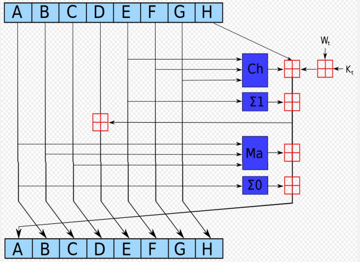

## SHA-3 - Keccak

### SHA-3 NIST Requirements

The main requirement for SHA-3 is that it must be a function that gets as input a message of arbitrary length and returns a fixed length output $n \in \{224,256,384,512\}$.

This numbers are not random:

- 224 bits is the security level of 112 bits as 3DES.
- 256 bits is the security level of 128 bits as AES-128.
- 384 bits is the security level of 192 bits as AES-192.
- 512 bits is the security level of 256 bits as AES-256.

(Remember the [Birthday Paradox](#collision-attack-and-birthday-paradox))

### Keccak Construction

The Keccak construction is based on the Sponge construction. There are two phases:

- **Absorb phase**: the message is processed by the permutation function.

- **Squeeze phase**: the output is produced.

### Keccak Parameters

- ***State size***: $b = 25\cdot 2^l$ where $l = 0,1,2,...,6$. So the possible state sizes are: $25, 50, 100, 200, 400, 800, 1600$ bits.

- ***Number of rounds***: $n_r = 12 + 2^l$.

- ***Output size***: $n \in \{224,256,384,512\}$.

- ***Capacity and Rate***: $c = 2n$ and $r = b - c$.

For SHA-3 the only possible $l$ value is $6$, so the state size is $1600$ bits with $24$ rounds. The other parameters are:

| Output | c    | r    | 
|--------|------|------|
| 224    | 448  | 1152 |
| 256    | 512  | 1088 |
| 384    | 768  | 832  |
| 512    | 1024 | 576  |

### Keccak High Level Description

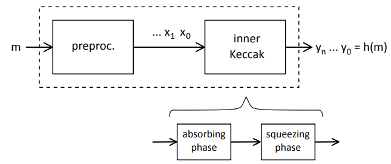

The preprocessing phase consists in the padding of the message to fit in a multiple of the rate $r$.

### Inner Keccak

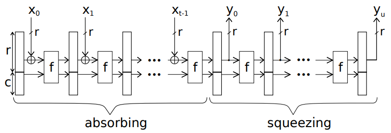

The inner Keccak is the core of the Keccak hash function, it is composed by a round for each block which is processed within the state (by XORing the $r$ buffer with the $x_i$ message). The state is then processed by the permutation function $f$.

After the last block is processed, starts the squeezing phase. If SHA-3 is used as simple hash function, the digest is the last state. SHA-3 can also be used as PRNG or other cryptographic primitives, by continue to process the state with the permutation function we can generate a longer output. It is important to note that, after a new squeezing round, the output is fresh and cryptographically strong.

### Keccak Permutation Function $f$

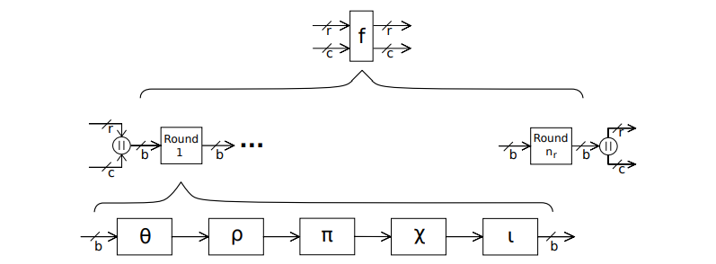

To understand the permutation function, we need to change the representation of the state. The state is a 3D matrix of $5 \times 5 \times w$ bits, where $w$ is the word size (64 bits for SHA-3).

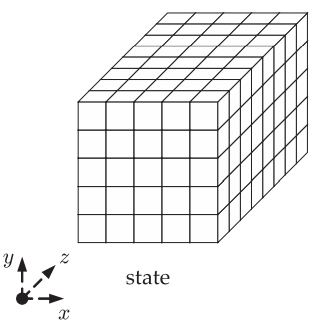

The Keccak $f$ function gets the current state and returns the next state. It is composed by $n_r$ rounds, each round is composed by 5 steps:

#### $\theta$ Step: 

The $\theta$ step, for each bit of the state, computes the XOR sum of 11 bits of the state in a particular way:

<div>
    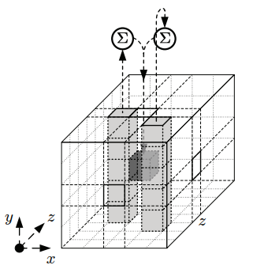
</div>

1. The original bit (darker cube).
2. The 5-bit "column to the left" (lighter column).
3. The 5-bit "column to the right and one step to the front" (lighter column).

In brutal mathematical expression:

$ C[x] = A[x,0] \oplus A[x,1] \oplus A[x,2] \oplus A[x,3] \oplus A[x,4] $, $\ \ \forall x \in \{0,1,2,3,4\}$

$ D[x] = C[x-1] \oplus \text{rot}(C[x+1],1) $, $\ \ \forall x \in \{0,1,2,3,4\}$

$ A[x,y] = A[x,y] \oplus D[x] $, $\ \ \forall x,y \in \{0,1,2,3,4\}$

Where $C[x]$ and $D[x]$ are one-dimensional arrays which contain five words of $w$ bits.

<br>
<br>

#### $\rho$ and $\pi$ Steps:

The $\rho$ step is a rotation of a state's word. The $\pi$ step is a permutation of the state's words.

Input: $A[x,y] \forall x,y \in \{0,1,2,3,4\}$

Output: $B[x,y] \forall x,y \in \{0,1,2,3,4\}$

1. ***Rotation $\rho$***: 
    
    $\ \ \ \ \ TMP[x,y] = \text{rot}(A[x,y], r[x,y]), \ \ \ \forall x,y \in \{0,1,2,3,4\}$

    | $r[x,y]$ | x = 0 | x = 1 | x = 2 | x = 3 | x = 4 |
    |----------|-------|-------|-------|-------|-------|
    | y = 0    | 25    | 39    | 3     | 10    | 43    |
    | y = 1    | 55    | 20    | 36    | 44    | 6     |
    | y = 2    | 28    | 27    | 0     | 1     | 62    |
    | y = 3    | 56    | 14    | 18    | 2     | 61    |
    | y = 4    | 21    | 8     | 41    | 45    | 15    |

2. ***Permutation $\pi$***: 

    $\ \ \ \ \ B[y, 2x + 3y \mod 5] = TMP[x,y], \ \ \ \forall x,y \in \{0,1,2,3,4\}$

#### $\chi$ Step:

The $\chi$ step is a non linear function that gets as input a state's word and returns a new state's word.

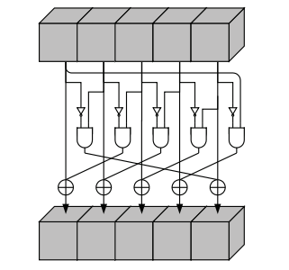

Input: $B[x,y] \forall x,y \in \{0,1,2,3,4\}$

Output: $A[x,y] \forall x,y \in \{0,1,2,3,4\}$

$A[x,y] = B[x,y] \oplus (\lnot B[x+1 \mod 5,y] \land B[x+2 \mod 5,y]), \ \ \ \forall x,y \in \{0,1,2,3,4\}$

#### $\iota$ Step:

The $\iota$ step add a round constant to the state's word $A[0,0]$.

$A[0,0] = A[0,0] \oplus RC[i]$

Where $RC[i]$ is a round constant that depends on the round number $i$.

# Hellman's and Rainbow Tables

## Lookup Tables

> A lookup table is a data structure that allows to store a set of precomputed values.

## Hellman's Tables

The Hellman's tables are a particular type of lookup tables. The attacker encrypts a plaintext $P_0$ with all possible $k \in \mathcal{K}$ and store $(P_0, Enc_k(P_0))$ in the table. The table is sorted by the ciphertext.

When a user chooses a key, the attacker forces the user to encrypt $P_0$ (CPA-Attack) getting the ciphertext $C_0$. The attacker looks for $C_0$ in the table and finds the plaintext $P_0$ with cost $O(\log(N))$. The attacker then knows the key.

The Hellman's tables are very efficient, but they require a lot of memory.