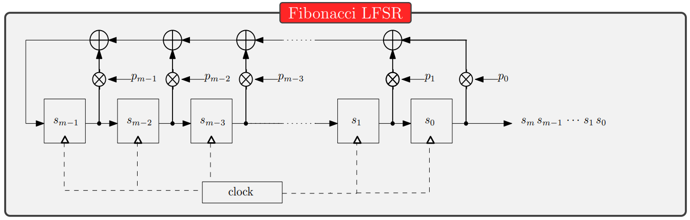

# Introduction to Symmetric Encryption

## Introduction

> ***Problem***: Alice (A) and Bob (B) want to communicate securely over an insecure channel. They want to keep the messages secret from Eve (E), an eavesdropper.

> ***Solution***: Alice and Bob share a secret key `k` and use it to encrypt and decrypt messages. Note that the key must be shared over a secure channel and kept secret.

> ***Important***: according to the [Kerckhoffs' principle](#kerckhoffs-principle), the security of the system should depends only on the secrecy of the key. Is a very bad practice to keep the algorithm secret and rely on the secrecy of the algorithm.
>
> A public algorithm is better because it can be studied and tested by all the community!

## The Vernam Cipher (XOR Cipher)

```
    Alice                                                      Bob
                            (secure channel)
         <======================== k =========================>

    C = Enc(k, P) = M XOR k

         ------------------------- C ------------------------->

                                                               P = Dec(k, C) = C XOR k
```

The Vernam cipher is a stream cipher, it encrypts a plaintext $P$ with a key $k$ by performing a XOR $(\oplus)$ between the plaintext and the key.

> ***Important***: the key must be as long as the plaintext, otherwise the cipher is not secure and can be broken with various types of attacks (ex. `known-plaintext attack`).

## ROT Cipher

```
    Alice                                                      Bob
                            (secure channel)
         <======================== k =========================>

    C = Enc(k, P) = ROT(k, P) = P <<< k

         ------------------------- C ------------------------->

                                                               P = Dec(k, C) = ROT(-k, C) = C <<< -k
```

> ***Key space size***: the key space size is $n$ where $n$ is the size in bits of the encryption chunk. If we encrypt each byte separately, the maximum number of rotations is 8, otherwise if we encrypt blocks of 1024 bytes the maximum number of rotations is 8192. The key space size is changing a lot! (in both cases a brute-force attack is extremely easy).

## Substitution Cipher

```
    Alice                                                      Bob
                            (secure channel)
         <======================== k =========================>

    C = Enc(k, P) = k(P)

         ------------------------- C ------------------------->

                                                               P = Dec(k, C) = k^-1(C)
```

The key `k` is a mapping function that maps each character of the plaintext to a character of the ciphertext. It's important that the function is a bijection, otherwise the decryption is not possible.

> The ***key*** can be viewed as a substitution table generated from a permutation of the alphabet.

> ***Key space size***: the key space size is `26!` (the number of permutations of the alphabet).

### Brute-force attack

The brute-force attack is always possible, but in this case it is unfeasible: $O(26!) ~ 2^{88} = 2^{56} * 2^{32}$.

Time examples:

- Suppose to spend $1ps$ for each key: $2^{88} * 1ps = 2^{88} * 10^{-12}s$, we can approximate $10^{-12} ~ 2^{-40}$ then $2^{88} * 2^{-40}s = 2^{48}s ~ 2^{41} years$.

- Suppose to used a special purpose hardware, as COPACOBABA, $2^{88} = 2^{56} * 2^{32}$ and $2^{56} ~ 1day$ then $2^{32} days ~ 2^{25} years$.

### Frequency analysis

Unfortunately, the substitution cipher is vulnerable to frequency analysis attacks. The underlying problem is that the cipher does not break the statistical properties of the plaintext.

> Identical plaintext symbols are mapped to identical ciphertext symbols.

The attack exploit the statistical distribution of the letter's usage in a specific language to reduce the key space size and make the brute-force attack feasible.

## Caesar Cipher (Mod Add Cipher)

```
    Alice                                                      Bob
                            (secure channel)
         <======================== k =========================>

    C = Enc(k, P) = P + k mod n

         ------------------------- C ------------------------->

                                                               P = Dec(k, C) = C - k mod n
```

The key $k$ is a number in $\mathbb{Z}_n$ and the encryption is performed by adding the key to the plaintext modulo `n`.

> ***The original Caesar Cipher***: the original Caesar Cipher is a special case of the Mod Add Cipher where $n = 26$ and $k = 3$. Each letter is shifted by 3 positions in the alphabet (this means add to the letter the number 3 in modulo 26).

> ***Attacks***:
>
> - Brute-force attack: $O(n)$ where $n = 26$ ***YES***.
> - Frequency analysis: consists in an addition between the plaintext value and a fixed constant, ***YES***.

## Affine Cipher

```
    Alice                                                      Bob
                            (secure channel)
         <======================== k =========================>

    C = Enc(k, P) = aP + b mod n

         ------------------------- C ------------------------->

                                                               P = Dec(k, C) = a^-1(C - b) mod n
```

> ***The original Affine Cipher***: the original Affine Cipher works on the alphabet letters, this means that $n = 26$. So we can say that:
> - $b$ must a reminder in $\mathbb{Z}_{26}$: $|b| = 26$.
> - $a$ must be invertible in $\mathbb{Z}_{26}$: $gcd(a, 26) = 1$, so $|a| = 12$.

> ***Attacks***:
> 
> - Brute-force attack: $O(x)$ where $x = |a|*|b| = 12*26 = 312$ ***YES***.
> - Frequency analysis: consists in a linear operation over the plaintext with fixed parameters, ***YES***.

# Randomness and PRNGs

> ***Randomness***: a sequence of bits is random if it is unpredictable and unbiased.

> ***Pseudo-randomness***: a sequence of bits is pseudo-random if it is generated by a deterministic algorithm and it is unpredictable and unbiased.

## Random Number Generators

A **Random Number Generator** is a device that generates a sequence of random bits. It can be classified in three categories:

1. **True Random Number Generators (TRNGs)**: they generate a sequence of random bits from a physical source of randomness. (thermal noise, mouse movements, electrical noise, etc.)

2. **Pseudo Random Number Generators (PRNGs)***: they generate a sequence of random bits from a deterministic algorithm from a seed `s0`: `s[i] = F(s[i-1])`.

3. **Cryptographically Secure Pseudo Random Number Generators (CSPRNGs)**: they are PNRGs with an additional property: the output sequence is indistinguishable from a truly random sequence (unpredictability).

> ***Note about TRNGs***: the TRNGs are the best source of randomness, but they can have problems with the generation of particular crytographic parameters. For example the generation of nonces, the same random value can be triggered twice.

## PRNGs

A PNRG is a function $G: Z^n_2 \rightarrow Z^{l(n)}_2$ where $l(n) > n$ such that no adversary succed with probability better than $1/2$ in distinguishing $G(s)$ from a truly random sequence.

### Linear Congruential Generator (LCG)

Let $a$, $b$, $N$, $s_i$ in $Z$ with $N>0$. The LCG is defined as:

$$
    s_i = (a*s_{i-1} + b) \mod N
$$

```python
def LCG(seed, a, b, N):
    x = seed
    while True:
        x = (a * x + b) % N
        yield x
```

An example is the `rand()` function in ANSI C: 

$a = 1103515245$
$b = 12345$
$N = 2^{31}$
$s_0 = 12345$

#### Attacks

Given the last 3 values of the sequence $s_{i-2}$, $s_{i-1}$, $s_i$ it is possible to compute the values of $a$ and $b$.

$$
    s_{i-2} \equiv (a*s_{i-3} + b) \mod N \\
    s_{i-1} \equiv (a*s_{i-2} + b) \mod N \\
$$

It is a system of two equations with two unknowns (a and b)


$$
    a = (s_{i-1} - s_{i-2}) * (s_{i-2} - s_{i-3})^{-1} \mod N \\
    b = s_{i-1} - s_{i-2} * a \mod N    
$$

```python
from Crypto.Util.number import inverse
from myLCG import LCG

def LCG_attack(s1, s2, s3, N):
    a = (s2 - s1) * inverse(s1 - s0, N) % N
    b = (s2 - s1 * a) % N
    return a, b

gen = LCG(s3, a, b, N)

```

### Blum Blum Shub (BBS) PRNG

Let $p$ and $q$ two large primes such that $p \equiv q \equiv 3 \mod 4$. 

Let $N = p*q$ and $s_0$ in $Z_N$ such that $gcd(s_0, N) = 1$. The BBS PRNG is defined as:

$$
    s_i = s_{i-1}^2 \mod N
    b_i = parity(s_i)
$$

> ***Note***: the knowledge of $N$ and $s_j$ allows to compute the forward stream of bits $b_{j+1}, b_{j+2}, ...$.
>
> To compute the backward stream of bits $b_{j-1}, b_{j-2}, ...$ it is necessary to know the factorization of $N$.


### Linear Feedback Shift Register (LFSR)

> ***Shift Register***: a shift register is a sequence of flip-flops, each one is connected to the next one. The output of the last flip-flop is the output of the shift register. The electical signal is shifted from one flip-flop to the next one each clock cycle.
>
> $SR_3$ [1,0,0] $\rightarrow$ [x, 1, 0] $\rightarrow$ [x, x, 1] $\rightarrow$ [x, x, x]
> The complete output of this shift register is `0011`.

> ***Linear Feedback***: the first bit of the register is computed by XORing the other two bits.
>
> 

#### Some consideration on this 3-bits LFSR

1. If the value of the register is `000`, the LFSR will break (the next values will be always `000`).

2. The output is cyclic, in this case after eigth clock cycles the output will repeat.

3. The mathematical representation of this LFSR is: $s_i = s_{i-1} \oplus s_{i-2}$, with $(s_2, s_1, s_0) \ne (0,0,0)$.

#### Generalized LFSR - Fibonacci Construction

The Fibonacci construction for a generic $m$ bits LFSR is:



##### The multiplier

<div style="float: left; margin-right: 1em">


</div>

The multiplier gets the output from the FF and multiply it with a coefficient. If the coefficient is `1` the output is the same, if the coefficient is `0` the output is `0` (it works as a switch).

$$
\begin{equation}
s_{out} = 
\begin{cases}
    s_{in} & \text{if p = 1}\\
    0 & \text{if p = 1} \\
\end{cases}
\end{equation}
$$

<br><br>

##### Mathematical description

The mathematical description of the LFSR is:

$$
    s_m = f(\bold{s}) = \sum_{j=0}^{m-1} p_j * s_j \mod 2
$$

> ***Feedback Polynomial***: the feedback polynomial is the polynomial that describes the LFSR. It is defined as: $P(x) = 1 + p_{m-1}x + p_{m-2}x^2 + ... + p_0x^m$.

> ***Characteristic Polynomial***: the characteristic polynomial is different way to describe the LFSR. It is defined as: $\chi_L(x) = x^mP(1/x) = p_0 + p_1x + ... + p_{m-1}x^{m-1} + x^m$

##### Example

$\chi_L(x) = 1 + x^2 + x^3 + x^5$

$m = 5$
$p_1 = (0,1,1,0,1)$

$s_{m+i} = s_i \oplus s_{i+2} \oplus s_{i+3}$

##### Theorems

> ***About the maximum sequence length***: the maximum sequence length of a LFSR is $2^m - 1$.

> ***About the characteristic polynomial***: the LFSR has maximum sequence length only if his characteristic polynomial is primitive.

##### Attacks

Oscar knows that:

- Alice and Bob use a stream cipher.
- All $y_i = x_i \oplus s_i$.
- All $x_i$ up to $x_{2m-1}.
- The degree $m$ of the LSFR.

So:

$y_i = x_i \oplus s_i \rightarrow s_i = y_i \oplus x_i$

The generic expression for the LFSR is:

$s_{m} = s_{m-1} * p_{m-1} \oplus s_{m-2} * p_{m-2} \oplus ... \oplus s_{0} * p_{0}$

In this expression we have all $s_i$ and all $p_i$ unknown. If we get $2m-1$ values of $s_i$ we can solve the system and get all $p_i$ and all $s_i$. Now Oscar can build the LFSR and decrypt all the future messages.

#### Generalized LFSR - Galois Construction

The Galois construction for a generic $m$ bits LFSR is:


The main difference with the Fibonacci construction is that the XOR operation is between the output of the FF and the input of the next FF. Each clock cycle the $i$ bit can be XORed with the output bit of the LFSR. The characteristic polynomial define when the XOR operation is performed.

##### Mathematical description

The current state $\bold{s} = [g_0, g_1, ..., g_{m-1}]$ can be represented as a polynomial $s(x) = g_0 + g_1x + ... + g_{m-1}x^{m-1}$.

The new state $\bold{s'}$ can be computed as:

$s'(x) = x * s(x) \mod P(x)$

So

$s'(x) = g_0x + g_1x^2 + ... + g_{m-1}x^m \mod P(x)$

### Multiple LFSRs

In many cases, more then one LFSR are used to generate the key stream. An example is the ***Geffe Generator***:

It is composed by three different LFSRs with different length and different characteristic polynomials. Two LFSRs generate the key stream and the third one is used to select which key stream is sent as output:


$$
\begin{equation}
s_{out} = 
\begin{cases}
    s_{LFSR\_1} & \text{if }s_{LFSR\_2} = 1\\
    s_{LFSR\_3} & \text{if }s_{LFSR\_2} = 0\\
\end{cases}
\end{equation}
$$

# Stream Ciphers

A **stream cipher** is a [symmetric encryption](#symmetric-encryption) algorithm that encrypts a plaintext by performing a XOR between the plaintext and a key stream. The key stream is generated by using a [PRNG](#prngs), a [LFSR](#linear-feedback-shift-register-lfsr) or some modes of operation of a block cipher.

**Encryption**: $c_i = enc_k(p_i) \equiv p_i \oplus k_i \equiv p_i + k_i \mod 2$

**Decryption**: $p_i = dec_k(c_i) \equiv c_i \oplus k_i \equiv c_i + k_i \mod 2$

Where $p_i,\ c_i,\ k_i \in Z_2 = \{0,1\}$

## One-Time Pad (OTP)

The **One-Time Pad** is the perfect algorithm cipher: unbreakable.

> ***Unconditional security***: the security of the algorithm does not depend on the computational power of the attacker. This means that the algorithm cannot be broken even if the attacker has infinite computational power.

### Definition

The One Time Pad is a stream cipher where:

1. The key stream bit $s_i$ is generated by a TRNG.
2. Each key stream bit $s_i$ is used only once.

### The problem

The key must be as long as the plaintext and it must be known by the receiver. ***OTP is not practical and very hard to use***.

## Stream Cipher's operation modes

Stream ciphers can be divided in two categories:

1. **Synchronous stream ciphers**.

2. **Unsynchronous stream ciphers**.

### Synchronous stream ciphers

```
    Alice                                                      Bob
                            (secure channel)
         <======================== k =========================>

    st0 = Init(k)                                               st0 = Init(k)
    k0,st1 = Gen(st0, len(p0))
    c0 = Enc(k0, p0) = p0 XOR k0

         ------------------------- c0 ------------------------->

                                                                k0,st1 = Gen(st0, len(c0))
                                                                p0 = Dec(k0, c0) = c0 XOR k0
```

> This mode does not require a IV.

### Unsynchronous stream ciphers

```
    Alice                                                      Bob
                            (secure channel)
         <======================== k =========================>

    iv = Rand()
    st = Init(k, IV0)
    k0 = Gen(st, len(p0))
    c0 = Enc(k0, p0) = p0 XOR k0

         ----------------------- c0, iv ----------------------->

                                                                st  = Init(k, iv)
                                                                k0  = Gen(st, len(c0))
                                                                p0  = Dec(k0, c0) = c0 XOR k0
```

> This mode requires a IV. If the IV is a random nonce the cipher is CPA-secure, but not CCA-secure (an attacker can guess the bit $p$ by sending particulare queries to the CCA-oracle).

## Permutation oracle

A random oracle $R$ is a map from $\{0,1\}^*$ to $\{0,1\}^\infty$ chosen by selecting each bit of $R(x)$ uniformly and independently, for every $x$.

### Keccak-f

The Keccak-f is a permutation oracle. It is a function $f: \{0,1\}^* \rightarrow \{0,1\}^*$ that maps a string of bits to another string of bits. [Mode details here]().

## ARX Ciphers

The ARX ciphers are a class of stream ciphers based on an architecture consisting in a long chain of three simple operations:

- **Addition**.
- **Rotation**.
- **XOR**.

The cryptographic strength of ARX comes from the fact that addition is not associative with rotation and XOR.

### RC4

The RC4 is a stream cipher based on the ARX architecture. It is composed by two parts:

1. **Key scheduling algorithm**: it generates the key stream from the key.

2. **Pseudo-random generation algorithm**: it generates the key stream.

#### Key scheduling algorithm

The key schedule algorithm initialize the RC4 environment. It gets the $l$ key as input ($l < 256$) and generates the initial $register$ (256 number array).

> Note: the key is a vector of bytes.

```python

def Init(key):
    register = [i for i in range(256)]              # [0, 1, 2, ..., 255]
    j = 0
    klen = len(key)

    for i in range(256):
        r = register[i]                             # current register value
        k = key[i % klen]                           # current key value, note that the index is modulo the key length (klen < 256)
        j = (j + r + k) % 256                       # compute the new index, it is a combination of current value, key value and current index

        swap(register, i, j)                        # swap the values
    
    return register
```

#### Pseudo-random generation algorithm

The pseudo-random generation algorithm generates the key stream from the register (that represents the state of the RC4 environment).

```python

def Gen(register):
    i = 0
    j = 0

    while True:
        i = (i + 1) % 256                               # compute the new index (counter with increment of 1)
        j = (j + register[i]) % 256                     # compute the new index (counter with variable increment based on the register value)

        swap(register, i, j)                            # swap the values

        outIndex = (register[i] + register[j]) % 256    # this will be the index of the output value, is computed by adding the two register values
        yield register[outIndex]                        # return the output value

def RC4(key, plaintext):
    register = Init(key)
    gen = Gen(register)
salsa20Block
    ciphertext = [p ^ next(gen) for p in plaintext]     # XOR the plaintext with the key stream
    return ciphertext
```

### Salsa20

The Salsa20 is a stream cipher based on ARX architecture that expands a 256-bit key and a 64-bit nonce into a $2^70$ key stream.

#### Initial state

The initial state is a 4x4 matrix of 32-bit words. It structure is:

<table>
    <tbody>
        <tr>
            <td style="background-color: yellow; color: black">"expa</td>
            <td style="background-color: blue">key</td>
            <td style="background-color: blue">key</td>
            <td style="background-color: blue">key</td>
        </tr>
        <tr>
            <td style="background-color: blue">key</td>
            <td style="background-color: yellow; color: black">"nd 3"</td>
            <td style="background-color: green">nonce</td>
            <td style="background-color: green">nonce</td>
        </tr>
        <tr>
            <td style="background-color: red">pos</td>
            <td style="background-color: red">pos</td>
            <td style="background-color: yellow; color: black">"2-by"</td>
            <td style="background-color: blue">key</td>
        </tr>
        <tr>
            <td style="background-color: blue">key</td>
            <td style="background-color: blue">key</td>
            <td style="background-color: blue">key</td>
            <td style="background-color: yellow; color: black">"te k"</td>
        </tr>
    </tbody>
</table>

Where:

- The diagonal words are constants and represent the string `"expand 32-byte k"`.
- `key` and `nonce` are the key and the nonce.
- `pos` is the position counter: it is the position in the words of the stream.

#### Quarter round function

The quarter round function is a function that get 4 words as input and returns 4 words as output. The ouput is computed as:

```
    b ^= (a + d) <<< 7
    c ^= (b + a) <<< 9
    d ^= (c + b) <<< 13
    a ^= (d + c) <<< 18
```

Where `^` is the XOR operation and `<<<` is the rotation operation.

#### Salsa20 Core function

The Salsa20 algorithm generate the key stream by applying the quarter round function 20 times, then adding the new state to the initial one.

> This **last addition is fundamental** for the Salsa20 security, otherwise each round will be invertible, the attacker can go back to the initial matrix and recover the key.

#### Salsa20 Full Code

```python
# Create the initial state
def __buildInitialState(key, nonce, pos):
    initialState = [0 for i in range(16)]

    # constants
    initialState[0] = b"expa"
    initialState[5] = b"nd 3"
    initialState[10] = b"2-by"
    initialState[15] = b"te k"

    # key
    initialState[1] = key[0:4]
    initialState[2] = key[4:8]
    initialState[3] = key[8:12]
    initialState[4] = key[12:16]
    initialState[11] = key[16:20]
    initialState[12] = key[20:24]
    initialState[13] = key[24:28]
    initialState[14] = key[28:32]

    # nonce
    initialState[6] = nonce[0:4]
    initialState[7] = nonce[4:8]

    # position
    initialState[8] = pos[0:4]
    initialState[9] = pos[4:8]

    return initialState

# Salsa20 QR function
def __quarterRound(a, b, c, d):
    b ^= (a + d) << 7
    c ^= (b + a) << 9
    d ^= (c + b) << 13
    a ^= (d + c) << 18

    return a, b, c, d

# Salsa20 round function, if the round is odd it is a column round, otherwise it is a row round
def __salsa20Round(state, i):
    if i % 2 == 1:
        # column round
        state[0], state[4], state[8], state[12] = quarterRound(state[0], state[4], state[8], state[12])
        state[5], state[9], state[13], state[1] = quarterRound(state[5], state[9], state[13], state[1])
        state[10], state[14], state[2], state[6] = quarterRound(state[10], state[14], state[2], state[6])
        state[15], state[3], state[7], state[11] = quarterRound(state[15], state[3], state[7], state[11])
    else:
        # row round
        state[0], state[1], state[2], state[3] = quarterRound(state[0], state[1], state[2], state[3])
        state[5], state[6], state[7], state[4] = quarterRound(state[5], state[6], state[7], state[4])
        state[10], state[11], state[8], state[9] = quarterRound(state[10], state[11], state[8], state[9])
        state[15], state[12], state[13], state[14] = quarterRound(state[15], state[12], state[13], state[14])

    return state

# Salsa20 core function
def salsa20Block(key, nonce):
    pos = 0
    while True:
        istate = __buildInitialState(key, nonce, pos)
        state = istate.copy()
        pos += 1

        # apply 20 rounds
        for i in range(20):
            state = salsa20Round(state, i)

        # add the new state to the initial one
        for i in range(16):
            state[i] += istate[i]

        yield state


def Salsa20(key, nonce, plaintext):

    # generate the key stream
    gen = salsa20Block(key, nonce)

    ciphertext = b""

    for p in range(0, len(plaintext), 64):
        block = plaintext[p:p+64]
        keystream = next(gen)

        # XOR the plaintext with the keystream
        for i in range(64):
            ciphertext += bytes([block[i] ^ keystream[i]])

    return ciphertext
```

### ChaCha20

ChaCha20 is a stream cipher based on Salsa20. The modifications are:

- The initial state is different.
- The quarter round function is different.

#### Initial state

The initial state is a 4x4 matrix of 32-bit words. It structure is:

<table>
    <tbody>
        <tr>
            <td style="background-color: yellow; color: black">"expa</td>
            <td style="background-color: yellow; color: black">"nd 3"</td>
            <td style="background-color: yellow; color: black">"2-by"</td>
            <td style="background-color: yellow; color: black">"te k"</td>
        </tr>
        <tr>
            <td style="background-color: blue">key</td>
            <td style="background-color: blue">key</td>
            <td style="background-color: blue">key</td>
            <td style="background-color: blue">key</td>
        </tr>
        <tr>
            <td style="background-color: blue">key</td>
            <td style="background-color: blue">key</td>
            <td style="background-color: blue">key</td>
            <td style="background-color: blue">key</td>
        </tr>
        <tr>
            <td style="background-color: red">pos</td>
            <td style="background-color: red">pos</td>
            <td style="background-color: green">nonce</td>
            <td style="background-color: green">nonce</td>
        </tr>
    </tbody>
</table>

Where:

- The diagonal words are constants and represent the string `"expand 32-byte k"`.
- `key` and `nonce` are the key and the nonce.
- `pos` is the position counter: it is the position in the words of the stream.

#### Quarter round function

The quarter round function is a function that get 4 words as input and returns 4 words as output. The ouput is computed as:

```
    a += b; 
    d ^= a; 
    d <<<= 16;

    c += d; 
    b ^= c; 
    b <<<= 12;

    a += b; 
    d ^= a; 
    d <<<= 8;

    c += d; 
    b ^= c; 
    b <<<= 7;
```

#### ChaCha20 Full Code

```python
# Create the initial state
def __buildInitialState(key, nonce, pos):
    initialState = [0 for i in range(16)]

    # constants
    initialState[0] = b"expa"
    initialState[1] = b"nd 3"
    initialState[2] = b"2-by"
    initialState[3] = b"te k"

    # key
    initialState[4] = key[0:4]
    initialState[5] = key[4:8]salsa20Block
    initialState[715 = nonce[4:8]

    return initialState

# ChaCha20 QR function
def __quarterRound(a, b, c, d):
    a += b
    d ^= a
    d <<<= 16

    c += d
    b ^= c
    b <<<= 12

    a += b
    d ^= a
    d <<<= 8

    c += d
    b ^= c
    b <<<= 7

    return a, b, c, d

# ChaCha20 round function, if the round is odd it is a column round, otherwise it is a row round
def __chacha20Round(state, i):
    if i % 2 == 1:
        # column round
        state[0], state[4], state[8], state[12] = quarterRound(state[0], state[4], state[8], state[12])
        state[5], state[9], state[13], state[1] = quarterRound(state[5], state[9], state[13], state[1])
        state[10], state[14], state[2], state[6] = quarterRound(state[10], state[14], state[2], state[6])
        state[15], state[3], state[7], state[11] = quarterRound(state[15], state[3], state[7], state[11])
    else:
        # row round
        state[0], state[1], state[2], state[3] = quarterRound(state[0], state[1], state[2], state[3])
        state[5], state[6], state[7], state[4] = quarterRound(state[5], state[6], state[7], state[4])
        state[10], state[11], state[8], state[9] = quarterRound(state[10], state[11], state[8], state[9])
        state[15], state[12], state[13], state[14] = quarterRound(state[15], state[12], state[13], state[14])

    return state

# ChaCha20 core function
def chacha20Block(key, nonce):
    pos = 0
    while True:
        istate = __buildInitialState(key, nonce, pos)
        state = istate.copy()
        pos += 1

        # apply 20 rounds
        for i in range(20):
            state = salsa20Round(state, i)

        # add the new state to the initial one
        for i in range(16):
            state[i] += istate[i]

        yield state


def chacha20(key, nonce, plaintext):

    # generate the key stream
    gen = chacha20Block(key, nonce)

    ciphertext = b""

    for p in range(0, len(plaintext), 64):
        block = plaintext[p:p+64]
        keystream = next(gen)

        # XOR the plaintext with the keystream
        for i in range(64):
            ciphertext += bytes([block[i] ^ keystream[i]])

    return ciphertext
```