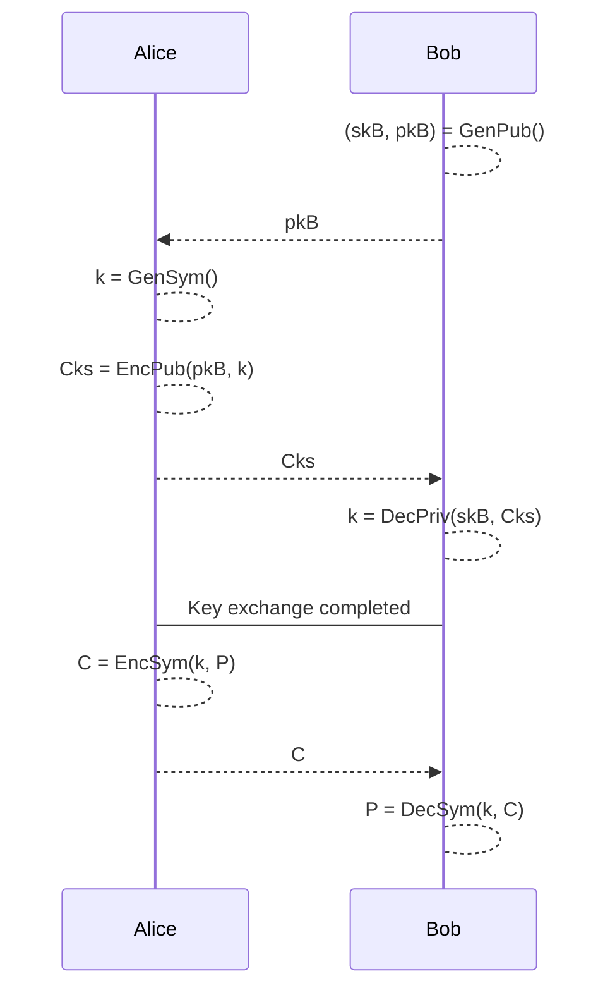

# Introduction

> The ***cryptography*** is the art and science of keeping messages secure, it is practiced by **cryptographers**. Inside the cryptography we can identify three main branches:
> 
> - **Symmetric Algorithms**: the same key is used for encryption and decryption. We include here also the hash functions.
> - **Asymmetric Algorithms**: the encryption key is different from the decryption key.
> - **Protocols**: the protocols are what is really used in the real world, they are based on the previous two branches.

> The ***cryptoanalysis*** is the art and the science of breaking ciphers, it is practiced by **cryptanalysts**.

> The ***cryptology*** is the study of cryptography and cryptoanalysis, it is practiced by **cryptologists**.

## Some definitions

> ***Brute-force attack***: this attack consists in trying all possible keys until the attacker guesses the right one. Note that this is an attack always possible (the key space is always finite), but it can be unfeasible (a good cipher has a very large key space).

> ***Attack classification***:
>
> 1. **Classical cryptoanalysis**: the attacker has access to the ciphertext and the algorithm. Examples are the frequency analysis, the brute-force attack.
> 2. **Social engineering**: the attacker tries to obtain the key from the user. Examples are the phishing, the shoulder surfing, Man-in-the-middle attacks.
> 3. **Implementation attacks**: the attacker tries to obtain the key from the implementation of the algorithm. Examples are the side channel attacks, the fault attacks.

> ***Domain parameters***: the domain parameters are all elements agreed by the parties during the definition of the crypto system.

> ***Computationally infeasible***: a task is computationally infeasible if its cost in terms of time and/or memory space is too high to be performed in practice.

## Kerckhoffs' principle

> *<u>Hypothesis</u>*: the enemy knows all about system, except for the secret key.
> 
> The security should just depends on the secrecy of the key.

## Symmetric of Private Key Cryptosystem

The **Symmetric Cryptosystem** consists of three algorithms:

1. `Gen`: the key generation algorithm, it generates the key `k`.
2. `Enc`: the encryption algorithm.
3. `Dec`: the decryption algorithm.

The encryption and decryption algorithms are defined as:

$\text{Enc}(k, P) = C$
$\text{Dec}(k, C) = P$

> All of the three algorithms must be computationally feasible.

### Indistinguishability - IND

Given $P1$ and $P2$ two known plaintexts. Given $C = \text{Enc}(k, P?)$, where $?$ is a random choice between `1` and `2`. The attacker must not be able to distinguish between $C1$ and $C2$.

### IND Secure

The symmetric cryptosystem $(\text{Gen}, \text{Enc}, \text{Dec})$ is **IND secure** if no adversary can distinguish with probability better then $1/2$.

## Key Distribution Problem

The goal is for two users, Alice (A) and Bob (B), to securely exchange a key over an insecure channel. This key is then used by both users in a normal symmetric cryptosystem.

> ***Key Exchange Protocol***: is a protocol that starting from a security parameter `n` allows them (Alice and Bob) to compute keys $kA$ an $kB$ such that $kA = kB$.

## Asymmetric or Public Key Cryptosystem

The **Asymmetric Cryptosystem** consists of three algorithms:

1. `Gen`: the key generation algorithm, it generates the key pair $(sk, pk)$.
2. `Enc`: the encryption algorithm.
3. `Dec`: the decryption algorithm.

The encryption and decryption algorithms are defined as:

$\text{Enc}(pk, P) = C$
$\text{Dec}(sk, C) = P$

> All of the three algorithms must be computationally feasible.

> The secret key $sk$ should be computationally infeasible to compute from the public key $pk$. This allow to publish the public key without compromising the security of the system.

### Public Key Distribution System

The public cryptography allows to solve the key distribution problem.

Alice and Bob are users of a $PKC = (Gen, Enc, Dec)$.

> ***Note***: with PKC we intend the public key cryptosystem (not public key certificate)

## Attacks definitions

1. **Ciphertext only attack**: the cryptoanalyst has the ciphertext of several messages. All of them are encrypted with the same algorithm, the goal is to find as many plaintexts as possible or to find the key(s).

2. **Known plaintext attack**: the cryptoanalyst has the ciphertext of several messages and the corresponding plaintexts. All of them are encrypted with the same algorithm, the goal is to find the key(s).

3. **Chosen plaintext attack**: the cryptoanalyst has the ciphertext of several messages and the corresponding plaintexts that he can control. All of them are encrypted with the same algorithm, the goal is to find the key(s) or a mechanism (algorithm) to decrypt other messages.

4. **Adaptive chosen plaintext attack**: it is a special case of chosen plaintext attack where the cryptoanalyst can choose the plaintexts based on the previous results.

5. **Chosen ciphertext attack**: the cryptoanalyst can choose the ciphertexts to decrypt and has access to the decrypted version. The goal is to find the key(s).

6. **Chosen key attack**: the cryptoanalyst cannot choose the key, but it knows some details about relations between the keys.

7. **Rubber-hose cryptanalysis**: the cryptoanalyst threatens, blackmails, tortures or otherwise coerces the victim to reveal the key.

## Security level

The security level of a algorithm is expressed in bits. An algorithm as a security level of `n` bits if the best attack against it requires $O(2^n)$ operations.

> The security level is related to a security parameter $\lambda$ which is usually written in unary $1^n$. In cryptography, a common and important security parameter is the **key length**.

## CPA-IND - Probabilistic Encryption

The probabilistic encryption is a encryption scheme that is not deterministic, it means that encrypting the same plaintext with the same key can produce different ciphertexts.

Examples:

- **ECB mode**: the same plaintext is always encrypted in the same way $\rightarrow$ **NOT** probabilistic.
- **CBC mode**: the same plaintext is encrypted in different ways $\rightarrow$ **probabilistic** (if **IV** is a nonce).

## Non-malleability

A cryptosystem is **non-malleable** if given a ciphertext $C$ it is computationally infeasible to compute a ciphertext $C'$ such that $\text{Dec}(C')$ is related to $\text{Dec}(C)$.

# Modular Arithmetic

**Modular arithmetic** deals with the study of the finite rings: $\mathbb{Z}_n = \{0, 1, 2, ..., n-1\}$.

**Modulo operator**: Let $a$, $r$, $n$ in $\mathbb{Z}$ with $n>0$. We write $a \equiv r \mod n$ if $n$ divides exactly $a-r$. We say that $a$ is congruent to $r$ modulo $n$.

**Equivalence classes**: Let $n$ in $\mathbb{Z}$ with $n>0$. The set of all integers congruent to $r$ modulo $n$ is called the equivalence class of $r$ modulo $n$.

Example:

$a = 15, n = 5$

$12 \equiv 2 \mod 5$
$12 \equiv 7 \mod 5$
$12 \equiv -3 \mod 5$

$Eq_{class}(12) = \{..., -8, -3, 2, 7, 12, 17, ...\}$

The equivalence classes can be exploited to simplify the computation of the modular arithmetic.

Example:

$$
\begin{align*}
13 * 16 - 8 \mod 5 &\equiv (13 \mod 5) * (16 \mod 5) - (8 \mod 5) \\
&\equiv 3 * 1 - 3 \mod 5 \\
&\equiv 0 \mod 5
\end{align*}
$$

In cryptography:

$$
\begin{align*}
3^8 \mod 7 &\equiv (3^3 * 3^3 * 3^2) \mod 7 \\
&\equiv (27 * 27 * 9) \mod 7 \\
&\equiv (6 * 6 * 2) \mod 7 \\
&\equiv (36 * 2) \mod 7 \\
&\equiv 1*2 \mod 7 \\
&\equiv 2 \mod 7
&\end{align*}
$$

## Computation of the remainder

Let $a$, $n$ in $\mathbb{Z}$.

$a = qn + r$

$q = floor(a/n)$&emsp;&emsp; `// Quotient`
$r = a - qn$&emsp;&emsp;&emsp;&emsp;&nbsp; `// Remainder`

## Rings

The **integer ring** $\mathbb{Z}_n$ consists of:

1. A set of integers $\mathbb{Z}_n = \{0, 1, 2, ..., n-1\}$.
2. Two operations: $+$ and $*$ such that for all $a, b, c, d \in \mathbb{Z}_n$:
    - $a + b \equiv c \mod n$.
    - $a * b \equiv d \mod n$.

## Multiplicative inverse

Let $a$ in $\mathbb{Z}_n$. We call multiplicative inverse of $a$ modulo $n$ the integer $a^{-1}$ such that:

$$
a * a^{-1} \equiv 1 \mod n
$$

> ***Note***: the multiplicative inverse exists if and only if $a$ and $n$ are coprime $(gcd(a,n) = 1)$.

## Galois fields

A **Galois field** is an integer ring where $n$ is a prime number (from now we call it $p$). The Galois field is denoted by $\mathbb{GF}(p)$, $\mathbb{Z}_p$ or $\mathbb{F}_p$.

The Galois field is a finite field, it contains $p$ elements and four operations: $+, -, *, /$.

> ***Note***: the division $/$ is defined as the multiplication by the multiplicative inverse $(^{-1})$.
