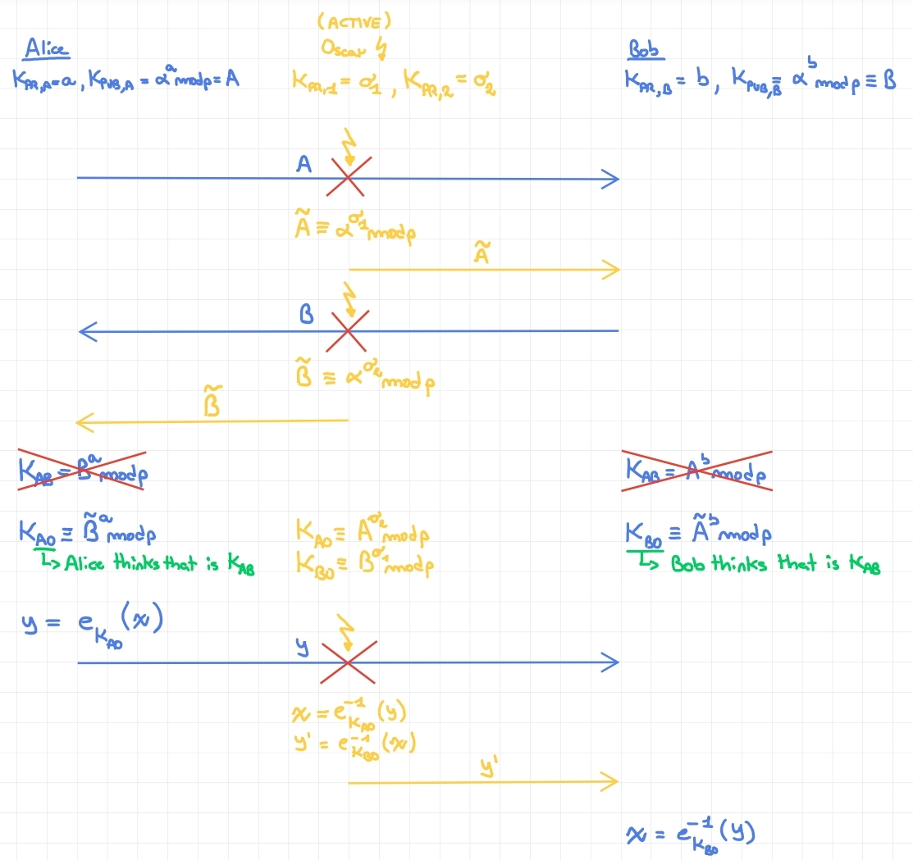

# Key Distribution

Key establishment deals with the problem of how to distribute the shared (symmetric) secret keys between two or more parties.

There are two possible approaches:

- **Key agreement**: the parties agree on a shared secret key (ex. DH).

- **Key transport**: the keys are distributed over a secure channel (ex. key encrypted with RSA).

> ***The $n^2$ key distribution problem***: suppose to have $n$ parties and each party wants to communicate privately with all the other parties. 
>
> The number of keys to be distributed and stored is: $n\cdot (n-1) \approx n^2$ (quadratic!).
> 
> The number of pairs of keys is: $\frac{n\cdot (n-1)}{2} = (\begin{smallmatrix} n \\ 2  \\ \end{smallmatrix}) $
>
> The drawback of this problem are:
>
> - The number of keys is huge, for small real-world networks can be suitable, but a general approach based on this mechanism is not feasible.
> - The addition of a new party requires the distribution of $(n-1)$ pairs of keys (one for each party). 

## Symmetric Key Distribution

The classical key negotiation between two party is:

1. Alice generate a random session key $R$.

2. Alice encrypts $R$ with the pre-shared secret key $P$ and sends it to Bob.

3. Bob decrypts the message with the pre-shared secret key $P$ and gets the session key $R$.

This approach is insecure and have many flaws. One of this is that an attacker can intercept and record the messages and run **offline** a **dictionary attack** against $P$.

Note that breaking $P$ means breaking all the sessions keys $R^{(i)}$ and all the messages encrypted with them.

### Key Freshness

> The **key freshness** is the property of a key that ensures that the key can be used only for a limited time. This keys are called **ephemeral keys** or **session keys**.

The advantages of limiting the validity time of a key are:

1) If the key is compromised, the attacker gets access only to a few messages. 

2) The attacker has a limited time to break the key to use it for live attacks.

3) The attacker has limited material to perform cryptanalysis (ex. differential cryptoanalysis).

4) The attacker is forced to recover several keys to decrypt all the messages.

#### How we can update efficiently the keys?

The key can be updated in two ways:

- Running periodically the exchange protocol.

- Using a ***key derivation function*** (KDF).

The KDF is a function that takes two inputs:

- A secret master key $P./assets
> ***Important***: the master secret $P$ is used to **derive** the key, not to **encrypt** the key. So, an attacker cannot directly attack it by sniffing the network and recording the messages. 
>
> It's important that the KDF does not leak anything about the master key $P$.

> **Implicit Nonce**: the nonce can be a counter that is incremented at each new key derivation, so the nonce is not transmitted over the network. Note that the counters must be synchronized between the parties.
>
> The counter can be implemented in different and weird ways, for example as LFSR or as Galois counter.

## Encrypted Key Exchange (EKE)

The Encrypted Key Exchange protocol is a combination of asymmetric and symmetric cryptography. 

The two parties, Alice and Bob, share a pre-shared secret password $P$.

1. Alice generates an asymmetric key pair $(pk, sk)$. She sends the public key encrypted with the password $P$ to Bob: $E_P(pk)$.

2. Bob decrypts the message with the password $P$ and gets the public key $pk$.

3. Bob generates a session symmetric key $R$ and encrypts it with the public key $pk$ of Alice: $E_{pk}(R)$. Now Bob encrypts again the message with the password $P$: $E_P(E_{pk}(R))$ and sends it to Alice.

4. Alice decrypts the message with the password $P$ and gets the session key encrypted asymmetrically. She decrypts the session key with her private key and gets the session key $R$.

### Key Validation

The keys can be validated from the two parties by a challenge-response mechanism.

1. Alice generates a random nonce $C_A$, encrypt it with the session key $R$ and sends it to Bob: $E_R(C_A)$.

2. Bob decrypts the message with the session key $R$ and gets the nonce $C_A$. Now he generates a random nonce $C_B$, encrypt the concatenation of $C_A$ and $C_B$ with the session key $R$ and sends it to Alice: $E_R(C_A || C_B)$.

3. Alice decrypts the message with the session key $R$ and gets the nonce $C_A || C_B$. If the $C_A$ value is the same previously generated, she encrypts the nonce $C_B$ with the session key $R$ and sends it to Bob: $E_R(C_B)$.

4. Bob decrypts the message with the session key $R$ and gets the nonce $C_B$. If the $C_B$ value is the same previously generated, the session key $R$ is valid.

Note that, if Bob has not $R$ he cannot get the nonce $C_A$ from $E_R(C_A)$. If Alice has not $R$ she cannot get the nonce $C_B$ from the $E_R(C_A || C_B)$.

### Flaws

Suppose that an attacker compromise the current session key $R$. The attacker can recover the master key $P$ by running an offline dictionary attack.

Let:

- $R$ be the compromised session key.
- $M_A$ be the message sent from Alice to Bob: $M_A = E_P(pk)$.
- $M_B$ be the message sent from Bob to Alice: $M_B = E_P(E_{pk}(R))$.

The attacker can run the following attack:

$\forall P^* \in \text{dictionary}:\ pk^* := E^{-1}_{P^*}(M_A)$

then

$E_{P^*}(E_{pk^*}(R)) \stackrel{?}{=} M_B$

If the equality holds, the attacker has recovered the master key $P = P^*$.

### KEK revisited

To avoid the previous attack, the EKE can be modified as follows:

1. Alice generates two random values: $C_A$ and $SA$, where $SA$ is a subkey.

2. Alice encrypts the concatenation of the two values with the pre-shared secret key $R$: $E_R(C_A || SA)$ and sends it to Bob.

3. Bob decrypts the message obtaining the two values: $C_A$ and $SA$.

4. Bob generates two random values: $C_B$ and $SB$, where $SB$ is a subkey.

5. Bob encrypts the concatenation of the challenge $C_A$ and the two values with the session key $R$: $E_R(C_A || C_B || SB)$ and sends it to Alice.

6. Alice decrypts the message obtaining the values: $C_A$, $C_B$ and $SB$. If $C_A$ is the same as the previously generated, she encrypts the challenge $C_B$ sends it to Bob.

7. Bob decrypts the message obtaining the challenge $C_B$. If $C_B$ is the same as the previously generated the handshake is valid.

Now both parties have the two subkeys $SA$ and $SB$ that can be used to derive the session key $S := \mathcal{f}(SA, SB)$

> Even if the attacker compromise a session key $S$, he cannot recover the master key $R$ with the previous attack.

> ***Note***: the function $\mathcal{f}$ must be agreed between the parties.

### EKE with RSA

The EKE can be implemented via RSA cryptosystem. Suppose that Alice and Bob have the public keys of each other.

1. Alice generates a random session key $R$, encrypts it with the public key of Bob: $E_{pk_B}(R)$ and sends it to Bob.

2. Bob decrypts the message with his private key and gets the session key $R$.

Now Alice and Bob have shared the session key $R$.

#### Partition Attack

We noted that the public keys in RSA are always odd, an attacker could rule out half of the candidate values $P'$ if $E_{P'}^{-1}(E_P(e))$ is an even number where $E_P(e)$ is the sniffed encrypted public key.

For each session key, we use a new public key, so the attacker exclude new $P'$ values decreasing the key space logarithmically. At a certain point, the attacker can guess the master key $P$ easily.

## Key Distribution Center (KDC)

The Key Distribution Center is a trusted third party that distributes the session keys between the parties. 

> The KDC server must share a secret key with each party.

### Protocol (Kerberos)

- Alice wants to communicate with Bob.
- Alice and the KDC share a secret key $K_A$.
- Bob and the KDC share a secret key $K_B$.

```
    Alice                           KDC                            Bob
    ra = nonce()
        ---rq(IDa,IDb,ra)---------->
                                    Kses = rand()
                                    T = getLifetime()
                                    Ya = E_KA(Kses,ra,T,IDb)
                                    Yb = E_KB(Kses,IDa,T)
        <-----------------(Ya,Yb)---
    Kses,ra',T,IDb = D_KA(Ya)
    verify(ra,ra')
    verify(IDb)
    verify(T)
    Ts = getTimestamp()
    Yab = E_Kses(IDa, Ts)
        ---(Yab,Yb)------------------------------------------------>
                                                                    Kses,IDa,T = D_KB(Yb)
                                                                    IDa',Ts = D_Kses(Yab)
                                                                    verify(IDa,IDa')
                                                                    verify(Ts)
                                                                    verify(T)
    ________________________________________________________________

    y = E_Kses(x)
        ---y-------------------------------------------------------->
                                                                    x = D_Kses(y)
```

Responsibility of Alice:

1. Alice must send to the KDC the ID of Bob to get the right $Y_b$ and must send her ID to avoid that the key is used by impersonating an other party.

2. Alice must verify that the response from the KDC is not a replay by checking the nonce $ra$.

3. Alice must check the freshness of the session key by checking the lifetime $T$.

4. Alice must check the ID of Bob to know that the session key is for Bob (Alice may have request multiple session keys).

Responsibility of Bob:

1. Bob must verify that the ID that is sent by Alice (the claimed identity) is equal to the ID that is encrypted by the KDC.

2. Bob must verify the freshness of the session key by checking the lifetime $T$ (from the KDC).

3. Bob must check the freshness of the session key by checking the timestamp $Ts$ (from Alice).

### Flaws

1. A secure channel between the user and the KDC is required when a new user joins in the network. The new user must share a secret key with the KDC.

2. The KDC is a single point of failure. If the KDC is compromised, all the session keys are compromised.

3. No forward secrecy. If the session key is compromised, all the previous messages are compromised.

### Protocol (Needham-Schroeder)

Let:

- $K_{AS}$ be the secret key between Alice and the KDC.
- $K_{BS}$ be the secret key between Bob and the KDC.
- $N_A$ and $N_B$ two nonces.
- $K_{AB} is a symmetric session key between Alice and Bob.

1. Alice $\rightarrow$ S: $(A, B, N_A)$.

    I'm Alice, I want to communicate with Bob, here is my nonce $N_A$.

2. S $\rightarrow$ A: $E_{K_{AS}}(\ N_A, K_{AB}, B, E_{BS}(K_{AB}, A)\ )$.

    The full message is encrypted with the secret key between Alice and the KDC.

    There is your key $K_{AB}$ for the request with nonce ${N_A}$ to Bob. Here there is the key $K_{AB}$ for Bob and the encrypted key for Bob including your ID.

3. Alice $\rightarrow$ B: $E_{K_{BS}}(K_{AB}, A)$.

    Here is the key for the communication with you encrypted by S.

4. B $\rightarrow$ A: $E_{K_{AB}}(N_B)$.

    Here is the nonce encrypted with our key, so you can verify that I'm Bob.

5. A $\rightarrow$ B: $E_{K_{AB}}(N_B-1)$.

    Here is the nonce encrypted with our key, so you can verify that I'm Alice.

## Perfect Forward Secrecy (PFS)

The perfect forward secrecy is a property of a cryptosystem that ensures that the compromise of a session key does not compromise the previous session keys.

## Hopper-Blum Identification Protocol

> This is the scenario: a user and a computer share a secret, the computer identify the user with a random challenge and the user must respond with the correct response.

Suppose that the user and the computer share a secret vector $x \in GF(2)^n$, where $n$ is the length of the vector.

1. The computer generates a random vector $c \in GF(2)^n$ and sends it to the user.

2. The user computes the response $r = x \cdot c$ and sends it to the computer.

Now the computer can verify the identity of the user by checking if the response $r$ is the correct one.

On a single authentication $n = 1$, we can say that:

- The probability that the user is correctly identified is $1$, he knows the secret.

- The probability that an attacker is correctly identified is $0.5$.

After $k$ authentication, the probability of the user remains $1$, but the probability of the attacker is $2^{-k}$.

The attacker, after observing $O(n)$ challenge-response pairs, can recover the secret $x$ via Gaussian elimination.

To avoid this attack, the system must introduce a parameter $\eta \in (0, \frac{1}{2})$ and allow the user to respond with an incorrect response with probability $\eta$. The attacker cannot use the Gaussian elimination to recover the secret $x$. The problem becomes the "**learning parity with noise**" (LPN) problem, that is an NP-hard problem.

## Simultaneous Authentication of Equals (SAE)

The SAE is a protocol that allows two parties to authenticate each other and to establish a shared session key. The protocol is a peer-to-peer protocol, so there is no need of a trusted third party.

The two parties, Alice and Bob, share a secret password $P$.

### SAE Parameters

- $\Gamma$ is a finite cyclic group of order $r$. It can be FFC or ECC.

- $L: (User1, User2) \rightarrow User?$ is a function that returns the greater of the two users.

- $H: \{0,1\}^* \rightarrow \{0,1\}^s$ is a one-way function (ex. hash function).

- A random oracle (with equal probability).

- A KDF function that get a $smallstr$ and a length $len$ and stretch the $smallstr$ to a string of length $len$:

    $bigstr = \text{KDF}(smallstr, len)$.

- a bijection $F: \Gamma \rightarrow \text{number}$.

### SAE Protocol


## Secure Remote Password (SRP)

The SRP is a protocol that allows a user to authenticate to a server and to establish a shared session key. The protocol is a client-server protocol.

There are two types of protocol:

1- **Plaintext-equivalent**: requires that the server stores a copy of each user's password in plaintext or something from which the password can be easily recovered.

2- **Verifier-based**: requires that the server stores a verifier $V$ or something from which the verifier can verify the password but is computationally infeasible to recover the password.

# Asymmetric Key Exchange (AKE)

Let be:

- $Q(x,y), R(x,y)$ two mixing functions.

- $P(x)$ a one-way function.

- $S(x,y)$ a KDF.

- The server must have a secret key $K_S$.

- The client must have a secret key $K_C$.

The function must be designed to satisfy the following property:

Let $V_{server} = S(\ R(\ P(w),\ P(K_C)\ ),\ Q(y,K_S)\ )$

And $V_{client} = S(\ R(\ P(Y),\ P(K_S)\ ),\ Q(W,K_C)\ )$

$$

V_{server} = V_{client}

$$


Setup phase:

1. The server compute $P(K_S)$ and sends it to the client that will store it.

2. The client compute $P(K_C)$ and sends it to the server that will store it.

Key exchange phase:

1. The client generate a random nonce $w$, compute $C_n = P(w)$ and sends it to the server.

2. The server generate a random nonce $y$, compute $S_n = P(y)$ and sends it to the client.

Now the client compute:

$$
    K = S(\ R(\ S_n,\ P(K_S)\ ),\ Q(w,K_C)\ )
$$

And the server compute:

$$
    K = S(\ R(\ C_n,\ P(K_C)\ ),\ Q(y,K_S)\ )
$$

Remember that the server and the client knows the result of $P(K_C)$ and $P(K_S)$, respectively. They do not know the secret keys $K_C$ and $K_S$.

The schema can be completed by adding the key verification via a challenge-response mechanism.

## SRP specification

This protocol is implemented in SRP by performing the operation on $GF(p)$ where $p$ is a large prime number.

The parameters are:

- $P(x) = g^x \mod p$, where $g$ is a generator of the group.

- $Q(w,x) = w + u \cdot x \mod p$.

- $R(w,x) = w \cdot x^u \mod p$.

- $S(w,x) = w^x \mod p$.

> Note: $u$ is defined int the SRP protocol specification as a *"random scrambling parameter, publicly revealed"*. More about SRP protocol [here](http://srp.stanford.edu/ndss.html#SECTION00032200000000000000)

## J-PAKE

> The Password Authenticated Key Exchange by Juggling (J-PAKE) is a password-authenticated key agreement protocol that allows two parties to establish private and authenticated communications solely based on their shared low-entropy password without requiring a Public Key Infrastructure (PKI) or any other trusted third party.

# Certificates

## Man-in-the-Middle Attack



The consequences of a MITM attack are:

- The attacker can read the messages.

- The attacker can modify the messages.

- The attacker can inject or drop messages.

The MITM attack works against ***ALL public key schemes***. The problem **the public keys are not authenticated**.

The certificates are used to authenticate the public keys: the exchange of the public keys is performed sending a digital certificate that contains the public key and the identity of the owner.

