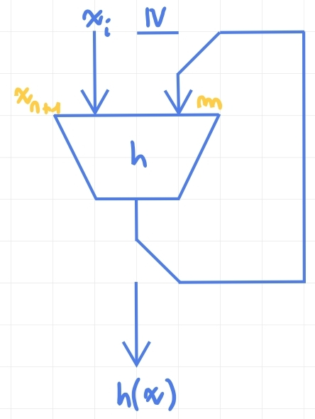
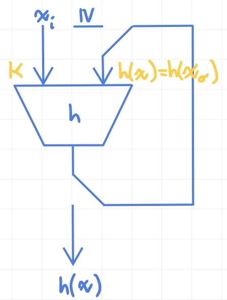
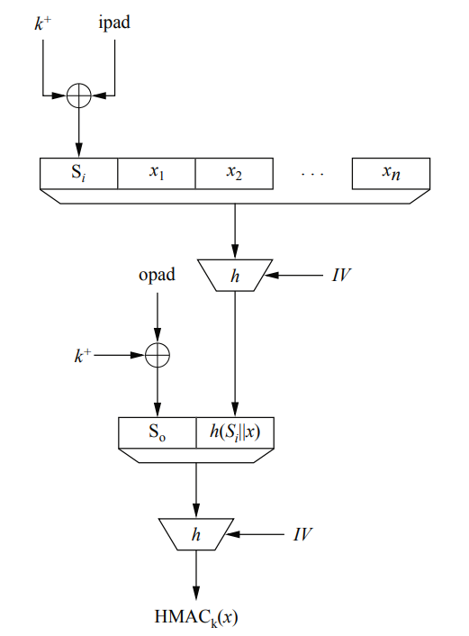

# Message Authentication Codes - MACs

> ***MAC***: a MAC is a cryptographic checksum, it is a way to sign something via symmetric cryptography.

> ***Important***:
>
> 1. ***Message authentication? Yes***: The MAC is computed with a secret key, that key is known only by the sender and the receiver.
> 2. ***Message integrity? Yes***: The MAC is computed with the message and the key, so if the message is altered, the MAC will not be valid. If the key is correctly kept secret, the sender and the receiver are the only ones that can compute a valid MAC.
> 3. ***Non-repudiation? No***: The MAC is computed with a secret **symmetric** key, so the sender and the receiver has the same capabilities. It is impossible to prove who generate the MAC (the sender or the receiver).

The MAC gets an arbitrary length message and a secret key and returns a fixed length value.

## MACs with Block Ciphers

The MAC can be computed with a block cipher.

### CBC-MAC

The CBC-MAC is a MAC computed with a block cipher in CBC mode. The message is padded and encrypted with the block cipher in the same way of the symmetric encryption with CBC mode.

The MAC is the last block of the ciphertext: the last block is the result of the encryption of the last block of the message XORed with the second last block of the ciphertext, and so on. 

We can say that the $i$-th block of the ciphertext has the information about the $i$-th block of the plaintext from the current encryption and the information about the previous blocks from the XOR with the $(i-1)$-th ciphertext.

### GMAC

The GMAC is a variant of the Galois Counter Mode [(GCM)](#gcm-mode---galois-counter-mode). The GMAC does not encrypt data but only compute the message authentication code (**t-tag**).

## MACs with Hash Functions

The basic idea of MACs implemented with hash functions is to compute the MAC by processing the combination of secret key and message with a hash function: $m = MAC_k(x) = h(k,x)$.

The most simle way to combine message and key is concatenation:

- $m = h(k || x)\ \ \ \ \ \ $ [secret suffix].
- $m = h(x || k)\ \ \ \ \ \ $ [secret prefix].

> Both have some weaknesses. The best way is to use more complex methods like HMAC.

### Secret Prefix MACs Attack

Let assume: $x = (x_1 || x_2 || ... || x_n)$ with $x_i$ blocks of the same size of the hash function block.

The MAC is: $m = h(k || x) = h(k || x_1 || x_2 || ... || x_n)$.

Most of all hash function has the Merkle-Damgard construction (but the same attack can be performed with the sponge construction with some modifications).

Suppose that Bob has computed the MAC $m$ with the secret key $k$ and the message $x = (x_1 || x_2 || ... || x_n)$:

$m = h(k || x_1 || x_2 || ... || x_n)$.

Bob sends the message $x$ and the MAC $m$ to Alice, but Oscar intercept the message.

The attacker, Oscar, wants to append something to the message and the MAC must be valid: now, for simplicity, we assume that Oscar wants to append a single block $x_{n+1}$ to the message.

$x_O = (x || x_{n+1}) = (x_1 || x_2 || ... || x_n || x_{n+1})$

The attacker does not know the secret key $k$, but he knows the MAC $m$ of the message $x$. He can exploit the Merkle-Damgard construction to compute the MAC of the message $x_O$ without knowing the secret key $k$.

 

Oscar can compute a single round of the hash function sending as input the new block $x_{n+1}$ and as state the actual MAC $m$.

Alice will receive the message $x_O$ and the MAC $m_O$ computed by Oscar. The MAC will be valid:

Alice will perform the same computation of Bob + Oscar by using the hash function and the secret key $k$ over the full message.

### Secret Suffix MACs Attack

This attack is more complex and has more restrictive conditions: the attacker must be able to find a collision for the hash of the message.

Bob compute the MAC $m = h(x || k)$ and sends the message $x$ and the MAC $m$ to Alice.

Oscar intercept the message. Let assume that Oscar finds a collision for the hash of the message $x$: $h(x) = h(x_O)$:

The attacker can substitute the message $x$ with the message $x_O$ and the MAC will be valid.

 

The last round of the hash function computes:

 - Bob side: $h(state = h(x), block = k)$

 - Alice side: $h(state = h(x_O), block = k)$

But $h(x) = h(x_O)$, so the MAC computed is the same.

### HMAC

The idea behind HMAC is to compute the MAC by using two nested secret prefix MACs, in the reality the construction is a few more complex but the concept is the same.

Simple idea: $m = h(k || h(k || x))$. Where we call **inner hash** the $h(k || x)$ and **outer hash** the $h(k || \text{inner hash})$.

The HMAC schema is: 

 

$HMAC_k(x) = h(\ (k^+\oplus opad)\ ||\ h(\ (k^+\oplus ipad) \ ||\ x )\ )$

Where the **inner hash** is computed has $h(\ (k^+\oplus ipad) \ ||\ x )$ and the **outer hash** is computed has $h(\ (k^+\oplus opad)\ ||\ \text{inner hash}\ )$.

The $k^+$ is the left padded secret key: $k^+ = 000...0||k$ to fit the key to the hash function block size.

The $opad$ e $ipad$ values are defined in the standard and are:

- $ipad = (00110110) \times \frac{\text{hash input length}}{8}$

- $opad = (01011100) \times \frac{\text{hash input length}}{8}$

> $h$ is a generic hash function, note that the cryptographic strength of the key and the hash function must be equivalent: this means $n$ bits key length and $2n$ bits hash function digest size.