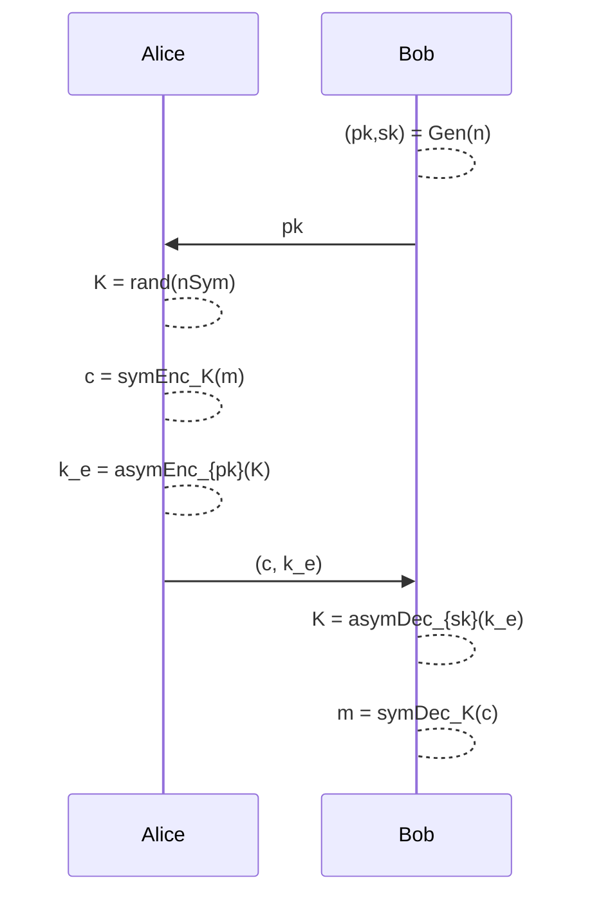

# RSA Cryptosystem

> The RSA cryptosystem is an asymmetric cryptosystem based on the **Factorization Problem**.

## Factorization Problem

> ***Definition***: given $N$ integer, find his prime factors: $N = \prod_{i=1}^k p_i^{e_i}$.
>
> In RSA, $N = p \cdot q$. So the problem is to find $p$ and $q$.

More precisely, the RSA problem a this time is equivalent to the factorization problem.

The goal to break RSA is find the private exponent $d$ from the public key $(e,N)$.

To compute $d$, we need the euler's $\phi(N)$ function. But to compute $\phi(N)$, we need to factorize $N$.

## Key generation - $Gen(\lambda)$

1. Choose two large prime numbers $p,q$ such that $p \ne q$.

2. Compute $N = p \cdot q$.

3. Compute $\phi(N) = (p-1) \cdot (q-1)$.

4. Choose $e \in \{1, ..., \phi(N)-1\}$ such that $gcd(e, \phi(N)) = 1$.

5. Compute $d = e^{-1} \mod \phi(N)$.

The public key is $K_{pub} = (e,N)$ and the private key is $K_{pr} = (d,\phi(N))$.

```python
from Crypto.Util.number import getPrime, inverse

def gen(l):
    p = getPrime(l)
    q = getPrime(l)
    N = p * q
    phi = (p - 1) * (q - 1)
    e = random.randint(1, phi - 1)
    d = inverse(e, phi)

    return (e, N), (d, phi)
```

> Common values for $e$ are $3$, $17$ and $2^{16} + 1 = 65537$. We exclude $e=3$ because it can be attacked, but is useful in the examples.

## Encryption - $Enc_{K_{pub}}(x)$

$Enc_{K_{pub}}(x)$: compute $y = x^e \mod N$.

```python

def enc(x, Kpub):
    e, N = Kpub
    return pow(x, e, N)
```

## Decryption - $Dec_{K_{pr}}(y)$

$Dec_{K_{pr}}(y)$: compute $x = y^d \mod N$.

```python

def dec(y, Kpr):
    d, N = Kpr
    return pow(y, d, N)
```

## Proof of Correctness

// Write the proof of correctness in latex
$$
\begin{align}
    y^d \mod N &\equiv (x^e)^d \mod N\\
    &\equiv x^{ed} \mod N\\
    &\equiv x^{ed \mod \phi(N)} \mod N\\
    &\equiv x^{1 + k \cdot \phi(N)} \mod N\\
    &\equiv x \cdot x^{k \cdot \phi(N)} \mod N\\
    &\equiv x \cdot (x^{\phi(N)})^k \mod N\\
    &\equiv x \cdot 1^k \mod N\\
    &\equiv x \mod N
\end{align}
$$

## Security and Attacks

Now we consider secure the RSA cryptosystem if the factorization problem is hard to solve, this means that the keys must be greater then 2048 bits.

### Hastad's Broadcast Attack

Assume that the message $m$ is encrypted with $e = 3$ three times with three different moduli $N_1, N_2, N_3$.

$$
\begin{cases}
    y_1 = m^3 \mod N_1\\
    y_2 = m^3 \mod N_2\\
    y_3 = m^3 \mod N_3\\
\end{cases}
$$

By using the CRT we can find $y = crt([y_1, y_2, y_3], [N_1, N_2, N_3])$. Then we can compute the cube root of $y$ to find $m$.

> The only requirement is that $m^3 < N_1 * N_2 * N_3$.

### Factorization of N

Various algorithms to factorize $N$:

- Pollard's $\rho$: $O(n^{\frac{1}{4}})$
- Quadratic Sieve: $O(e^{\sqrt{\ln N \ln \ln N}})$
- General Number Field Sieve: $O(e^{\sqrt[3]{\ln N \ln \ln N}})$

Many other attacks can be performed, see [here](#attacks-against-rsa).


# Hybrid Encryption - KEM/DEM Paradigm

The basic idea is: **use a symmetric cryptosystem to encrypt the message and an asymmetric cryptosystem to encrypt the symmetric key**.

## Protocol

- ***$Gen(n) \rightarrow (pk,sk)$***: generate the public and private keys with size $n$ bits.

- ***$Enc(pk, m) \rightarrow (c = symEnc_K(m), k_e = asymEnc_{pk}(K))$***: generate a random key $K$ for the symmetric cryptosystem, encrypt the message $m$ with $K$ and encrypt $K$ with the asymmetric cryptosystem.

- ***$Dec(sk, (c, k_e)) \rightarrow (K = asymDec_{sk}(k_e), m = symDec_K(c))$***: decrypt the key $K$ with the asymmetric cryptosystem and decrypt the message $m$ with $K$.

<div style="background-color: white">



</div>