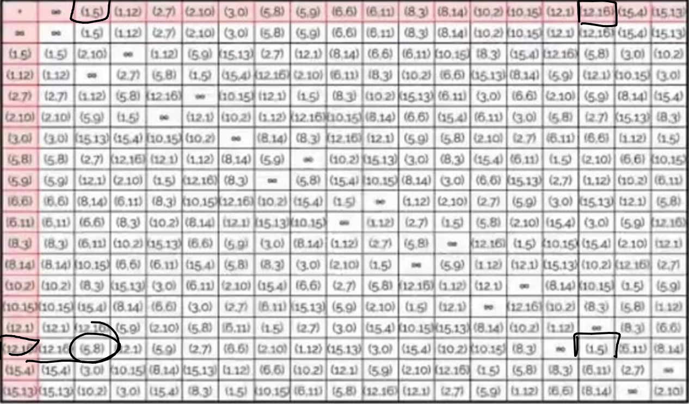
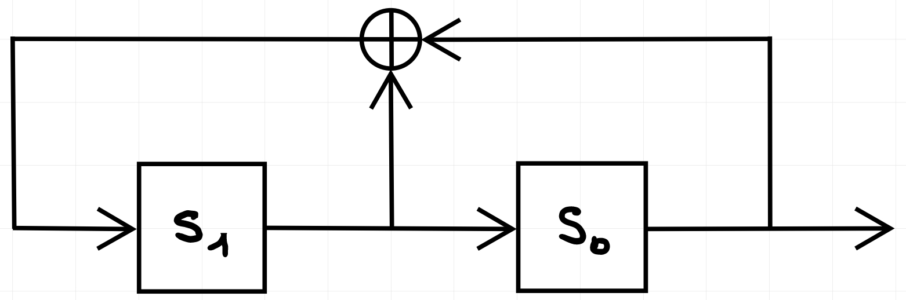

# 02-07-2021

###### ref1
1. Let $E: y^2 \equiv x^3 + 2x +2 \mod 17$ an elliptic curve; let $P = (5,1)$, $Q = (6,3)$ and $R = (x,y)$ such that $P + Q + R = \mathcal{O}$. Then $R$ is:

    a) $R = (10,12)$

    b) $R = (10,1)$

    ***c) $R = (10,11)$***

    d) $R = (10,6)$

Solution:

$$
\begin{align*}
    P + Q + R &= \mathcal{O} \rightarrow P + Q = -R \\
    \\
    \\
    -R = P + Q &= (5,1) + (6,3) = \\
    \\
    s &= \frac{y_2 - y_1}{x_2 - x_1} = \\
    &= (3 - 1) \cdot (6 - 5)^{-1} \mod 17 = \\
    &= 2 \cdot 1 \mod 17 \\
    &= 2 \mod 17 \\
    \\
    x_3 &= s^2 - x_1 - x_2 = \\
    &= 2^2 - 5 - 6 \mod 17 = \\
    &= 4 - 5 - 6 \mod 17 = \\
    &= -7 \mod 17 \\
    &= 10 \mod 17 \\
    \\
    y_3 &= s \cdot (x_1 - x_3) - y_1 = \\
    &= 2 \cdot (5 - 10) - 1 \mod 17 = \\
    &= 2 \cdot (-5) - 1 \mod 17 = \\
    &= -10 - 1 \mod 17 = \\
    &= -11 \mod 17 = \\
    \\
    R &= -(-R) = (x_3, -y_3) = (10,11)
\end{align*}
$$

---

2. Let $E: y^2 \equiv x^3 + 2x +2 \mod 17$ an elliptic curve; let $P = (6,3)$, $Q = (10,6)$ and $R = (x,y)$ such that $P + Q + R = \mathcal{O}$. Then $R$ is:

    a) $R = (9,16)$

    ***b) $R = (9,1)$***

    c) $R = (9,14)$

    d) $R = (9,12)$

For complete solution see previous exercise.

$$
\begin{align*}
    P + Q + R &= \mathcal{O} \rightarrow P + Q = -R \\
    \\
    \\
    -R = P + Q &= (6,3) + (10,6) = \\
    \\
    s &= (6-3) \cdot (10-6)^{-1} \mod 17 = \\
    &= 3 \cdot 4^{-1} \mod 17 = \\
    &= 5 \mod 17 = \\
    \\
    x_3 &= 5^2 - 6 - 10 \mod 17 = \\
    &= 9 \mod 17 \\
    \\
    y_3 &= 5 \cdot (6 - 9) - 3 = \\
    &= -18 \mod 17 = \\
    &= -1 \mod 17 = \\
    \\
    R &= -(-R) = (9,1)\\
\end{align*}
$$

---

3. Let $\mathbb{GF}(8)$ be the Galois Field defined by the polynomial $G(x) = x^3 + x + 1 \in \mathbb{Z}_2[x]$. Let $a(x) \in \mathbb{GF}_8$ be $a(x) = x + 1$. The multiplicative inverse of $a(x)$ is:

    a) $x^2 + 1$

    b) $x^2$

    c) $x^2 + x + 1$

    ***d) $x^2 + x$***

Solution: 

$$
\begin{align*}
    1x^3 + 0x^2 + 1x + 1 &|\ x + 1 \\
    1x^3 + 1x^2 +\_ + \_ &|\ x^2 + x \\
    \backslash + 1x^2 + 1x + 1 &| \\
    1x^2 + 1x + \_ &| \\
    \backslash + \ \ \backslash + 1 &| \\
    \\
    q &= 1\\
    r &= x^2 + x\\
\end{align*}
$$

---

4. Let $\mathbb{GF}(8)$ be the Galois Field defined by the polynomial $G(x) = x^3 + x + 1 \in \mathbb{Z}_2[x]$. Let $a(x) \in \mathbb{GF}_8$ be $a(x) = x^2 + x$. The multiplicative inverse of $a(x)$ is:

    ***a) $x + 1$***

    b) $x$

    c) $x^2 + x + 1$

    d) $x^2 + x$

Solution

$$
\begin{align*}
    1x^3 + 0x^2 + 1x + 1 &|\ x^2 + x \\
    1x^3 + 1x^2 +\_ + \_ &|\ x + 1 \\
    \backslash + 1x^2 + 1x + 1 &| \\
    1x^2 + 1x + \_ &| \\
    \backslash + \ \ \backslash + 1 &| \\
    \\
    q &= 1\\
    r &= x + 1\\
\end{align*}
$$

---

###### ref4
5. Find $x \in \mathbb{Z}_{401}$ such that:

    $x \cdot 56 \equiv 1 \mod 401$

    $5 \cdot x \equiv 308 \mod 401$

Solution:

$$
\begin{align*}
    401 = 56 \times 7 + 9 \rightarrow\ \  & 9 = 401 - 56 \times 7 \\
    \\
    56 = 6 \times 9 + 2 \rightarrow\ \  & 2 = 56 - 6 \times 9 \\
    & \ \ = 56 - 6 \times (401 - 56 \times 7) \\
    & \ \ = 56 - 6 \times 401 + 42 \times 56 \\
    & \ \ = 43 \times 56 - 6 \times 401 \\
    \\
    9 = 4 \times 2 + 1 \rightarrow\ \  & 1 = 9 - 4 \times 2 \\
    & \ \ = (401 - 56 \times 7) - 4 \times (43 \times 56 - 6 \times 401) \\
    & \ \ = 401 + (-6) \times (-4) \times 401 - 4 \times 43 \times 56 - 7 \times 56 \\
    & \ \ = 401 + 24 \times 401 - 172 \times 56 - 7 \times 56 \\
    & \ \ = 25 \times 401 - 179 \times 56 \\ 
    \\
    \\ x &= t = -179 \mod 401 = 222 \mod 401 \\
    \\
    & \text{Check} \\
    5 \cdot x \stackrel{?}{\equiv} 308 \mod 401 &\rightarrow\ \ 5 \cdot 222 \equiv 1110 \mod 401 \equiv 308 \mod 401
\end{align*}
$$

---

6. Find $x \in \mathbb{Z}_{401}$ such that:

    $x \cdot 29 \equiv 1 \mod 401$

    $5 \cdot x \equiv 14 \mod 401$

Solution:

$$
\begin{align*}
    401 &= 29 \times 13 + 24 \\
    29 &= 24 \times 1 + 5 \\
    24 &= 5 \times 4 + 4 \\
    5 &= 4 \times 1 + 1 \\
    4 &= 1 \times 4 + 0 \ \ stop\\
    \\
    \\
    24 &= 401 - 29 \times 13 \\
    5 &= 29 - 24 = 14 \times 29 - 401 \\
    4 &= 24 - 5\ times 4 = 5 \times 401 - 69 \times 29 \\
    1 &= 5 \times 1 - 4 \times 1 = 83 \times 29 - 6 \times 401 \\
    \\
    t &= x = 83 \mod 401 \\
    \\
    & \text{Check} \\
    5 \cdot x &\stackrel{?}{\equiv} 14 \mod 401 \\
    5 \cdot 83 &\equiv 415 \mod 401 \equiv 14 \mod 401
\end{align*}
$$

---

# 03 - 07 - 2020

1. Let $p = 11$, $q = 19$, $n = p\cdot q = 209$.

    How many solution does the equation $x^2 \equiv 171 \mod 209$ have?

    a) 1

    b) 3

    ***c) 0***

    d) 4

    e) 2

Solution:

$$
\begin{align*}
    x^2 &\equiv 171 \mod 209 \equiv 171 \mod (11*\cdot 9)\\
    &\downarrow \text{CRT} \downarrow \\
    &\begin{cases}
        x^2 &\equiv 171 \mod 11 \equiv 6 \mod 11 \\
        x^2 &\equiv 171 \mod 19 \equiv 0 \mod 19 \\
    \end{cases}\\
    \\
    &\text{Let analyze: } x^2 \equiv 0 \mod 19 \\
    &\text{the only solution is } x = 0 \\
    &\text{but } 0 \text{cannot be a solution for } x^2 \equiv 6 \mod 11 \\
    \\
    &\text{The equation has no solutions.}
\end{align*}
$$

---

2. Let $p = 11$, $q = 19$, $n = p\cdot q = 209$.

    How many solution does the equation $x^2 \equiv 130 \mod 209$ have?

    a) 1

    ***b) 4***

    c) 2

    d) 3

    e) 0

Solution:

$$
\begin{align*}
    x^2 &\equiv 130 \mod 209 \equiv 130 \mod (11*\cdot 9)
    \\
    &\downarrow \text{CRT} \downarrow \\
    &\begin{cases}
        x^2 &\equiv 130 \mod 11 \equiv 9 \mod 11 \\
        x^2 &\equiv 130 \mod 19 \equiv 16 \mod 19 \\
    \end{cases}\\
    \\
    &\text{The possible solutions are:} \\
    x^2 &\equiv 9 \mod 11 \equiv \pm 3^2 \mod 11 \\
    x^2 &\equiv 16 \mod 19 \equiv \pm 4^2 \mod 19 \\
    \\
    &\text{Testing for } \pm 3 \\
    9^{\frac{11-1}{2}} \stackrel{?}{\equiv} 1 \mod 11 \rightarrow 9^5 \mod 11 &\equiv 9 \cdot 81^2 \mod 11 \\
    &\equiv 9 \cdot 4^2 \mod 11 \\
    &\equiv 9 \cdot 16 \mod 11 \\
    &\equiv 9 \cdot 5 \mod 11 \\
    &\equiv 45 \mod 11 \\
    &\equiv 1 \mod 11 \rightarrow \text{OK}\\
    \\
    &\text{Testing for } \pm 4 \\
    16^{\frac{19-1}{2}} \stackrel{?}{\equiv} 1 \mod 19 \rightarrow 16^9 \mod 19 &\equiv 16 \cdot 256^4 \mod 19 \\
    &\equiv 16 \cdot 9^4 \mod 19 \\
    &\equiv 16 \cdot 81^2 \mod 19 \\
    &\equiv 16 \cdot 5^2 \mod 19 \\
    &\equiv 16 \cdot 25 \mod 19 \\
    &\equiv 16 \cdot 6 \mod 19 \\
    &\equiv 96 \mod 19 \\
    &\equiv 1 \mod 19 \rightarrow \text{OK}\\
    \\
    &\text{The solutions are: } 4\\
\end{align*}
$$

---

###### ref2

3. Let $f: \mathbb{Z}_3 \times \mathbb{Z}_5 \to \mathbb{Z}_{15}$ be the isomorphism of CRT, then:

    a) $f(x,y) = 7x + 9y$

    b) $f(x,y) = 6x + 10y$

    ***c) $f(x,y) = 10x + 6y$***

    d) $f(x,y) = 12x + 4y$

Solution:

$$
\begin{align*}
    f: \mathbb{Z}_p \times \mathbb{Z}_q &\to \mathbb{Z}_{pq} \\
    f(x,y) &= x \cdot q \cdot (q^{-1} \mod p) + y \cdot p \cdot (p^{-1} \mod q) \mod pq\\
    \\
    \text{in this case: }&\\
    p &= 3, q = 5, pq = 15\\
    \\
    f(x,y) &= x \cdot 5 \cdot (5^{-1} \mod 3) + y \cdot 3 \cdot (3^{-1} \mod 5) \mod 15\\
    \\
    &\text{Let's find the inverses:}\\
    5^{-1} \mod 3 &\rightarrow 5 \cdot 2 \equiv 1 \mod 3 \rightarrow 2\\
    3^{-1} \mod 5 &\rightarrow 3 \cdot 2 \equiv 1 \mod 5 \rightarrow 2\\
    \\
    f(x,y) &= x \cdot 5 \cdot 2 + y \cdot 3 \cdot 2 \mod 15\\
    &= 10x + 6y \mod 15
\end{align*}
$$

---

4. Let $f: \mathbb{Z}_5 \times \mathbb{Z}_7 \to \mathbb{Z}_{35}$ be the isomorphism of CRT, then:

    a) $f(x,y) = 20x + 16y$

    ***b) $f(x,y) = 21x + 15y$***

    c) $f(x,y) = 15x + 21y$

    d) $f(x,y) = 17x + 19y$

Solution:

$$
\begin{align*}
    f: \mathbb{Z}_p \times \mathbb{Z}_q &\to \mathbb{Z}_{pq} \\
    f(x,y) &= x \cdot q \cdot (q^{-1} \mod p) + y \cdot p \cdot (p^{-1} \mod q) \mod pq\\
    \\
    \text{in this case: }&\\
    p &= 5, q = 7, pq = 35\\
    \\
    f(x,y) &= x \cdot 7 \cdot (7^{-1} \mod 5) + y \cdot 5 \cdot (5^{-1} \mod 7) \mod 35\\
    \\
    &\text{Let's find the inverses:}\\
    7^{-1} \mod 5 &\rightarrow 7 \cdot 3 \equiv 1 \mod 5 \rightarrow 3\\
    5^{-1} \mod 7 &\rightarrow 5 \cdot 3 \equiv 1 \mod 7 \rightarrow 3\\
    \\
    f(x,y) &= x \cdot 7 \cdot 3 + y \cdot 5 \cdot 3 \mod 35\\
    &= 21x + 15y \mod 35
\end{align*}
$$

---

5. Alice generates a secret key $sk_A = 4$ and wants to generate a DS. Prime numbers: $p = 11$, $q = 5$.

What is the public key?

Solution:

First of all we need to understand which algorithm is used: we have two primes and an integer as private key. The operation is digital signature.

We exclude RSA because the private key is very small as private exponent (is strange to have a private exponent of 4 in RSA). We exclude elliptic curves because we have two primes.

So the only algorithm left is DSA.

1. Check if $q$ is a divisor of $p-1$.

    $p-1 = 10$, $q = 5$.

    $q$ is a divisor of $p-1$, OK.

2. Check if $d < q$.

    $d = 4$, $q = 5$.

    $d < q$, OK.

3. Find $\alpha$ such that $\text{ord}(\alpha) = q$.

    The set from which we can choose $\alpha$ is $\mathbb{Z}_q^* = \{1,2,3,4\}$.

    - $\alpha = 1$, $\text{ord}(\alpha) = 1$.
    - $\alpha = 2$, $\text{ord}(\alpha) = 4$:
        - $\alpha^1 = 2$
        - $\alpha^2 = 4$
        - $\alpha^3 = 3$
        - $\alpha^4 = 1$
    - $\alpha = 3$, $\text{ord}(\alpha) = 4$:
        - $\alpha^1 = 3$
        - $\alpha^2 = 2$
        - $\alpha^3 = 4$
        - $\alpha^4 = 1$
    - $\alpha = 4$, $\text{ord}(\alpha) = 2$:
        - $\alpha^1 = 4$
        - $\alpha^2 = 1$

    So we can choose $\alpha = 2$ or $\alpha = 3$.

4. Find $\beta = \alpha^d \mod p$.

    $\beta = 2^4 \mod 11 = 5$.

    The public key is $(p,q,\alpha,\beta) = (11,5,2,5)$.

    or 

    $\beta = 3^4 \mod 11 = 4$.

    The public key is $(p,q,\alpha,\beta) = (11,5,3,4)$.

---

# 14-09-2021

1. Consider the following Feistel scheme:

    $B = 1000\ 1111$
    $K = 1111$
    $f(x) = x \oplus K$

    $Y = f(B)$

    What is the output of the Feistel scheme?

Solution:

$L = 1000$, $R = 1111$.

$L'= R = 1111$

$R'= L \oplus f(R) = L \oplus (R \oplus K) = 1000 \oplus (1111 \oplus 1111) = 1000 \oplus 0000 = 1000$

The output is $Y = 1000\ 1000$.

> This solution can be wrong, because the question is not clear about the function $f$, the solution is based that $f(R) = R \oplus K$ and the result is XORed again with the left part of the input.

---

2. Compute the value of $S_1(55) in DES algorithm.

    $S_1(x)$

    |         | 0 | 1 | 2 | 3 | 4 | 5 | 6 | 7 | 8 | 9 | 10|***11***| 12| 13| 14| 15|
    |---------|---|---|---|---|---|---|---|---|---|---|---|--------|---|---|---|---|
    | 0       | 14| 4 | 13| 1 | 2 | 15| 11| 8 | 3 | 10| 6 | 12     | 5 | 9 | 0 | 7 |
    | 1       | 0 | 15| 7 | 4 | 14| 2 | 13| 1 | 10| 6 | 12| 11     | 9 | 5 | 3 | 8 |
    | 2       | 4 | 1 | 14| 8 | 13| 6 | 2 | 11| 15| 12| 9 | 7      | 3 | 10| 5 | 0 |
    | ***3*** | 15| 12| 8 | 2 | 4 | 9 | 1 | 7 | 5 | 11| 3 |***14***| 10| 0 | 6 | 13|

Solution:

The value is $55$ in binary is $110111$.

| 1 | 1 | 0 | 1 | 1 | 1 |
|---|---|---|---|---|---|
|r1 | c3| c2| c1| c0| r0|

So:

- $r = (11)_2 = 3$
- $c = (1011)_2 = 11$

The value is $S_1(54) = 0$.

---

3. RSA parameters: $p = 5$, $q = 11$. What is a valid combination for RSA?

    a) $e = 12$, $M = 6$.

    ***b) $e = 17$, $d = 33$, $M = 6$, $C = 41$.***

    c) $e = 11$, $d = 11$, $M = 6$, $C = 16$.

Solution:

$n = p * q = 5 * 11 = 55$

$\phi(n) = (p-1) * (q-1) = 4 * 10 = 40$

Check a):

- $e$ and $\phi(n)$ must be coprime: $gcd(12,40) = 4 \neq 1$. **Not valid**.

Check b):

- $e$ and $\phi(n)$ must be coprime: $gcd(17,40) = 1$. **Ok**.

- $d = e^{-1} \mod \phi(n) \rightarrow 17 * 33 \stackrel{?}{\equiv} 1 \mod 40 \rightarrow 561 \equiv 40 \cdot 9 + 1 \equiv 1 \mod 40$. **Ok**.

- $M = 6 < n$. **Ok**.

- $C = M^e \mod n = 6^{17} \mod 55 \stackrel{?}{\equiv} 41 \mod 55$.

    $6^{17} = (6^3)^5 \cdot 6^2 = 216^5 \cdot 36 = 6^5 \cdot 36 = 36 \cdot 36 = 1296 \mod 55 = 41$. **Ok**.

This can be true.

Check c):

- $e$ and $\phi(n)$ must be coprime: $gcd(11,40) = 1$. **Ok**.

- $d = e^{-1} \mod \phi(n) \rightarrow 11 * 11 \stackrel{?}{\equiv} 1 \mod 40 \rightarrow 121 \equiv 40 \cdot 3 + 1 \equiv 1 \mod 40$. **Ok**.

- $M = 6 < n$. **Ok**.

- $C = M^e \mod n = 6^{11} \mod 55 \stackrel{?}{\equiv} 16 \mod 55$.

    $6^{11} = (6^3)^3 \cdot 6^2 = 6^3 \cdot 36 = 216 \cdot 36 \mod 55 = 6 \cdot 36 \mod 55 = 216 \mod 55 = 6 \mod 55$. **Not valid**.

---

4. DSA algorithm: $p = 11$, $q = 5$, $d = 4$, what is the public key?

    ***a) $(11,5,9,5)$***

    b) $(11,5,3,5)$

    c) $(11,5,7,3)$

    d) $(11,5,2,4)$

    e) $(11,5,4,2)$

Solution:

The values that can be generators are $\alpha = {1,2,3,4}$. The generator must have order $q$.

Let find the generators:

- $\text{ord}(1)$ is $1$.
- $\text{ord}(2)$ is $4$:
    - $2^1 = 2 \mod 5$
    - $2^2 = 4 \mod 5$
    - $2^3 = 8 \mod 5 = 3 \mod 5$
    - $2^4 = 16 \mod 5 = 1 \mod 5$.
- $\text{ord}(3)$ is $4$:
    - $3^1 = 3 \mod 5$
    - $3^2 = 9 \mod 5 = 4 \mod 5$
    - $3^3 = 27 \mod 5 = 2 \mod 5$
    - $3^4 = 81 \mod 5 = 1 \mod 5$
- $\text{ord}(4)$ is $2$:
    - $4^1 = 4 \mod 5$
    - $4^2 = 16 \mod 5 = 1 \mod 5$

So the generators are $\{2,3\}$.

- Public key for $\alpha = 2$:

    $\beta = \alpha^d \mod p = 2^4 \mod 11 = 16 \mod 11 = 5 \mod 11.

    $K_{pub} = (p,q,\alpha,\beta) = (11,5,2,5)$

    ***Not in the list***.

- Public key for $\alpha = 3$:

    $\beta = \alpha^d \mod p = 3^4 \mod 11 = 81 \mod 11 = 4 \mod 11$

    $K_{pub} = (5,11,3,4)$

    ***Not in the list***.

No solution found: we need to swap the roles of $p$ and $q$

We need to find an element with $\text{ord}(\alpha) = q = 5$

- $\text{ord}(1) = 1$ Not acceptable.
- $\text{ord}(2) > 5$ Not acceptable.
- $\text{ord}(3) = 5$ Acceptable.
- $\text{ord}(4) = 5$ Acceptable.
- $\text{ord}(5) = 5$ Acceptable.
- $\text{ord}(6) > 5$ Not acceptable.
- $\text{ord}(7) > 5$ Not acceptable.
- $\text{ord}(8) > 5$ Not acceptable.
- $\text{ord}(9) = 5$ Acceptable.
- $\text{ord}(10)= 2$ Not acceptable.

So the generators that we can use are $\{3,4,5,9\}$

- Public key for $\alpha = 3$:

    $\beta = \alpha^d \mod 11 = 3^4 \mod 11 = 4 \mod 11$

    $K_{pub} = (11,5,3,4)$

    ***Not in the list***.

- Public key for $\alpha = 4$

    $\beta = 4^4 \mod 11 = 3 \mod 11$

    $K_{pub} = (11,5,4,3)$

    ***Not in the list***.

- Public key for $\alpha = 5$

    $\beta = 5^4 \mod 11 = 9 \mod 11$

    $K_{pub} = (11,5,5,9)$

    ***Not in the list***.

- Public key for $\alpha = 9$

    $\beta = 9^4 \mod 11 = 5 \mod 11$

    $K_{pub} = (11,5,9,5)$

    ***Found***

> ***Important note***: instead try all possible value like done in this solution, we can start from the option:
>
> For each option, we need to check if the third parameter is a generator for $\mathbb{Z}_q$ or if it has $\text{ord}(\alpha) = q$ in $\mathbb{Z}_p$.
> Then compute $\beta = \alpha^d \mod p$ and check if it is equal to the fourth parameter of the key.

---

# 16-07-2021

###### ref3
1. Let $f: \mathbb{Z}_4 \times \mathbb{Z}_5 \to \mathbb{Z}_{20}$ be the isomorphism of CRT, then:

    a) $f(x,y) = 16x + 5y$

    b) $f(x,y) = 13x + 8y$

    ***c) $f(x,y) = 5x + 16y$***

    d) $f(x,y) = 8x + 13y$

Solution:

$f(x,y) = (x \cdot q \cdot (q^{-1} \mod p)) + (y \cdot p \cdot (p^{-1} \mod q))$

$f(x,y) = (x \cdot 5 \cdot (5^{-1} \mod 4)) + (y \cdot 4 \cdot (4^{-1} \mod 5))$

$4^{-1} \mod 5 \rightarrow 4 \cdot a = 1 \mod 5 \rightarrow 4$

$5^{-1} \mod 4 \rightarrow 5 \cdot a = 1 \mod 4 \rightarrow 1$

So:

$f(x,y) = (x \cdot 5 \cdot 1) + (y \cdot 4 \cdot 4) = 5x + 16y$

---

2. A $m$-bits Fibonacci LFSR has $m$ flip flops and produces an output stream $...s_2s_1s_0$ , if a sequence like $...01100001001...$ is observed in the output stream, then 

    a) $m = 4$

    b) $m = 2$

    ***c) $m = 5$***

    d) $m = 3$

Solution:

Let analyze the given sequence, the longer sequence of $0$ is long $4$ bits. This means that the LFSR has length greater then 4, otherwise the LFSR break and produce only zeros.

This means that the only suitable option is c) $m = 5$.

---

3. Consider ECDH. Let $G = (2,7)$, $p = 11 = A$ and $q = 5 = B$. What is the secret key $K$?

    **Some information are missing! To doubling we need the table or the $a$ value of the curve**

Solution:

$$
    K = p \cdot q \cdot G = 11 \cdot 5 \cdot (2,7) = 55 \cdot (2,7)
$$

A possible approach to compute the result is to use the "Double and Add Algorithm"

To find the binary representation of the scalar we do:

$55 = 32 + 16 + 7$

$55 = (100000)_2 + (10000)_2 + (111)_2 = (110111)_2$

From left to right:

1. First iteration we always compute: $R = 1_2P = P$

2. $b = 1 \rightarrow R = 2\cdot R + P = 2\cdot P + P = 3P$

3. $b = 0 \rightarrow R = 2\cdot R = 2\cdot 3P = 6P$

4. $b = 1 \rightarrow R = 2\cdot R + P = 2 \cdot 6P + P = 13P$.

5. $b = 1 \rightarrow R = 2\cdot R + P = 2 \cdot 13P + P = 27P$.

6. $b = 1 \rightarrow R = 2\cdot R + P = 2 \cdot 27P + P = 55P$.

In absence of the table, we compute:

- $2P = (s^2 - 2x_p, s(x_P - x_{2P}) - y_P)$, where $s = \frac{3x_P^2 + a}{2y_P}$

- $R + P = (s^2 - x_R - x_P, s(x_P - x_R) - y_P)$, where $s = \frac{y_R - y_P}{x_R - x_P}$

---

4. Consider DSA. Let $p = 11$, $q = 5$, $d = 4$. What is the public key?

    a) $(11,5,4,2)$

    b) $(11,5,5,7)$

    ***c) $(11,5,5,9)$***

    d) $(11,5,7,3)$

    e) $(11,5,2,4)$

Solution:

Let start finding $\alpha \in {1,2,3,4}$ generator of $\mathbb{Z}_q$:

- $\text{ord}(1) = 1$.
- $\text{ord}(2) = 4$.
- $\text{ord}(3) = 4$.
- $\text{ord}(4) = 2$.

The generators are $\alpha \in {2,3}$.

Let compute the public keys for this values:

- $\alpha = 2 \rightarrow \beta = \alpha^d \mod p = 2^4 \mod 11 = 5 \mod 11$

    $P_k = (p,q,\alpha,\beta) = (5,11,2,5)

    ***Not in the list***

- $\alpha = 3 \rightarrow \beta = 3^4 \mod 11 = 4 \mod 11$

    $P_k = (5,11,3,4)

    ***Not in the list***

Let now try with the elements $\alpha \in \mathbb{Z}_p\ st\ \text{ord}(\alpha) = q$.

- $\text{ord}(1) = 1$.
- $\text{ord}(2) > 5$.
- $\text{ord}(3) = 5$.
- $\text{ord}(4) = 5$.
- $\text{ord}(5) = 5$.
- $\text{ord}(6) > 5$.
- $\text{ord}(7) > 5$.
- $\text{ord}(8) > 5$.
- $\text{ord}(9) = 5$.
- $\text{ord}(10) = 2$.

The possible values of $\alpha$ are $\{3,4,5,9\}$

Let compute the public keys:

- $\alpha = 3 \rightarrow \beta = 3^4 \mod p = 4 \mod p$

    $P_k = (11,5,3,4)

    ***Not in the list***

- $\alpha = 4 \rightarrow \beta = 4^4 \mod p = 3 \mod p$

    $P_k = (11,5,4,3)

    ***Not in the list***

- $\alpha = 5 \rightarrow \beta = 5^4 \mod p = 9 \mod p$

    $P_k = (11,5,5,9)

    ***Found***

---

# 21-07-2020

1. Let $E(\mathbb{Z}_{17})$ be the elliptic curve defined by $y^2 \equiv x^3 + 7 \mod 17$. Alice and Bob use $G = (2,7)$ as generator for ECDH to obtain the key session $K$. Alice's secret key is $sk_A = 5$, Bob's secret key is $sk_B = 12$. What of the following is the session key?

    a) $(10,15)$

    b) $(5,9)$

    c) $(6,6)$

    ***d) $(5,8)$***

    The table is the following:

    

Solution: 

$K = sk_A \cdot sk_B \cdot G = 5 \cdot 12 \cdot (2,7) = 60 \cdot (2,7)$

Using the double and add algorithm:

$60 = 32 + 16 + 8 + 4 = (100000)_2 + (10000)_2 + (1000)_2 + (100)_2 = (111100)_2$

We have to do 6 iterations:

1. The first is always $R = 1_2P = P = (2,7)$

2. $b = 1 \rightarrow R = 2R + P = 2\cdot (2,7) + (2,7) = (12,16) + (2,7) = (5,9)$

3. $b = 1 \rightarrow R = 2R + P = 2\cdot (5,9) + (2,7) = (5,8) + (2,7) = (12,1)$

4. $b = 1 \rightarrow R = 2R + P = 2\cdot (12,1) + (2,7) = (1,12) + (2,7) = (5,8)$

5. $b = 0 \rightarrow R = 2R = 2\cdot (5,8) = (5,9)$

6. $b = 0 \rightarrow R = 2R = 2\cdot (5,9) = (5,8)$

The secret key $K = (5,8)$

---

2. Seed $s_0 = 2$. $s_1, s_2, ...$ numbers generated by a linear PRNG with $a = 5$, $b = 1$, $\mod 23$. What is $s_2$?

    a) 6

    b) 17

    c) 15

    ***d) 10***

    e) 13

Solution:

The linear PRNG formula is $s_i \equiv a\cdot s_{i-1} + b \mod p$

In this case, we need to compute $s_2$, let start computing $s_1$:

$s_1 = 5\cdot 2 + 1 \mod 23 \equiv 11 \mod 23$

Now we compute:

$s_2 = 5\cdot 11 + 1 \mod 23 \equiv 56 \mod 23 \equiv 10 \mod 23$

---

3. Find $x \in \mathbb{Z}_{401}$ such that:

    $x \cdot 262 \equiv 1 \mod 401$

    $5 \cdot x \equiv 375 \mod 401$

Solution:

We need to find $x\cdot 261 \equiv 1 \mod 401$, so we use the EEA:

$$
\begin{align*}
    401 &= 1 \times 262 + 139\\
    262 &= 1 \times 139 + 123\\
    139 &= 1 \times 123 + 16\\
    123 &= 7 \times 16 + 11\\
    16  &= 1 \times 11 + 5\\
    11  &= 2 \times 5 + 1\\
    5   &= 5 \times 1 + 0\ \ \text{STOP}\\
    \\
    \\
    139 &= 1 \times 401 - 1 \times 262\\
    \\
    123 &= 1 \times 262 - (1 \times 401 - 1 \times 262)\\
        &= 2 \times 262 - 1 \times 401\\
    \\
    16  &= (1 \times 401 - 1 \times 26) - (2 \times 262 - 1 \times 401)\\
        &= 2 \times 401 - 3 \times 262\\
    \\
    11  &= (2 \times 262 - 1 \times 401) - 7 \times (2 \times 401 - 3 \times 262)\\
        &= 23 \times 262 - 15 \times 401\\
    \\
    5   &= (2 \times 401 - 3 \times 262) - (23 \times 262 - 15 \times 401)\\
        &= 17 \times 401 - 26 \times 262\\
    \\
    1   &= (23 \times 262 - 15 \times 401) - 2 \times (17 \times 401 - 26 \times 262)\\
        &= \bold{75} \times 262 - 49 \times 401\\
    \\
    \\
    x &= 75\\
    \\
    \\
    \text{C}&\text{heck}\\
    5 \cdot 75 &\equiv 375 \mod 401\ \ \text{OK!}\\
\end{align*}
$$

---

# 22-09-2020

1. Consider the following Feistel scheme:

    $B = 1100\ 1111$
    $K = 1111$
    $f(x) = x \oplus K$

    $Y = f(B)$
    
     
    
    a) $Y = 1111\ 1111$

    b) $Y = 1100\ 1111$

    ***c) $Y = 1111\ 1100$***

    d) $Y = 0000\ 0000$

Solution:

| L    | R    |
|------|------|
| 1100 | 1111 |

$L' = R = 1111$

$R' = f(R) \oplus L = (R \oplus K) \oplus L = (1111 \oplus 1111) \oplus 1100 = 0000 \oplus 1100 = 1100$

$Y = 1111\ 1100$

---

2. Consider the following Feistel scheme:

    $B = 0100\ 1111$
    $K = 1111$
    $f(x) = x \oplus K$

    $Y = f(B)$

    a) $Y = 1111\ 1111$

    b) $Y = 1100\ 1111$

    c) $Y = 1111\ 0100$

    d) $Y = 0000\ 0000$

     

3. Compute the value of $S_1(22)$ in DES algorithm.

    $S_1(x)$

    |         | 0 | 1 | 2 | 3 | 4 | 5 | 6 | 7 | 8 | 9 | 10| ***11*** | 12| 13| 14| 15|
    |---------|---|---|---|---|---|---|---|---|---|---|---|----------|---|---|---|---|
    | ***0*** | 14| 4 | 13| 1 | 2 | 15| 11| 8 | 3 | 10| 6 | ***12*** | 5 | 9 | 0 | 7 |
    | 1       | 0 | 15| 7 | 4 | 14| 2 | 13| 1 | 10| 6 | 12| 11       | 9 | 5 | 3 | 8 |
    | 2       | 4 | 1 | 14| 8 | 13| 6 | 2 | 11| 15| 12| 9 | 7        | 3 | 10| 5 | 0 |
    | 3       | 15| 12| 8 | 2 | 4 | 9 | 1 | 7 | 5 | 11| 3 | 14       | 10| 0 | 6 | 13|

Solution:

Let represent $22$ in binary: $(010110)_2$

| $r_1$ | $c_3$ | $c_2$ | $c_1$ | $c_0$ | $r_0$ |
|-------|-------|-------|-------|-------|-------|
|   0   |   1   |   0   |   1   |   1   |   0   | 

So:

$r = (00)_2 = 0$

$c = (1011)_2 = 11$

Then:

$S_1(22) = 12$

---

4. These are $IP$ and $IP^{-1}$ of DES:

    $$
    IP = \begin{bmatrix}
        58 & 50 & 42 & 34 & 26 & 18 & 10 & 2 \\
        60 & 52 & 44 & 36 & 28 & 20 & 12 & 4 \\
        62 & 54 & 46 & 38 & 30 & 22 & 14 & 6 \\
        64 & 56 & 48 & 40 & 32 & 24 & 16 & 8 \\
        57 & 49 & 41 & 33 & 25 & 17 & 9  & 1 \\
        59 & 51 & 43 & 35 & 27 & 19 & 11 & 3 \\
        61 & 53 & 45 & 37 & 29 & 21 & 13 & 5 \\
        63 & 55 & 47 & 39 & 31 & 23 & 15 & 7
    \end{bmatrix}
    $$

    $$
    IP^{-1} = \begin{bmatrix}
        40 & 8 & 48 & 16 & 56 & 24 & 64 & 32 \\
        39 & 7 & 47 & 15 & 55 & 23 & 63 & 31 \\
        38 & 6 & 46 & 14 & 54 & 22 & 62 & 30 \\
        37 & 5 & 45 & 13 & 53 & 21 & 61 & 29 \\
        36 & 4 & 44 & 12 & 52 & 20 & 60 & 28 \\
        35 & 3 & 43 & 11 & 51 & 19 & 59 & 27 \\
        34 & 2 & 42 & 10 & 50 & 18 & 58 & 26 \\
        33 & 1 & 41 & 9 & 49 & 17 & 57 & 25
    \end{bmatrix}
    $$

    What is the first row of the table corresponding to $IP^2 = IP \circ IP$?

Solution:

$IP(0) = IP[0][0] = 58 \rightarrow IP^2(0) = IP(58) = IP[58//8][58\%8] = IP[7][2] = 47$

$IP(1) = IP[0][0] = 50 \rightarrow IP^2(1) = IP(50) = IP[50//8][50\%8] = IP[6][2] = 45$

$IP(2) = IP[0][0] = 42 \rightarrow IP^2(2) = IP(42) = IP[42//8][42\%8] = IP[5][2] = 43$

$IP(3) = IP[0][0] = 34 \rightarrow IP^2(3) = IP(34) = IP[34//8][34\%8] = IP[4][2] = 41$

$IP(4) = IP[0][0] = 26 \rightarrow IP^2(4) = IP(26) = IP[26//8][26\%8] = IP[3][2] = 48$

$IP(5) = IP[0][0] = 18 \rightarrow IP^2(5) = IP(18) = IP[18//8][18\%8] = IP[2][2] = 46$

$IP(6) = IP[0][0] = 10 \rightarrow IP^2(6) = IP(10) = IP[10//8][10\%8] = IP[1][2] = 44$

$IP(7) = IP[0][0] =  2 \rightarrow IP^2(7) = IP( 2) = IP[ 2//8][ 2\%8] = IP[0][2] = 42$

So the first row of $IP^2 = IP \circ IP$ is:

$$
    \begin{bmatrix}
        47 & 45 & 43 & 41 & 48 & 46 & 44 & 42\\
    \end{bmatrix}
$$

---

# 27-06-2022

1. [Go to ex1 - 02-07-21](#ref1)

 

2. [Go to ex2 - 03-07-20](#ref2)

 

3. Let $Enc_k^1(P) = k \oplus P$ be the Vernam or XOR cipher of 3-bit blocks.
    Let $Enc_k^2(P) = k \boxtimes P$ be the multiplication cipher $\mod 8$ where $k,P$ are the binary expression of elements of $\mathbb{Z}_8$.
    Let $Enc_k(P) = Enc_{k_2}^2(Enc_{k_1}^1(P))$ be the 3-bit double-encryption of $P$.

    Knowing that $Enc_k(3) = 4$ and $Enc_k(4) = 7$, find the pair $(k_2,k_1)$.

Solution:

$$
\begin{cases}
    (3 \oplus k_1) \boxtimes k_2 \equiv 4 \mod 8\\
    (4 \oplus k_1) \boxtimes k_2 \equiv 7 \mod 8\\
\end{cases}
$$

Distributive property

$$
\begin{cases}
    (3 \boxtimes k_2) \oplus (k_1 \boxtimes k_2) \equiv 4 \mod 8\\
    (4 \boxtimes k_2) \oplus (k_1 \boxtimes k_2) \equiv 7 \mod 8\\
\end{cases}
$$

$$
\begin{cases}
    (k_1 \boxtimes k_2) \equiv 4 \oplus (3 \boxtimes k_2)\\
    (k_1 \boxtimes k_2) \equiv 7 \oplus (4 \boxtimes k_2)\\
\end{cases}
$$

Now the first member of both equation is the same, so:

$$
\begin{align*}
    4 \oplus (3 \boxtimes k_2) &= 7 \oplus (4 \boxtimes k_2)\\
    7 \oplus 4 \oplus (3 \boxtimes k_2) &= (4 \boxtimes k_2)\\
    3 \oplus (3 \boxtimes k_2) &= (4 \boxtimes k_2)\\
    (3 \oplus (3 \boxtimes k_2)) \oplus (4 \boxtimes k_2) &= 0\\
    3 \oplus ((3 \boxtimes k_2) \oplus (4 \boxtimes k_2)) &= 0\\
    3 \oplus ((3 \oplus 4) \boxtimes k_2) &= 0\\
    3 \oplus (7 \boxtimes k_2) &= 0\\
    7 \boxtimes k_2 &= 3 \mod 8\\
    k_2 &= 3 \boxtimes 7^{-1} \mod 8\\
    k_2 &= 3 \boxtimes 7 \mod 8\\
    k_2 &= 21 \mod 8\\
    k_2 &= 5\\
\end{align*}
$$

$(7^{-1} \mod 8 \rightarrow x \cdot 7 \equiv 1 \mod 8 \rightarrow 7 \cdot 7 \equiv 49 \mod 8 \equiv 1 \mod 8)$

We have found the key $k_2 = 5$

$$
\begin{align*}
    (3 \oplus k_1) \boxtimes 5 &\equiv 4 \mod 8\\
    (3 \boxtimes 5) \oplus (k_1 \boxtimes 5) &\equiv 4 \mod 8\\
    (15 \mod 8) \oplus (k_1 \boxtimes 5) &\equiv 4 \mod 8\\
    7 \oplus (k_1 \boxtimes 5) &\equiv 4 \mod 8\\
    k_1 \boxtimes 5 &\equiv 4 \oplus 7 \mod 8\\
    k_1 \boxtimes 5 &\equiv 3 \mod 8\\
    k_1 &\equiv 3 \boxtimes 5^{-1} \mod 8\\
    k_1 &\equiv 3 \boxtimes 5 \mod 8\\
    k_1 &\equiv 15 \mod 8\\
    k_1 &\equiv 7 \mod 8\\
\end{align*}
$$

$(5^{-1} \mod 8 \rightarrow x \cdot 5 \equiv 1 \mod 8 \rightarrow 5 \cdot 7 \equiv 25 \mod 8 \equiv 1 \mod 8)$

We have found the key $k_1 = 7$

Now the $K = (k_2, k_1) = (5,7)$

---

# Facsimile 2020

1. Compute the bits $s_5, s_4, s_3, s_2$ of the stream generated by the LFSR whose polynomial is $\chi_L(x) = x^2 + x + 1$ with seed $s_0 = 1$, $s_1 = 0$.

Solution:

The polynomial $\chi_L(x)$ identify a LFSR of degree $m = 2$ and feedback $s_i = s_{i-1} \oplus s_{i-2}$. It is drawn as follow:

$$
\begin{align*}
    s_0 &= 1\\
    s_1 &= 0\\
    s_2 &= s_0 \oplus s_1 = 1 \oplus 0 = 1\\
    s_3 &= s_1 \oplus s_2 = 0 \oplus 1 = 1\\
    s_4 &= s_2 \oplus s_3 = 1 \oplus 1 = 0\\
    s_5 &= s_3 \oplus s_4 = 1 \oplus 0 = 1\\
\end{align*}
$$

So the sequence $s_5s_4s_3s_2 = 1011$

---

2. Let $E: y^2 = x^3 + 7$ be an elliptic curve defined on $\mathbb{Z}_{11}$.

    (a) Check that $P = (2,2)$ and $Q = (7,3)$ are in $E$.

    (b) Compute $P + Q$.

    (c) Check the result of (b) is in $E$.

Solution:

(a)

$2^2 \equiv 2^3 + 7 \mod 11 \rightarrow 4 \equiv 8 + 7 \mod 11 = 15 \mod 11 = 4 \mod 11$ OK!.

$3^2 \equiv 7^3 + 7 \mod 11 \rightarrow 9 \equiv 5 \cdot 7 + 7 \mod 11 \rightarrow 9 \equiv 35 + 7 \mod 11 \equiv 2 + 7 \mod 11 \equiv 9 \mod 11$ OK.

(b)

$$
\begin{align*}
    &R = P + Q = (2,2) + (7,3)\\
    \\
    &s = (3-2)(7-2)^{-1} \mod 11 \equiv 1 \cdot 5^{-1} \mod 11 = 9 \mod 11\\
    \\
    &x_R = s^2 - x_P - x_Q = 9^2 - 2 - 7 \mod 11 \equiv 81 - 9 \mod 11 \equiv 72 \mod 11 \equiv 6 \mod 11\\
    \\
    &y_R = s(x_P - x_R) -y_P = 9\cdot (2 - 6) - 2 \mod 11 \equiv -4 \cdot 9 - 2 \mod 11 \equiv -38 \mod 11 \equiv -5 \mod 11 \equiv 6 \mod 11\\
    \\
    &R = (x_R, y_R) = (6,6)
\end{align*}
$$

(c)

$6^2 \equiv 6^3 + 7 \mod 11 \rightarrow 36 \mod 11 \equiv 36 \cdot 6 + 7 \mod 11 \rightarrow 3 \equiv 18 + 7 \mod 11 \equiv 25 \mod 11 \equiv 3 \mod 11$ OK.

---

3. In RSA:

    - user A keys are: $sk_A = (p_A, q_A, d_A) = (5,11,23)$ and $pk_A = (n_A, e_A) = (55, 7)$.

    - user B keys are: $sk_B = (p_B, q_B, d_B) = (3,7,5)$ and $pk_B = (n_B, e_B) = (21, 5)$.

    A wants to send to B the message M. So she send the ciphertext $C = Enc_{pk_B}(M)$ and add as her digital signature the pair $(Enc_{pk_B}(F), h(M))$ where $F = Enc_{sk_A}(h(M))$ and $h(x)$ is a fixed hash function.

    Assuming that $h(M) = 8$, find the digital signature i.e. the pair $(Enc_{pk_B}(F), h(M))$

Solution:

The signature $s = (E_{pk_B}(E_{sk_A}(H(x))),H(x))$, so:

- $H(x) = 18$.

- $E_{sk_A} = C_1 = (H(x))^{d_A} \mod n_A = 18^{23} \mod 55$

- $E_{pk_B} = C_1^{e_B} \mod n_B = C_1^5 \mod 21$

Let compute $C_1$:

$$
\begin{align*}
    18^{23} \mod 55 &\equiv 18 \cdot (18^2)^11 \mod 55 \equiv\\
                    &\equiv 18 \cdot (49)^11 \mod 55 \equiv\\
                    &\equiv 18 \cdot 49 \cdot (49^2)^5 \mod 55 \equiv\\
                    &\equiv 18 \cdot 49 \cdot (36)^5 \mod 55 \equiv\\
                    &\equiv 18 \cdot 49 \cdot 36 \cdot (36^2)^2 \mod 55 \equiv\\
                    &\equiv 18 \cdot 49 \cdot 36 \cdot 31^2 \mod 55 \equiv\\
                    &\equiv 18 \cdot 49 \cdot 36 \cdot 26 \mod 55 \equiv\\
                    &\equiv 2 \cdot 36 \cdot 26 \mod 55 \equiv\\
                    &\equiv 2 \cdot 1 \mod 55 \equiv\\
                    &\equiv 2 \mod 55\\
\end{align*}
$$

Let now compute the signature value:

$$
\begin{align*}
    2^{5} \mod 21 &\equiv 32 \mod 21 = 11 \mod 21\\
\end{align*}
$$

So the signature is $s = (E_{pk_B}(E_{sk_A}(H(x))),H(x)) = (11,18)$

---

# Gennaio 2021

1. [Go to ex1 - 16-07-21](#ref3)

 

2. How many solutions does have the equation $x^2 \equiv 173 \mod 291$?

    a) 3

    b) 1

    ***c) 0***

    d) 4

    e) 2

Solution:

To apply the CRT we need to have the factorization of $291$. 

- Try $2$: $291 \stackrel{?}{/} 2$ No.

- Try $3$: $\frac{291}{3} = \frac{300-9}{3} = 100 - 3 = 97$

Now we can continue with $97$ that is a prime number.

So $p = 3$ and $q = 97$:

$$
\begin{cases}
    x^2 \equiv 173 \mod 3 \equiv 2 \mod 3\\
    x^2 \equiv 173 \mod 97 \equiv 76 \mod 97\\
\end{cases}
$$

Let check if $2$ is a quadratic residue:

$$
2^{\frac{p-1}{2}} \stackrel{?}{\equiv} 1 \mod p\\
2^{\frac{3-1}{2}} \stackrel{?}{\equiv} 1 \mod 3\\
2^1 \stackrel{?}{\equiv} 1 \mod 3\\
$$

$2$ is not a quadratic residue.

Let check if $76$ is a quadratic residue:

$$
76^{\frac{q-1}{2}} \stackrel{?}{\equiv} 1 \mod q\\
76^{\frac{3-1}{2}} \stackrel{?}{\equiv} 1 \mod 97\\
76^{48} \stackrel{?}{\equiv} 1 \mod 97\\
\text{python3: 'pow(76,48,97)'}\\
96 \equiv 1 \mod 97\\
$$

$76$ is not a quadratic residue.

The equation has not solutions.

---

3. [Go to ex3 - 03-07-20](#ref4)

# Random

1. CRT System

    $$
    \begin{cases}
        x \equiv 4 \mod 11 \\
        x \equiv 3 \mod 17 \\
        x \equiv 6 \mod 18
    \end{cases}
    $$

    Find $x$

Solution:

(a) Check if the moduli are coprime:

- $gcd(11,17) = 1$ (easy... both are primes).
- $gcd(17,18) = 1$ (easy... 17 is prime and 18 is not a multiple of 17).
- $gcd(11,18) = 1$ (easy... 11 is prima and 18 is not a multiple of 11).

Ok

(b) $N = n_1 \cdot n_2 \cdot n_3 = 11 \cdot 17 \cdot 18 = 3366$

(c) Compute the coefficients:

- $M_1 = M / n_1 = n_2 \cdot n_3 = 17 \cdot 18 = 306$
- $y_1 = M_1^{-1} \mod m_1 = 306^-1 \mod 11 = 9^{-1} \mod 11 = 5 \mod 11$
- $M_2 = M / n_2 = n_1 \cdot n_3 = 11 \cdot 18 = 198$
- $y_2 = M_2^{-1} \mod m_2 = 198^{-1} \mod 17 = 11^{-1} \mod 17 = 14 \mod 17$
- $M_3 = M / n_3 = n_1 \cdot n_2 = 11 \cdot 12 = 187$
- $y_3 = M_3^{-1} \mod m_3 = 187^{-1} \mod 18 = 7^{-1} \mod 18 = 13 \mod 18$

(d)

$x = a_1 \cdot M_1 \cdot y_1 + a_2 \cdot M_2 \cdot y_2 + a_3 \cdot M_3 \cdot y_3 \mod M$

$x = 4 \cdot 306 \cdot 5 + 3 \cdot 198 \cdot 14 + 6 \cdot 187 \cdot 13 \mod 3366$

$x = 6120 + 8316 + 14586 \mod 3366 = 2754 + 1584 + 1122 \mod 3366 = 5460 \mod 3366 = 2094 \mod 3366$

---

# From Slides

Consider ECDSA on the elliptic curve $y^2 = x^3 + 2x + 2 \mod 17$. Let $G = (5,1)$, $n = 19$ and $d = 5$. Let $H(m) = 8$.

Sign M and compute the public key $p_k = (p,a,b,n,G,B)$.

Solution:

$B = d \cdot G = 5 \cdot (5,1)$

Using the doubling and add we need to:

- Double
- Double
- Add

So: $2G = 2 \times (5,1)$

$s = (3 \cdot x^2 + a)(2 \cdot y)^{-1} \mod p = (3 \cdot 25 + 2)(2)^{-1} \mod 17 = 77 \cdot 9 \mod 17 = 693 \mod 17 = 13 \mod 17$

$x_{2G} = s^2 - 2\cdot x_G \mod p = 13^2 - 2*5 \mod 17 = 169 - 10 \mod 17 = 159 \mod 17 = 6$

$y_{2G} = s(x_G - x_{2G}) - y_G \mod p = 13 \cdot (5 - 6) - 1 \mod 17 = -13 -1 \mod 16 = -14 \mod 17 = 3$

$2G = (6,3)$

Now: $4G = 2 \times (6,3)$

$s = (3 \cdot x^2 + a)(2 \cdot y)^{-1} \mod p = (3 \cdot 6^2 + 2)(2 \cdot 3)^{-1} \mod 17 = 110 \cdot 6^{-1} \mod 17 = 110 \cdot 3 \mod 17 = 330 \mod 17 = 7 \mod 17$

$x_{4G} = s^2 - 2 \cdot x_{2G} \mod p= 7^2 - 2 \cdot 6 \mod 17 = 49 - 12 \mod 17 = 37 \mod 17 = 3 \mod 17$

$y_{4G} = s(x_{2G} - x_{4G}) - y_{2G} \mod p = 7 \cdot (6 - 3) - 3 \mod 17 = 7 \cdot 3 - 3 \mod 17 = 21 - 3 \mod 17 = 18 \mod 17 = 1 \mod 17$

$4G = (3,1)$

Finally: $5G = 4G + G = (3,1) + (5,1)$

$s = (y_{4G} - y_{G})(x_{4G} - x_{G})^{-1} \mod p = (1-1)(5-3)^{-1} \mod p = 0 \mod p$

$x_{5G} = s^2 - x_{4G} - x_{G} \mod p = 0 - 3 - 5 = -8 \mod 17 = 9 \mod 17$

$y_{5G} = s(x_{4G} - x_{G}) - y_{4G} \mod p = 0 - 1 \mod 17 = -1 \mod 17 = 16 \mod 17$

$B = 5G = (9,16)$

The public key is $p_k = (17,2,2,19,(5,1), (9,16)).

Now we sign the message:

1. We need to choose a secret key $k \in {2, n-1}$. We choose $k = 4$.

2. $R = k \cdot G = 4G = (3,1)$, we have already computed this value before.

3. $s = (H(M) + d \cdot x_R) \cdot k^{-1} \mod n = (8 + 5 \cdot 3) \cdot 4^{-1} mod 19 = 23 \cdot 5 \mod 19 = 4 \cdot 5 \mod 19 = 20 \mod 19 = 1 \mod 19$

The signature is $sign_{sk}(M) = (x_R,s) = (3,1)$

